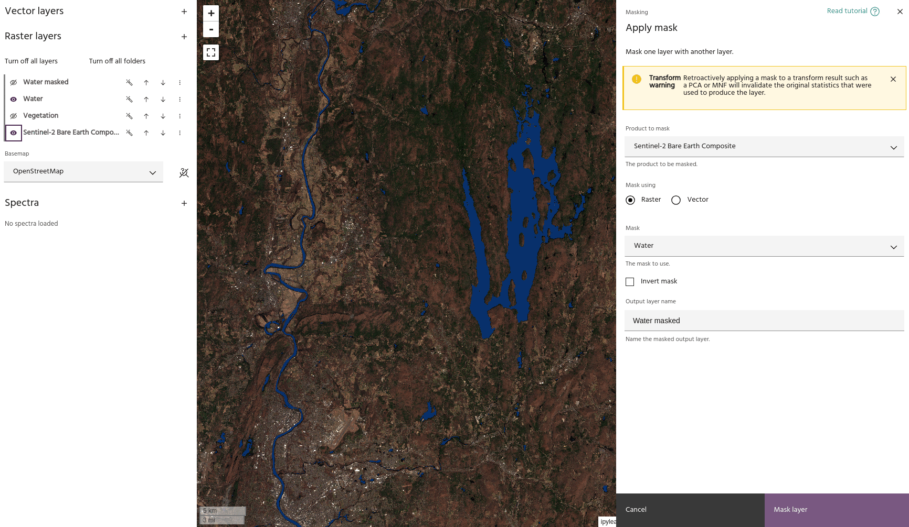
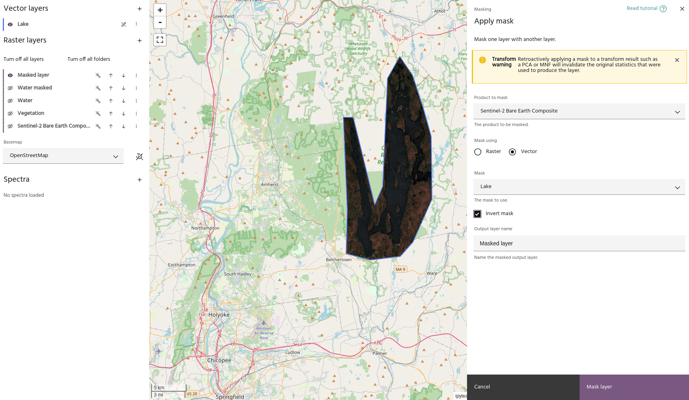

# Apply a mask

Masks are useful for visualizing where water, vegetation, and other features are
present in a given land area and removing them before analysis.

## Creating mask layers

Mask layers can be created using the [vegetation mask](vegetation-mask.md) or
[water mask](water-mask.md) tools, or created from a binary layer computed using
the [raster calculator](raster-calculator.md). Once a layer is created that you
want to use as a mask, be sure to
[mark it as a mask](../raster-layers/index.md#toggle-as-mask) so that it can be
used in this dialog.

<!-- prettier-ignore-start -->

!!! Tip
    Water and vegetation masks created using those tools will be automatically
    marked as masks.

<!-- prettier-ignore-end -->

## Masking layers

- Use the **Product to mask** dropdown menu to choose the layer you want masked.
- Use the **Mask** dropdown menu to choose the layer to use as a mask. Either
  raster or vector layers can be used.
- Once valid inputs are chosen, a preview layer will be generated showing the
  new masked data.

<!-- prettier-ignore-start -->

!!! Tip
    You may need to turn off the input layers to ensure your final masked layer
    looks how you expect.

<!-- prettier-ignore-end -->

- Use the `Invert mask` flag to invert the mask - mask outside a vector instead
  of inside, for example.

--8<-- "snippets/contact-footer.md"
