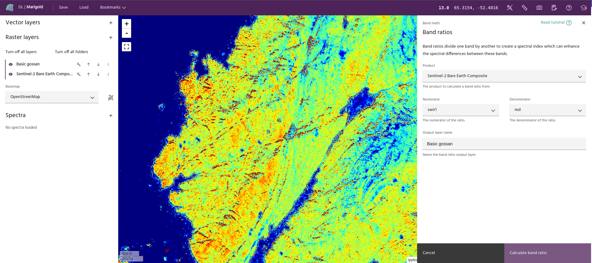

## Band ratio

The **Band ratio** tool divides one spectral band by another to highlight or
suppress certain features of mineral groups.

**Usage:**

- Click the **Band ratio** link in the **Processing toolbox** dropdown menu.
- Choose an available product from the **Product** dropdown menu. This menu
  includes all the raster layers you've added to your session. Choose the
  spectral band you want to represent the numerator and the spectral band you
  want to represent the denominator in the **Numerator** and **Denominator**
  dropdown menus.

<!-- prettier-ignore-start -->

!!! Tip
    The numerator and denominator must be selected from the same raster layer. To
    compute ratios for bands in different products, use the
    [Merge layers](merge-layers.md) tool.

<!-- prettier-ignore-end -->

- Name the output layer by typing it into the **Output layer** name field.
  Examples include "B4/B2", "Gossan" and "ASTER B4/B2".

<!-- prettier-ignore-start -->

!!! Tip
    Predefined band ratios and indices are available via the
    [Mineral indices](mineral-indices.md) tool.

<!-- prettier-ignore-end -->

- A preview of the new output layer will be added to the **Raster layers** index
  on the left side of the Marigold user interface. To add the layer permanently
  and close the dialog, click **Calculate band ratio**.

<!-- prettier-ignore-start -->

!!! Tip
    To compute complex band ratios, such as a ratio of sums, use the
    [Raster calculator](raster-calculator.md).

<!-- prettier-ignore-end -->

--8<-- "snippets/contact-footer.md"
