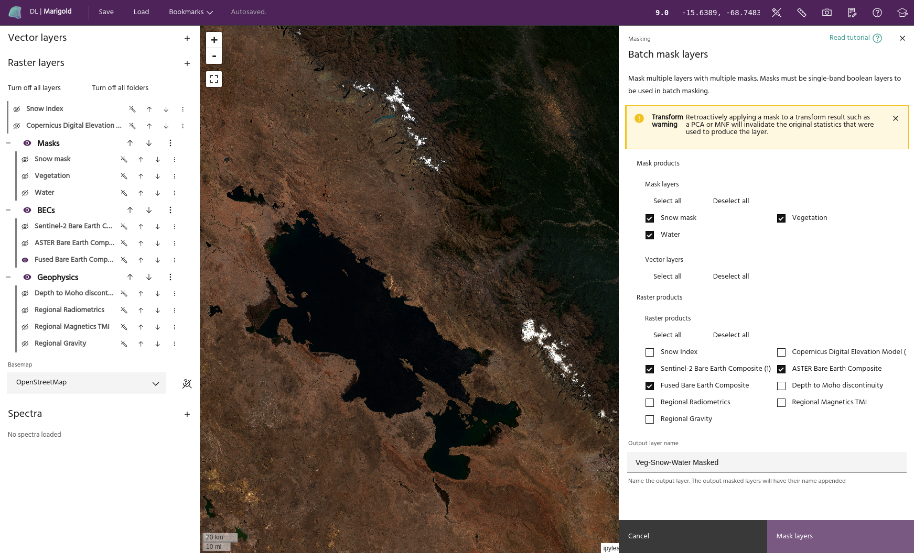
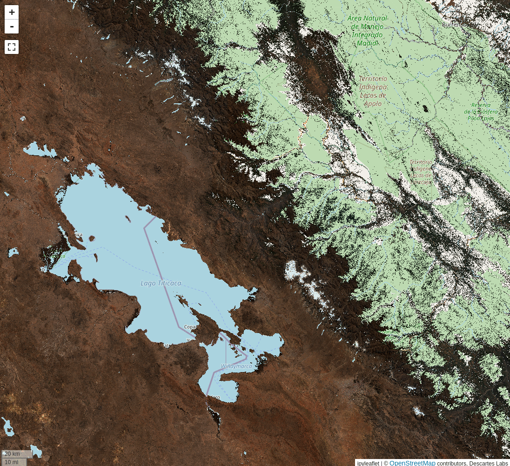

# Batch mask

Generally during a remote sensing workflow, several masks will need to be
applied to a data layer before analysis can begin.
[Vegetation](vegetation-mask.md) and [water](water-mask.md) will need to be
masked for most areas in the world, and oftentimes individual AOIs (built up
areas, restricted land, etc) will need to be removed as well. The **batch mask**
tool allows a user to apply several masks to many layers at once, quickly
preparing layers for further analysis.

## Usage

Once all your masks are built and properly assigned as
[masks](../raster-layers/index.md#toggle-as-mask), the batch mask tool will show
lists of:

- Mask rasters
- Vectors
- Non-mask rasters

Any number of masks (both vector and raster) can be selected and applied to any
number of rasters.

In the above example, we are applying the [vegetation](vegetation-mask.md) and
[water](water-mask.md) output from those tools, as well as a snow mask built
using the [raster calculator](raster-calculator.md). We will apply all masks to
the three Bare Earth Composite products we have loaded. Click `Mask layers` to
apply the masks.

<!-- prettier-ignore-start -->

!!! Tip
    The output name will be appended to the input layer's name for the final masked
    products. In the above example, masking the `Fused Bare Earth Composite` layer
    will generate a layer named `Fused Bare Earth Composite_Veg-Snow-Water Masked`.

<!-- prettier-ignore-end -->

--8<-- "snippets/contact-footer.md"
