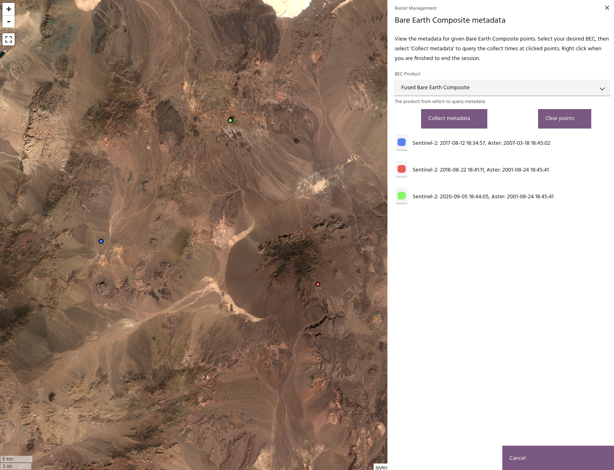

## View BEC metadata

The Bare Earth Composites are built from all available Sentinel-2 and ASTER
data, with a goal of selecting a single pixel out of years worth of data. The
**View BEC metadata** tool allows you to query a Bare Earth Composite to find
when specific pixels were collected.

### **Usage**

The View BEC metadata tool allows you to select a BEC product. Currently, the
Sentinel-2, ASTER, and Fused products are available.

<!-- prettier-ignore-start -->

!!! Tip
    The BEC does not need to exist as a layer in your project to use this tool.

<!-- prettier-ignore-end -->

After selecting the BEC of interest, the `Collect metadata` button will start a
query session. Click points on the map, and a list will be generated with the
dates on which the corresponding pixels were collected. Right click on the map
to end the query session, and select `Clear points` to clear the current list.

<!-- prettier-ignore-start -->

!!! Tip
    Querying with this tool works in the same manner as using the
    [spectral query](../spectra/spectra-vector.md) toolkit.

<!-- prettier-ignore-end -->

When you are finished, click `Cancel` to close the dialog.

--8<-- "snippets/contact-footer.md"
