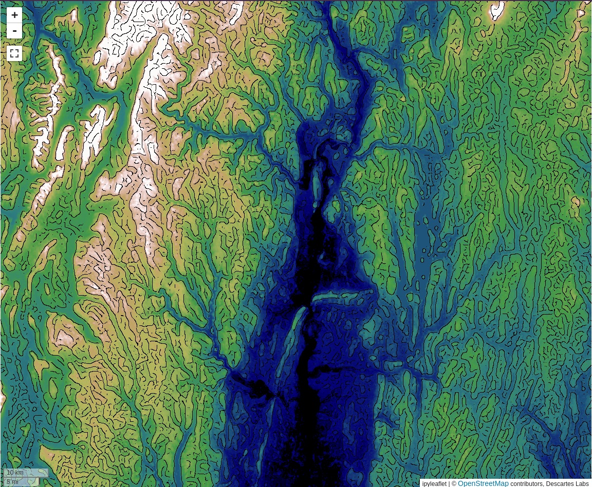
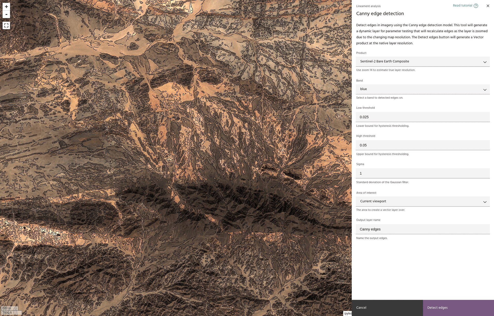

# Canny edge detection

The **Canny edge detection** tool offers a workflow for generating edges from a
band of raster data, suitable for further lineament analysis. Canny edge
detection works by smoothing the input data, building gradients for the smoothed
data, and thresholding the gradients to determine edges.

<!-- prettier-ignore-start -->
!!! warning
    Exporting edges as vectors requires access to 
    [Compute](https://docs.earthone.earthdaily.com/guides/compute.html).

!!! Tip
    More information about Canny edge detection, including the mathematics behind
    the method, can be found
    [here](https://en.wikipedia.org/wiki/Canny_edge_detector).

<!-- prettier-ignore-end -->

The tool will generate two outputs. When using the dialog, a raster layer is
created that will change dynamically when moving the map and changing the
parameters for the detection. Clicking [detect edges](#detect-edges) will start
a Compute function that will run the detection at the full layer resolution and
create a
[vector layer](../vector-layers/add-layers.md#add-a-vector-layer-from-the-catalog)
with the edges for further analysis.

<!-- prettier-ignore-start -->

!!! warning
    The created raster layer will use the current map view resolution to generate
    the edges, not the actual data resolution. For this reason, the edges detected
    will change as the map is zoomed in and out. The [input selector](#select-input-layer)
    will have an indication of the zoom level that is closest to the true layer resolution.

<!-- prettier-ignore-end -->

## Select input layer

The Canny edge detection dialog allows you to select the
[product](index.md#selecting-a-product) and an input band to detect edges from.

<!-- prettier-ignore-start -->

!!! note
    Canny edge detection only works on one band of data.

<!-- prettier-ignore-end -->

## Low and high thresholds

The low and high threshold values determine the cutoff points for finding edges
in the gradients. In general, lowering these values will allow more points to be
classified as edges.

## Smoothing sigma

The standard deviation for the Gaussian smoothing kernel. Higher values
corresponds to a more aggressive smoothing, which will clean noise in the image
at the potential cost of smoothing more edges.

## Area of interest

If Compute access is available, select the [AOI](index.md#selecting-an-aoi) over which
the final vectors will be generated.

## Detect edges

When you are happy with the edge detection parameters, click the `Detect edges`
button to start a Compute task that will compute Vector edges.

<!-- prettier-ignore-start -->

!!! tip
    Progress on the Compute task can be found [here](https://earthone.earthdaily.com/compute).

!!! warning
    The vector layer will be added to the map, but will be set to invisible by default.
    This is to allow Compute tasks to finish before trying to load tiles, which can lead
    to empty tiles being cached and make the data hard to visualize.

<!-- prettier-ignore-end -->

--8<-- "snippets/contact-footer.md"
