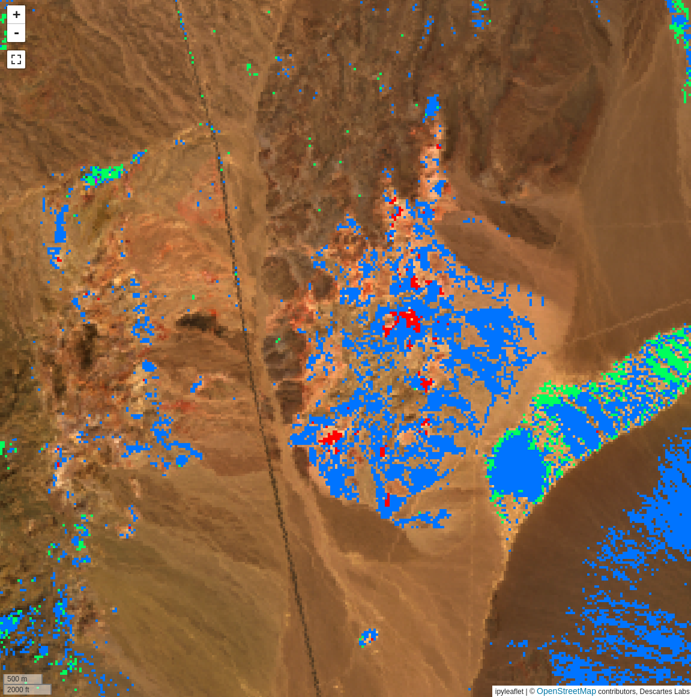
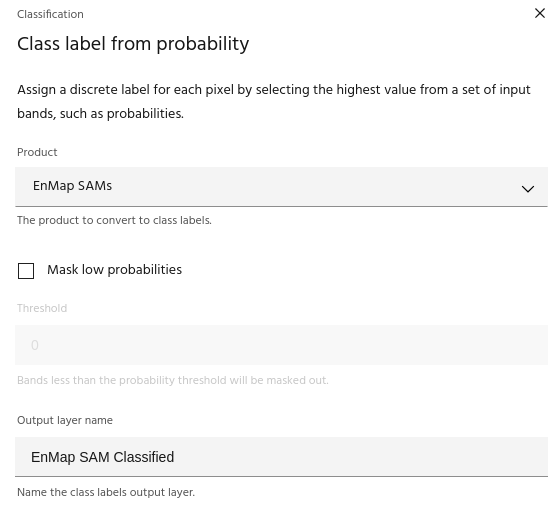

# Assign class labels

The **Assign class labels** tool can be used to create a classified
layer from an input containing bands that represent scores or probabilities
from several sources. For example, after running [SAM](sam.md) for
multiple targets, this tool can be used to select the highest score
at each pixel and create a classified layer from the result.

## Usage

The Assign class labels dialog allows you to select the input
[product](index.md#selecting-a-product) and choose an output name for the
classified layer.

### Mask low probabilities

The `Mask low probabilities` checkbox allows you to mask any pixel where
the band values are lower than the chosen `Threshold`.

--8<-- "snippets/contact-footer.md"
