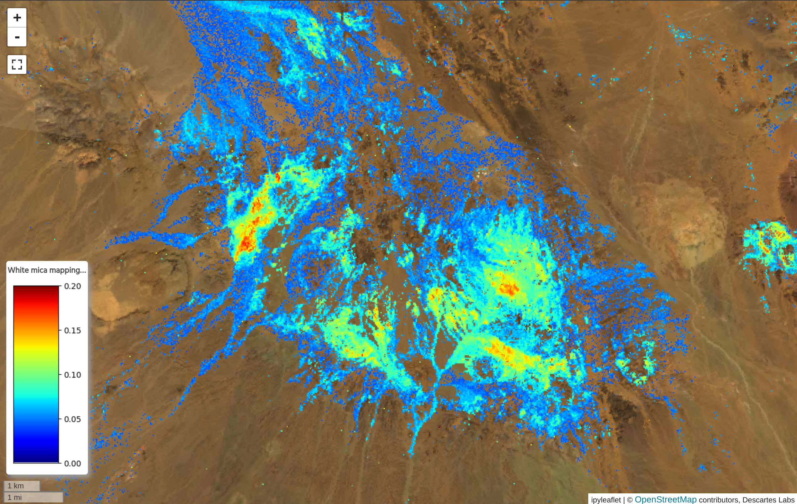
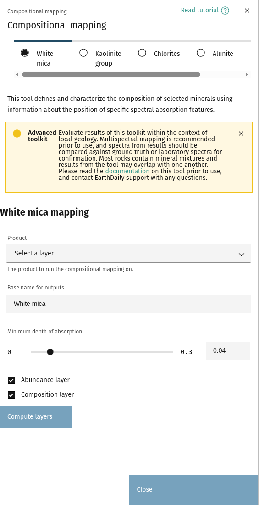
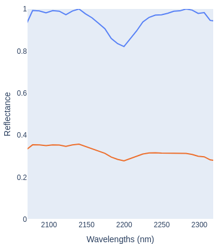
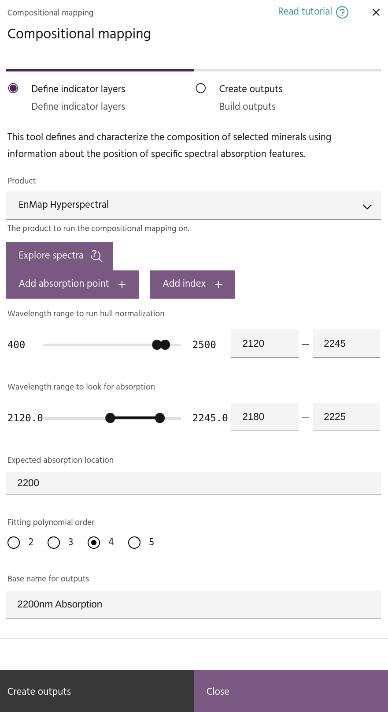
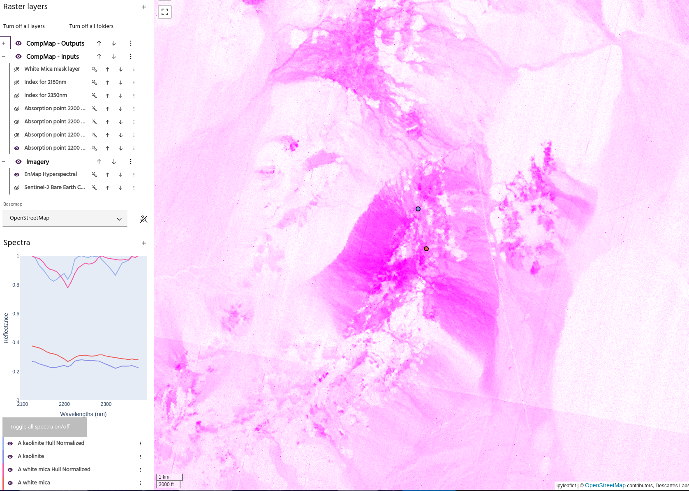
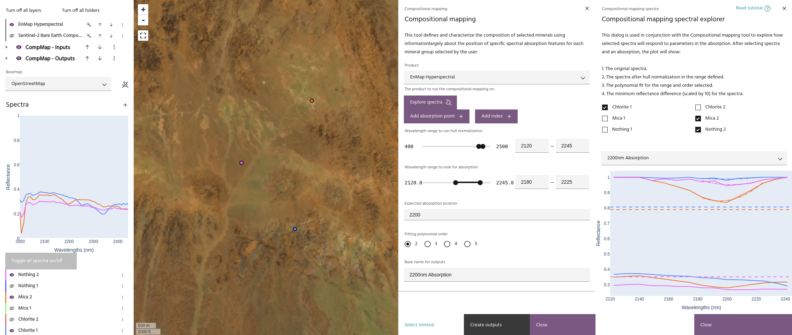
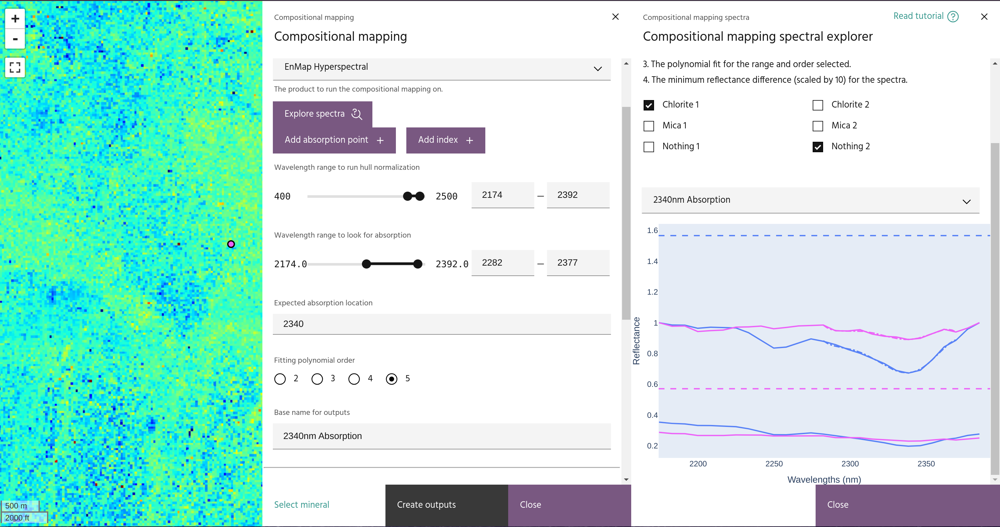
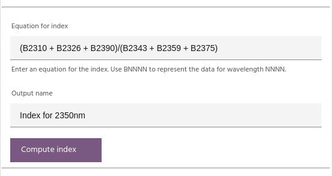
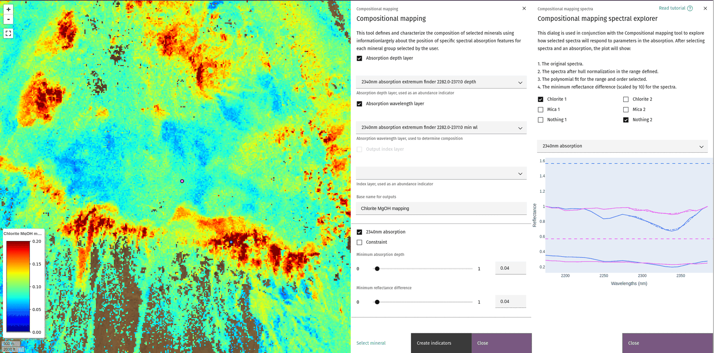
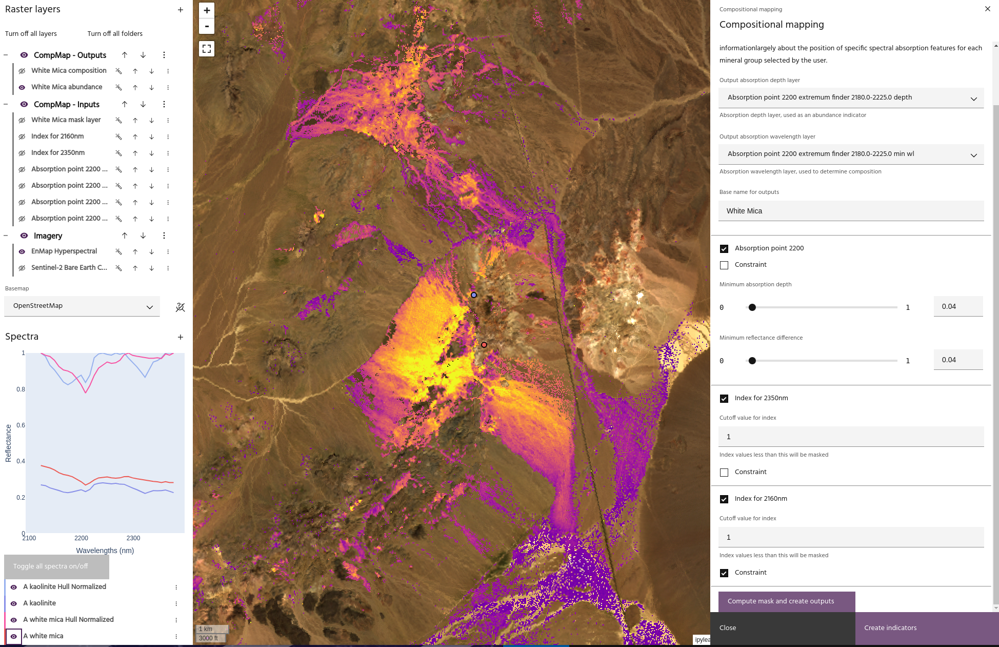

## Compositional mapping

The **Compositional mapping** toolkit is used to combine absorption features and
indices from a hyperspectral dataset in order to identify mineral composition. For
example, an absorption at approximately 2200nm can indicate white mica, with the specific
wavelength at which the spectrum is minimized identifying the mineral species. The
final outputs from this dialog are abundance and composition layers for the given mineral.

<!-- prettier-ignore-start -->
!!! tip
    Many case studies are available describing the techniques used in this toolkit, in a variety
    of geologic regimes. For example, studies are available in
    [Kenya](https://pangea.stanford.edu/ERE/db/GeoConf/papers/SGW/2020/Kamau.pdf),
    [Iran](https://doi.org/10.5382/econgeo.5041), and [Pakistan](https://doi.org/10.1016/j.rse.2024.114389).
    For a thorough exploration of spectroscopy in mineral identification, see
    [this guide](https://www.ugpti.org/smartse/research/citations/downloads/Clark-Manual_Spectroscopy_Rocks_Minerals_Book-1999.pdf).
<!-- prettier-ignore-end -->

Compositional mapping can be performed from either of two dialogs: a
[basic method](#option-1-choose-pre-selected-criteria-for-selected-minerals) which uses pre-selected
criteria for defined minerals, or an [advanced dialog](#option-2-manually-define-absorption-points-and-indices)
that lets you fully define the set of absorption features and indices to use for the mapping. Both methods
start with choosing the [raster layer](index.md#selecting-a-product) that will be used for the mapping.

<!-- prettier-ignore-start -->
!!! note
    Only hyperspectral data can be used with this tool.
<!-- prettier-ignore-end -->

### **Option 1: Choose pre-selected criteria for selected minerals**

Each of the buttons for a given mineral use a set of absorption points and indices defined
in the literature. Clicking one of the minerals will generate the composition and abundance
maps. For information on how each map is computed, see the [mineral definitions](#mineral-definitions)
section.

### Mask output layers

Once the output layers for the chosen mineral are computed, the sliders will control the minimum "strength"
of absorption required for a pixel to be chosen in the output map. The spectra above show a spectral query
of an expected White Mica pixel in EnMap data before and after hull normalization.

- The first slider controls the depth of the absorption on the hull normalized spectrum. In this example, we
  can see that the minimum point of the hull normalized spectrum is approximately 0.8, meaning that this pixel
  will be chosen as long as the value of the slider is less than 0.2.
- The value of the second slider references the difference between the maximum and minimum value of the raw
  spectrum (before hull normalization). In this case, the value is approximately 0.05.

<!-- prettier-ignore-start -->
!!! tip
    Spectra can be explored in more detail using the [advanced tool](#exploring-spectra).
<!-- prettier-ignore-end -->

### **Option 2: Manually define absorption points and indices**

### Defining absorption features

Click the `Add absorption point` button to add an absorption feature to your composition.
Absorption features are computed by first defining a wavelength range over which to compute
the [hull normalization](../spectra/index.md#hull-normalization) of the data. Within that range,
select a wavelength range over which to look for the feature, as well as the expected wavelength
of the feature. The absorption is computed by fitting a polygon of selected order and computing
the minimum of the polygon.

Several outputs will be generated for each absorption feature:

- The data after [hull normalization](../spectra/index.md#hull-normalization). The generated layer
  will have RGB defined with the minimum and maximum wavelengths mapped to Red and Blue, and the selected
  expected wavelength mapped to Green. From this layer, purple zones (high red+blue, low green) will
  represent areas with stronger absorption in the chosen wavelength.

<!-- prettier-ignore-start -->
!!! tip
    The RGB of this layer will update when the wavelength range or expected wavelength are changed.
<!-- prettier-ignore-end -->

- The `Minimum reflectance distance` for the spectrum. This is simply the difference between the minimum
  and maximum reflectance value at each point, and is used to determine if the point contains a true
  absorption.
- The depth and wavelength of the computed minimum.

#### Exploring spectra

Click the `Explore spectra` button to bring up a second dialog where the effect of the parameters can be
seen on any spectra in the product.

Select the spectra of interest and the absorption point. The following will be added to the plot:

- The input spectra, limited to the defined range.
- The hull normalized version of the spectrum within the range.
- The Minimum reflectance distance for the spectrum, represented by a horizontal dashed line.
- The fitted polynomial, using the range and order defined in the primary dialog.

<!-- prettier-ignore-start -->
!!! note
    The value for the minimum reflectance difference is multiplied by 10 on the plot.
<!-- prettier-ignore-end -->

Using these plots can be helpful in deciding parameters for finding the absorption and building the
final map. For example, the plot above shows the difference in polynomial fitting order, showing that
a higher order is necessary to obtain an accurate fit.

In this image, an expected chlorite spectrum is shown alongside one that is not chlorite. The minimum
reflectance difference lines show that the final value should be around 0.06 to ensure the
non-chlorite pixel is not chosen.

### Defining an Index

Indices can be computed be writing the equation for the index in the box, giving it a name, and clicking
`Compute index`. The equation should be written such that `B1234` is the data point (band) closest to
wavelength 1234nm.

### **Creating the final maps**

Once a selection of asorption points and indices have been defined, click `Create outputs` to combine them
and create the final maps.

### Selecting output layers

The output layers representing abundance and composition of the mineral are chosen from one of the defined
[absorption points](#defining-absorption-features). The abundance will be a masked version of the depth
layer, and the composition is the wavelength layer.

### Defining the mask

Each absorption point and [index](#defining-an-index) can be used to mask the output data. Absorption point
masking is done by selecting a threshold depth for the computed minimum, and a threshold for the minimum
reflectance distance of the layer. Indices are masked by selecting a cutoff value.

<!-- prettier-ignore-start -->
!!! tip
    Use the `Constraint` checkbox to change the logic for the layer to be reversed (eg, mask values greater
    than for a selected index instead of less than)
<!-- prettier-ignore-end -->

This image shows the effect of the depth and minimum reflectance difference sliders. The final values chosen
are informed by the spectra over pixels with and without the expected absorption.

In this image, we are using three layers to build a White Mica composition map:

1. An absorption point at 2200nm.
2. An Index that defines an absorption at 2350nm.
3. An Index that defines an absorption at 2160nm used as a constraint.

With these three layers, we can capture the dominant absorption features of white micas, while avoiding the
absorption at 2160nm which is associated with Kaolinites.

<!-- prettier-ignore-start -->
!!! tip
    The scheme just described can be computed automatically using the `White Mica` button
    in the basic dialog.
<!-- prettier-ignore-end -->

### **Mineral definitions**

Each pre-defined mineral map is generated with a combination of absorptions and indices.

### White mica

White mica abundance and composition are defined by:

- An absorption at 2200nm
- An index for absorption at 2350nm

$$
Idx_{2350} = \frac{\lambda_{2310} + \lambda_{2326} + \lambda_{2390}}{\lambda_{2343} + \lambda_{2359} + \lambda_{2375}}
$$

- An index for absorption at 2160nm, used as a constraint to avoid Kaolinite

$$
Idx_{2160} = \frac{\lambda_{2136} + \lambda_{2188}}{\lambda_{2153} + \lambda_{2171}}
$$

### Al smectite

Al smectite abundance and composition are defined by:

- An absorption at 2200nm
- An index for absorption at 2350nm, used as a constraint

$$
Idx_{2350} = \frac{\lambda_{2310} + \lambda_{2326} + \lambda_{2390}}{\lambda_{2343} + \lambda_{2359} + \lambda_{2375}}
$$

### Kaolinite

Kaolinite abundance and composition are defined by:

- An absorption at 2200nm
- An index for absorption at 2160nm

$$
Idx_{2160} = \frac{\lambda_{2136} + \lambda_{2188}}{\lambda_{2153} + \lambda_{2171}}
$$

### Amphibole

- An absorption at 2320nm
- An index for absorption at 2380nm

$$
Idx_{2380} = \frac{\lambda_{2374} + \lambda_{2422}}{\lambda_{2390} + \lambda_{2405}}
$$

- An index for Ferrous iron

$$
Idx_{Ferrous} = \frac{\lambda_{920} + \lambda_{1650}}{\lambda_{1030} + \lambda_{1230}}
$$

### FeOH Chlorite

- An absorption at 2250nm

### MgOH Chlorite

- An absorption at 2340nm

### Epidote

- An absorption at 2340nm
- An index for absorption at 1550nm

$$
Idx_{1550} = \frac{\lambda_{1587}}{\lambda_{1542}}
$$

### Ferric iron

- An absorption at 900nm

--8<-- "snippets/contact-footer.md"
