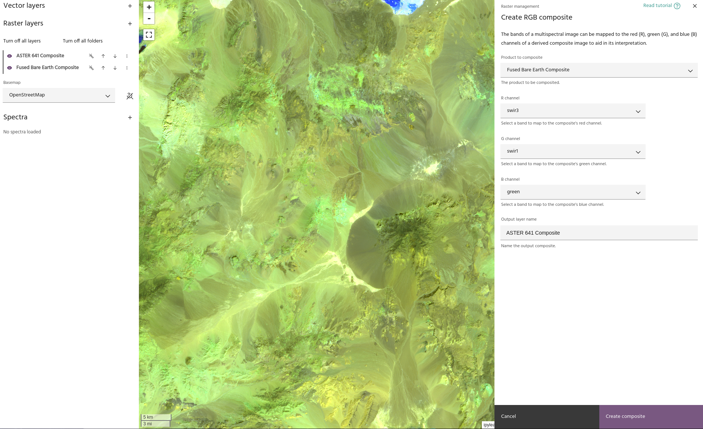

## Create RGB

The **Create RGB** tool is used to easily generate composite images from a base
layer. For example, you can generate a true RGB image and a false color
composite from a multispectral layer with this tool, allowing you to easily
compare the two images without having to modify the
[settings](../raster-layers/layer-settings.md#basic-layer-settings) of the
original layer

### **Usage**

The Create RGB dialog allows you to select a raster layer from which the
composite will be created. Once done, use the R/G/B channel dropdowns to map a
band in the input layer to the corresponding channel in the output layer. Select
an output name and click `Create composite` to add the layer to your project.

<!-- prettier-ignore-start -->

!!! warning
    This composites created will ONLY have the chosen RGB bands, making it useful
    for visualization but not analysis. The original layer will need to be used for
    analysis.

<!-- prettier-ignore-end -->

--8<-- "snippets/contact-footer.md"
