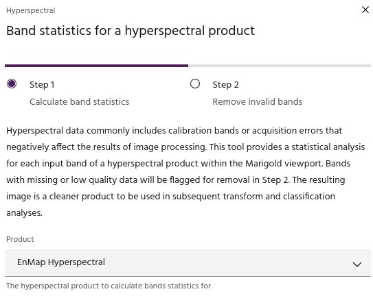
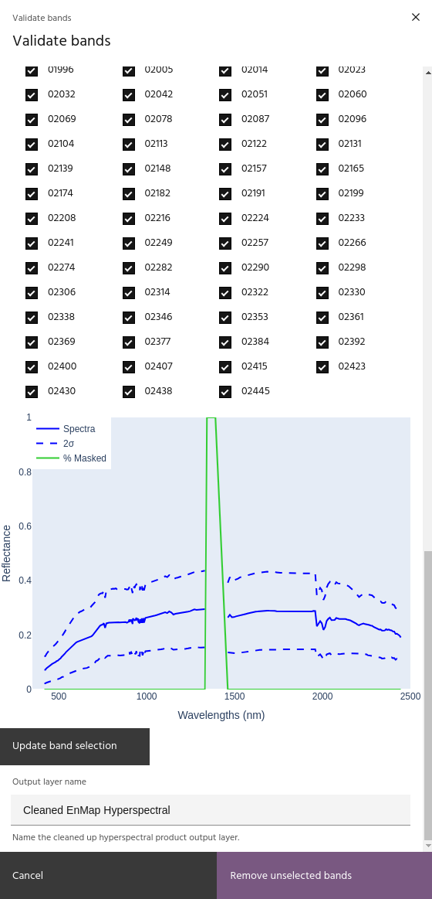

## Data statistical analysis

The **Data statistical analysis** tool provides a simple method of
removing bands that contain anomalous values. This is particularly
important for Hyperspectral imagery, which will often contain
calibration bands or acquisition errors across some bands. This tool
will allow you to remove such data so that the layer is ready for
further analysis.

### **Usage**

The data statistical analysis tool is broken into two sections. The
first section allows you to simply choose a product over which to
run the analysis. Select a product using the dropdown, and click
`Calculate band statistics` to run the analysis.

<!-- prettier-ignore-start -->
!!! warning
    The toolkit will compute statistics over the current map window.
    Low zoom levels will increase run time.
<!-- prettier-ignore-end -->

The second page of the dialog contains checkboxes for all bands in the
chosen product. Bands which have been flagged for removal will be
unchecked. Bands for the output can be manually added or removed by
selecting or unselecting the checkbox and clicking `Update band selection`.
The plot shows the mean spectrum over the area and the positions with
masked data. When you are satisfied with the selection of final bands,
choose a name for the output layer and click `Remove unselected bands`
to add the cleaned layer to your raster list.

--8<-- "snippets/contact-footer.md"
