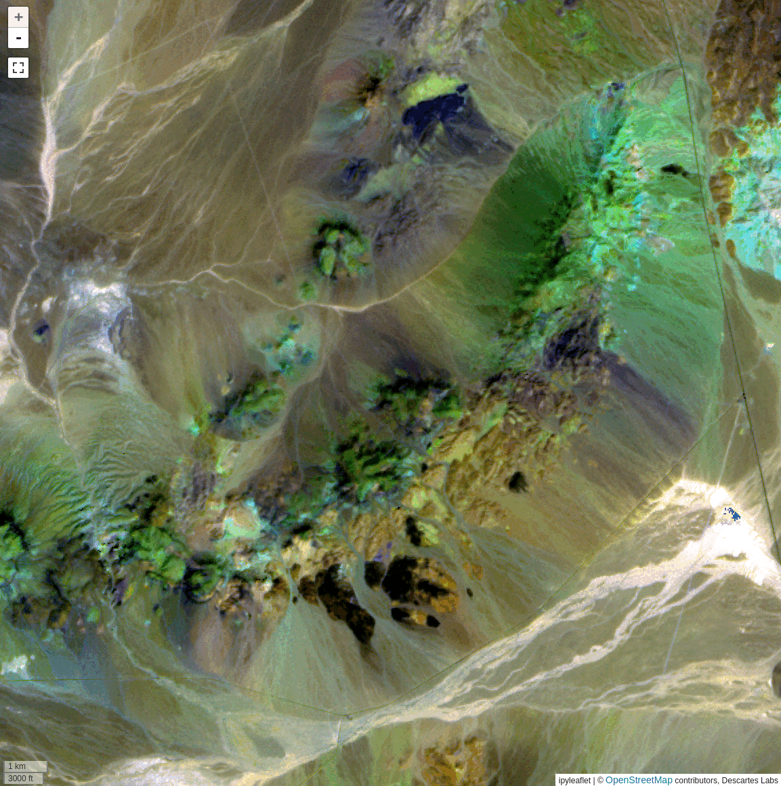
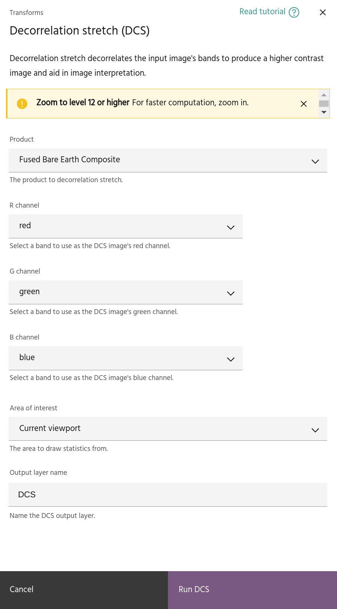

# Decorrelation stretch

Decorrelation stretch (DCS) is a process that increases the contrast of an image
by decorrelating the input bands. In the image above, note how shades of brown
are transformed into more vibrant primary colors, highlighting the subtle
differences in the original image. Similar to [PCA](pca.md), the algorithm works
by computing a linear transformation of the input, but unlike PCA it only works
on three input bands at a time.

<!-- prettier-ignore-start -->

!!! Tip
    More detailed information about DCS with a focus on ASTER processing can be
    found
    [here](https://eospso.gsfc.nasa.gov/sites/default/files/atbd/ASTER_ATBD_99-2010.pdf).

<!-- prettier-ignore-end -->

## Usage

The DCS dialog allows you to select the [product](index.md#selecting-a-product),
input bands to map to the decorrelated RGB image, and an
[AOI](index.md#selecting-an-aoi) for analysis, along with inputting a name for
the result. Click `Run DCS` to compute the transformation and add it to as a
raster layer in the project.

<!-- prettier-ignore-start -->

!!! warning
    Although the transformation will be applied dynamically to the layer, keep in
    mind that it was computed over a specific AOI, and the variance and loadings are
    only valid over the input AOI. If you are moving to a new geologic regime, it is
    often necessary and wise to recompute the transformation in the new area instead
    of relying on the original statistics.

<!-- prettier-ignore-end -->

--8<-- "snippets/contact-footer.md"
