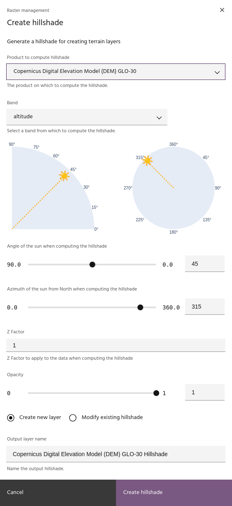
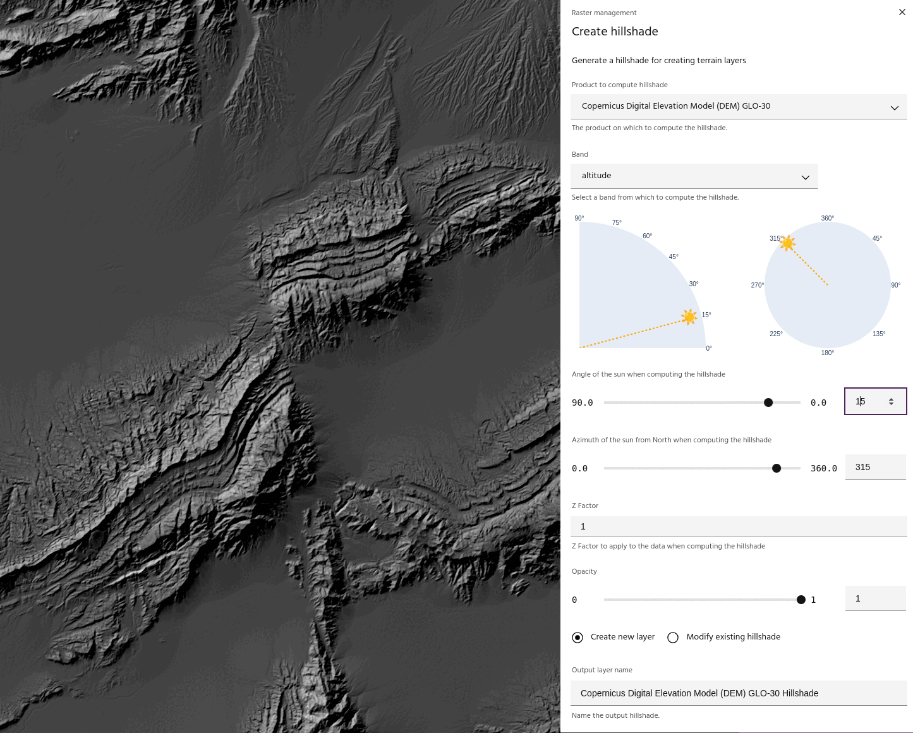
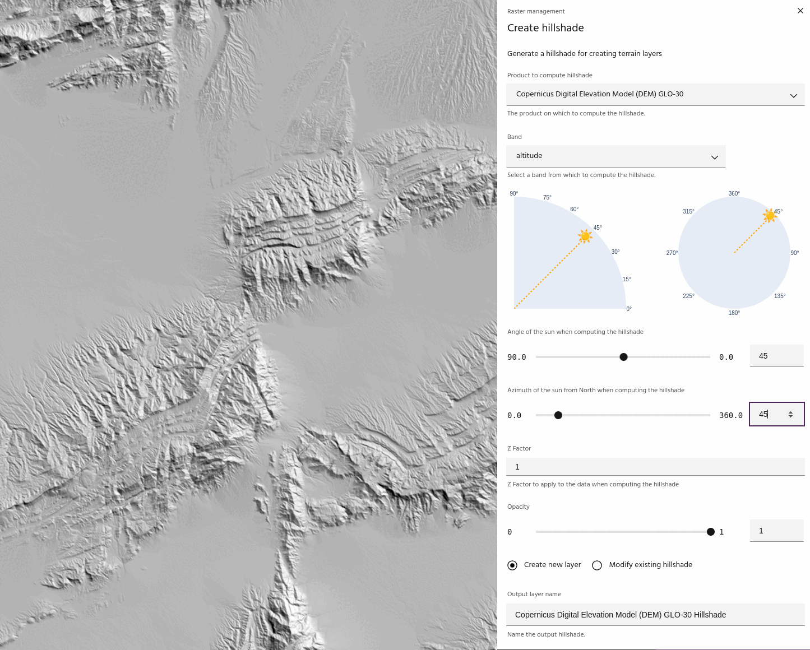
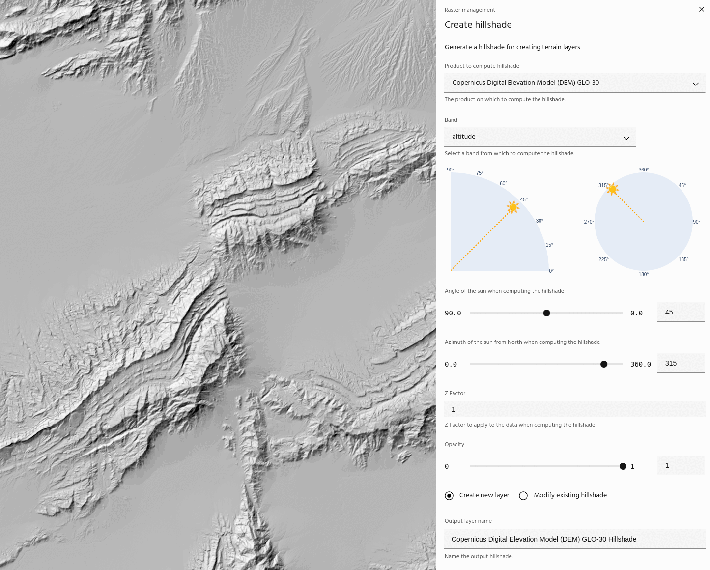
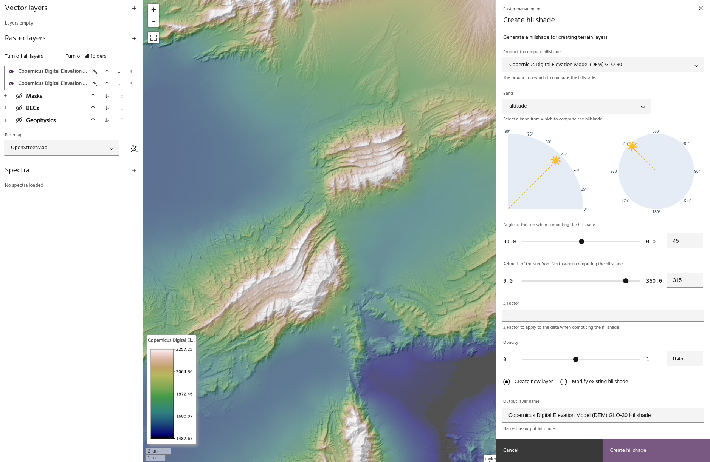

## Create a hillshade

Hillshading a raster layer is a process that adds shading to the image with the
goal of simulating sunlight to create 3D effects. While the process is
traditionally applied to digital elevation models (DEMs), hillshades can be
created from any band of any layer. The key parameters for generating a
hillshade are:

- [Input layer band](#select-input-layer)
- [Sun angle](#sun-angle)
- [Sun azimuth](#sun-azimuth)
- [Z factor](#z-factor)

Once a hillshade is created, it can be
[applied](../raster-layers/layer-settings.md#apply-hillshade-to-layer) to any
raster layer to highlight the shaded features.

### **Select input layer**

Select an input layer and band from which the hillshade will be computed.

<!-- prettier-ignore-start -->

!!! Tip
    DEM layers will populate the altitude band automatically if one is available.

<!-- prettier-ignore-end -->

### **Sun angle**

Use the sun angle slider to change the angle of the sun in the computation.

### **Sun azimuth**

Use the sun azimuth slider to change the angle of the sun in the computation

<!-- prettier-ignore-start -->

!!! Tip
    Use the sun plots to quickly see where the sun is for the computation.

<!-- prettier-ignore-end -->

### **Z factor**

The z factor parameter scales the data before computing the hillshade. This is
useful for low relief areas, or when hillshading non-terrain layers.

<!-- prettier-ignore-start -->

!!! Tip
    The z factor may need to be quite high to generate a good hillshade for non-
    elevation data. For example, for computing hillshades on Sentinel-2 bands, a z
    factor value of 100 is not unreasonable.

<!-- prettier-ignore-end -->

### **Opacity**

Visualization
[opacity](../raster-layers/layer-settings.md#adjust-layer-transparency) of the
hillshade display. Viewing hillshades with opacity is a good way to get a "quick
look" of the combined terrain display before you fully
[apply](../raster-layers/layer-settings.md#apply-hillshade-to-layer) the
hillshade to the layer.

### **Updating an existing hillshade**

Choosing the `Modify existing hillshade` option will allow you to modify a
hillshade that has already been created.

<!-- prettier-ignore-start -->

!!! Tip
    Modifying an existing hillshade will automatically update all layers that are
    visualized using that hillshade!

<!-- prettier-ignore-end -->

--8<-- "snippets/contact-footer.md"
