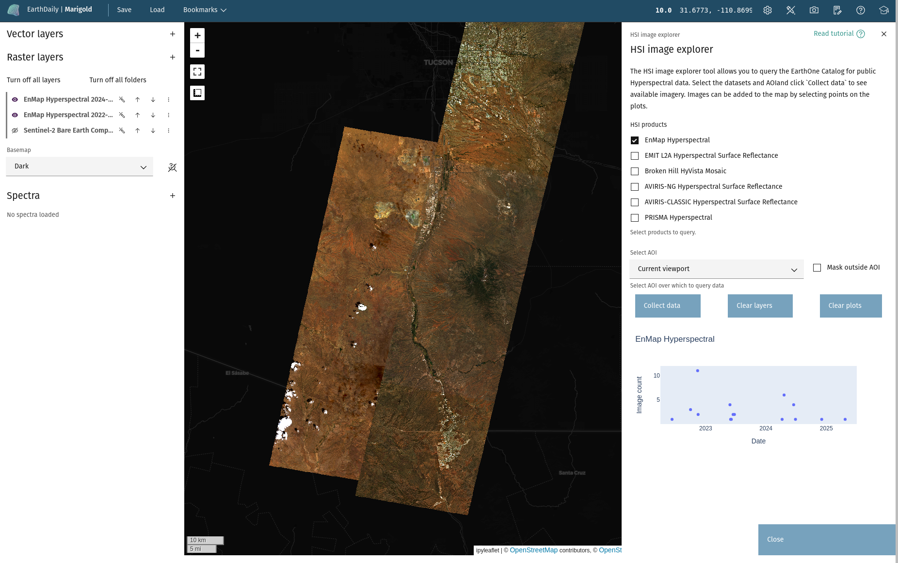
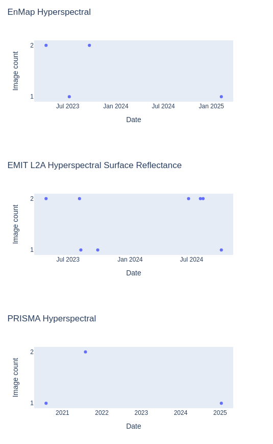

## HSI image explorer

The **HSI image explorer** tool allows you to query the EarthOne Catalog for
public Hyperspectral data.

### **Usage**

The HSI image explorer tool allows you to select from publicly available
Hyperspectral dataset, as well as an [AOI](index.md#selecting-an-aoi). If
desired, imagery can be masked by the AOI. Press the `Collect data` button
to search the EarthOne Catalog for imagery from the selected products over
the chosen AOI.

When the query is complete, the dialog will contain time series plots showing
when imagery was collected for each product. Selecting points will add the
image to the map as a layer.

<!-- prettier-ignore-start -->

!!! Note
    Layers will contain data acquired on a single calendar day.

!!! tip
    Multiple points can be selected using the Box Select or Lasso Select tools
    on the plot.
<!-- prettier-ignore-end -->

Use the `Clear layers/plots` buttons to clear all layers or plots associated
with this tool.

--8<-- "snippets/contact-footer.md"
