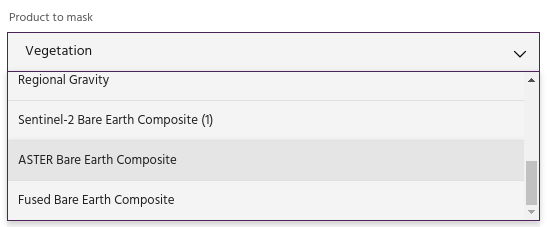
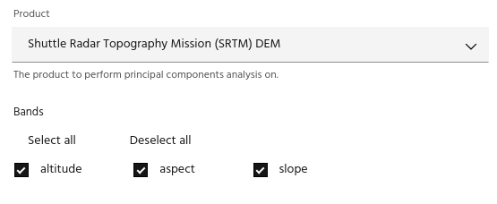
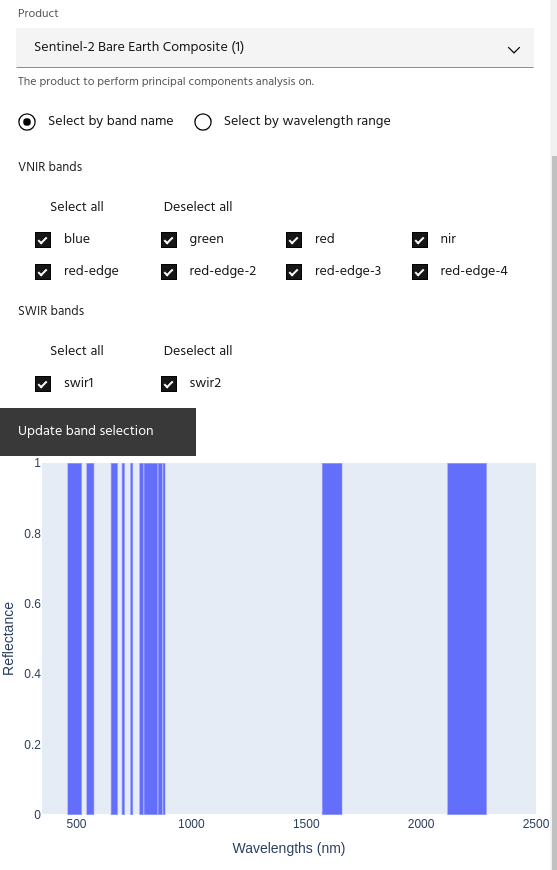
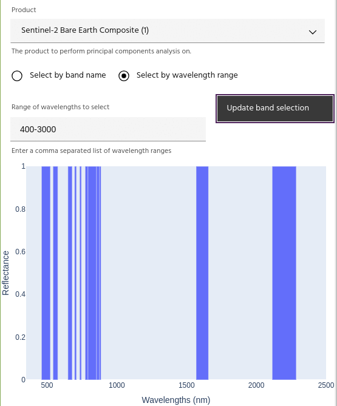
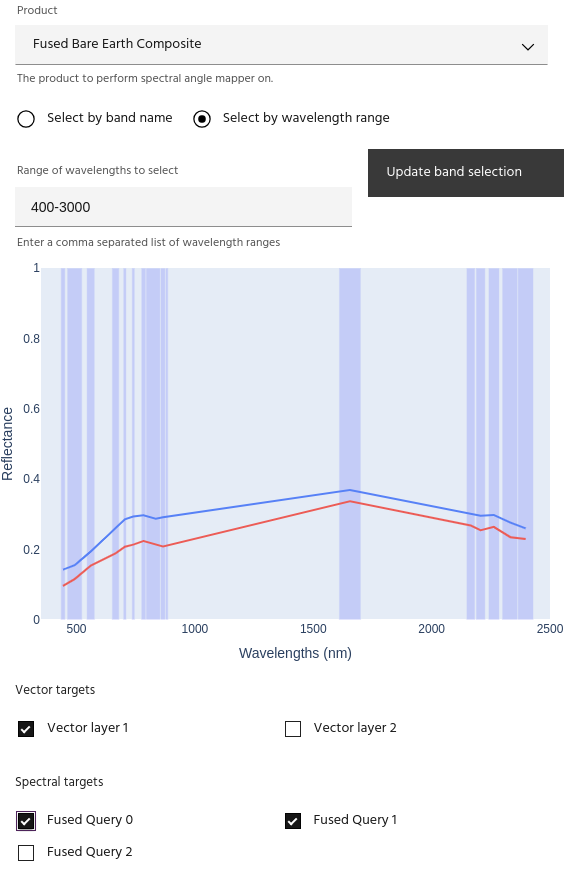
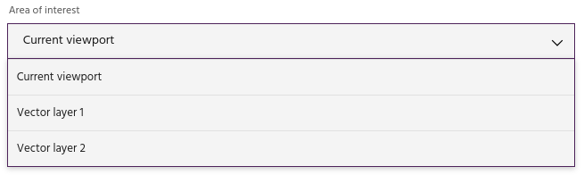
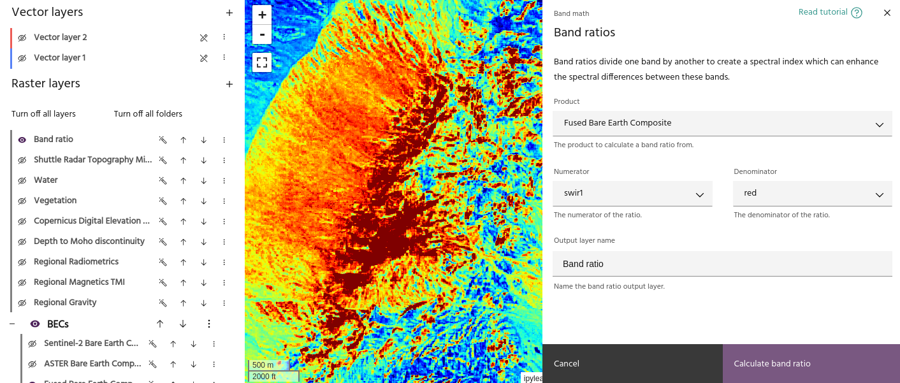

# Processing basics

Marigold supports a wide variety of processing tools that share many
components in common.

## Selecting a product

The first decision for most tools is the input product for the process.
This is often in the form of a dropdown list containing available products
for selection.

<!-- prettier-ignore-start -->
!!! note
    Not all layers will be available for all processes! For example, the
    standard [mineral index](mineral-indices.md) tool is not available for
    hyperspectral layers. Instead you must use the mineral index analag tool,
    which only accepts hyperspectral data.

!!! Tip
    The product dropdown will update when [new layers](../raster-layers/add-layers.md)
    are added to the project.
<!-- prettier-ignore-end -->

## Selecting bands

For most processes, you have the choice of what bands in the layer to process.
For example, with hyperspectral datasets it is often useful to limit analysis to
only the wavelengths corresponding to the minerals you are currently trying to
indicate (eg, looking at bands from 2180-2225nm when mapping white micas).

For data without spectral bands, band selection will appear as a simple list of
checkboxes.

Spectral data can be selected either with a list of checkboxes or by typing in the
wavelengths to use.

After selecting desired bands, click the `Update band selection` button to show
the position of the selected bands on the graph.

## Selecting spectra

For processes that use spectral data such as [spectral angle mapper](sam.md),
a list of available vectors and spectra will be presented as well. Spectra will
be used directly, while selecting a vector will run the same process as
[extracting vector spectra](../spectra/spectra-vector.md) to compute an average
spectrum over the vector.

<!-- prettier-ignore-start -->
!!! warning
    Non-spectral data will only allow Vector targets.

!!! Tip
    If the product has spectral bands, selecting a spectrum will plot it on the
    band plot.
<!-- prettier-ignore-end -->

## Selecting an AOI

Many processes use specific AOIs as input in addition to the layer itself. For
example, [PCA](pca.md) requires an AOI to compute the statistics which will
be applied dynamically to the whole layer. These processes will contain a
dropdown that will have all of your vector layers, as well as an option to
compute over the current map viewport.

<!-- prettier-ignore-start -->
!!! warning
    Low zoom levels can create very large AOI!
<!-- prettier-ignore-end -->

## Output layers

Dialogs will have an area to input a name for the resulting output layer. Many
dialogs will generate a "preview" layer with this name that will update as you
adjust the parameters of the process. You can find this layer in your layer list,
with all of the same [configuration options](../raster-layers/index.md#basic-layer-configuration) as a normal layer.

<!-- prettier-ignore-start -->
!!! warning
    Pressing `Cancel` on a dialog will delete the preview layer.
<!-- prettier-ignore-end -->

--8<-- "snippets/contact-footer.md"
