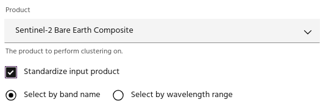
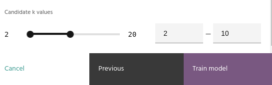
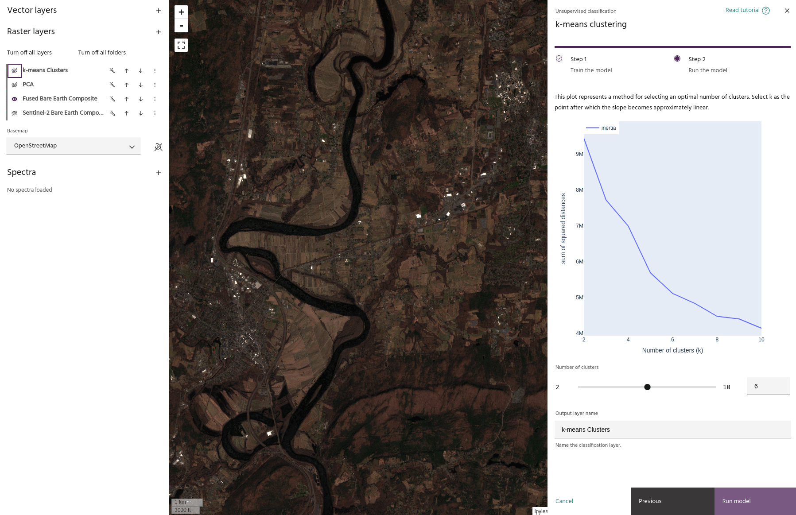
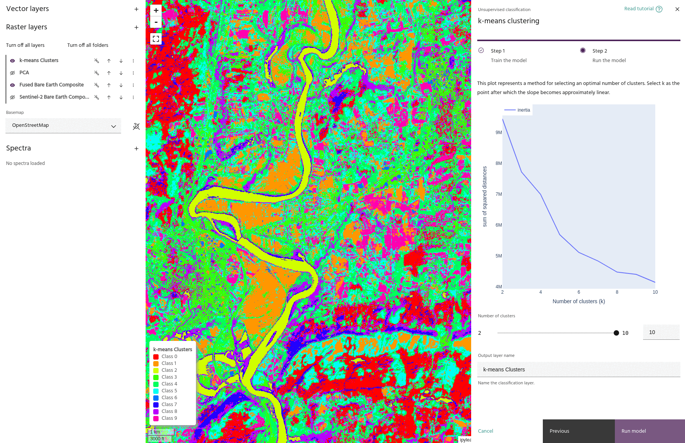

# k-means clustering

**k-means clustering** is an unsupervised classification technique that
automatically finds groupings of data based on their spectral characteristics.
k-means clustering does not assign meaning or labels to the clusters themselves,
but rather relies on the user to interpret the classification.

<!-- prettier-ignore-start -->

!!! Tip
    More information about k-means clustering, including a mathematical derivation,
    can be found [here](https://en.wikipedia.org/wiki/K-means_clustering).

<!-- prettier-ignore-end -->

## Prepare data

The k-means clustering dialog is split into two pages. The first contains the
standard selection of the input [product](index.md#selecting-a-product),
[bands](index.md#selecting-bands) and [AOI](index.md#selecting-an-aoi) for
analysis, along with two parameters specific for the k-means computation.

### Standardize input product

Use this checkbox to standardize the selected input data by the mean and
standard deviation of the data:

$$ ScaledData = \\frac{data - mean}{std} $$

Note that the data are scaled band-by-band - after this operation, each band
will have a mean of 0 and standard deviation of 1.

### Candidate k values

When training the k-means model, one model will be created for each value in
this range. This allows you to check several k-values (corresponding to the
number of clusters in the data) before applying the clustering to the entire
dataset.

### Train model

Click the `Train model` button to compute the models defined by your choice of
k-values.

## Investigate and apply the model

The second page of the k-means clustering dialog allows you to interrogate the
models defined by your chosen [k-values](#candidate-k-values), as well as give
the final output layer a name.

### Inertia plot

The plot shows the "inertia" of the model at each selected k-value. This value
represents the total sum of squared distances for each value in the dataset with
each model.

<!-- prettier-ignore-start -->

!!! Tip
    Generally, an appropriate k-value will be a point where this curve starts to
    flatten, representing a point of diminishing returns with an increased number of
    clusters.

<!-- prettier-ignore-end -->

### Number of clusters

Adjusting this slider will change the model to the one corresponding to the
selected number of k-values.

### Run model

When you are happy with your choice of k value, click `Run model` to finalize
the output layer in the raster list.

<!-- prettier-ignore-start -->

!!! warning
    Although the model will be applied dynamically to the layer, keep in mind that
    it was computed over a specific AOI, and the inertia values are only valid over
    the input AOI. If you are moving to a new geologic regime, it is often necessary
    and wise to recompute the model in the new area instead of relying on the
    original statistics.

<!-- prettier-ignore-end -->

--8<-- "snippets/contact-footer.md"
