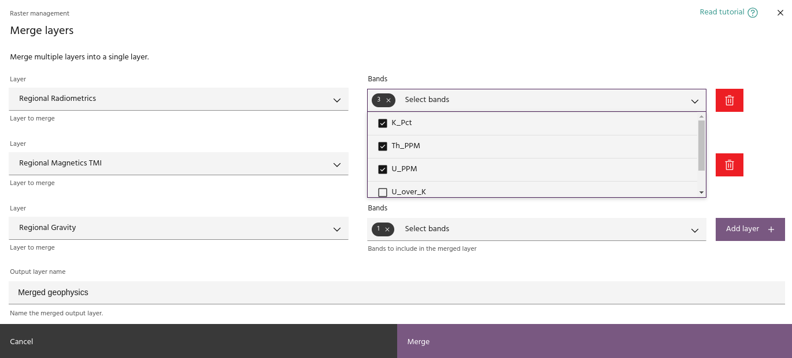

# Merge layers

The **Merge layers** tool allows you to add bands from multiple layers
into a single product. Merging layers allows you to create unique
visualizations, and to combine data from multiple sources for input
to processes like [PCA](pca.md).

## Usage

The merge layers tool will contain one row per layer to be merged.
Select a layer from the `Layer` dropdown, and select bands from the
`Bands` dropdown. Use the `Add layer` button to add more layers, or
use the trash can icon to remove a layer. When you are finished,
give the output layer a name and click `Merge` to add the layer to
the project.

--8<-- "snippets/contact-footer.md"
