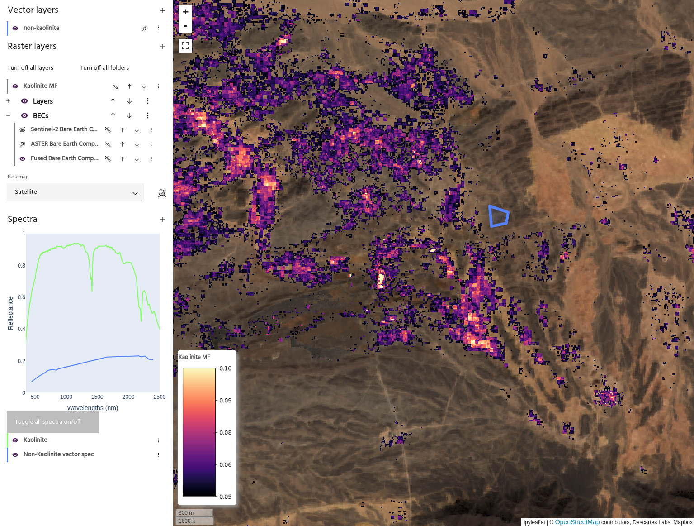

## Matched filter

While we often assume that each pixel in our remote sensing datasets is
homogeneous, in reality a single pixel will contain information from everything
in that area. For example, for a Sentinel 2 pixel at 10m resolution, every
mineral and piece of vegetation within that 10m will contribute to the final
spectrum. The **matched filter** operation attempts to extract a single spectrum
from this mixed input.

<!-- prettier-ignore-start -->

!!! Tip
    More information about the matched filter operation, including a mathematical
    derivation, can be found [here](https://en.wikipedia.org/wiki/Matched_filter).

<!-- prettier-ignore-end -->

A matched filter result for Kaolinite. These results can be checked against
ground truth data for confirmation.

### **Usage**

The matched filter dialog allows you to choose the
[raster layer](index.md#selecting-a-product) and
[bands](index.md#selecting-bands) to use as input data, an
[aoi](index.md#selecting-an-aoi) to use as the "background" data, and
[vector](index.md#selecting-an-aoi) and [spectra](index.md#selecting-spectra) to
use as targets.

<!-- prettier-ignore-start -->

!!! Tip
    The background AOI should not contain spectral data from the targets - these are
    the data that will be filtered out during the operation.

<!-- prettier-ignore-end -->

Choose a name for the output layer and select `Run matched filter` to create the
output in the raster list. The output layer will have one band per chosen
target.

--8<-- "snippets/contact-footer.md"
