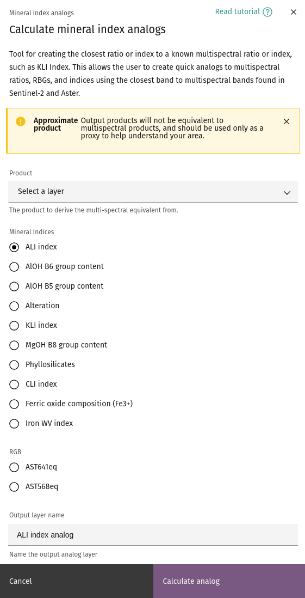

## Mineral index analogs

Manipulating bands of multispectral data to obtain different
[mineral indices](mineral-indices.md) is a convenient way to identify
specific mineral groups, however the process assumes that the band
wavelengths are well defined and sparsely populated. Hyperspectral
images are sampled much more densely along the wavelength axis, and
therefore the assumptions used to create mineral indices are not
satisfied. However, computing specific indices can still provide a
useful method for initial exploration and interpretation of an AOI.
The **mineral index analogs** tool allows a subset of mineral indices
to be computed for hyperspectral data, providing a convenient method
for generating initial screening products.

### **Usage**

The mineral index analogs tool allows you to select a product, and
select the desired mineral index or RGB composite to create. The
output layer name will populate with the chosen index, and can be
changed to a name of your choosing.

<!-- prettier-ignore-start -->
!!! note
    Only hyperspectral layers will appear in the product selection
    dropdown.
<!-- prettier-ignore-end -->

Click the `Calculate analog` button to add the computed index analog
to your project.

--8<-- "snippets/contact-footer.md"
