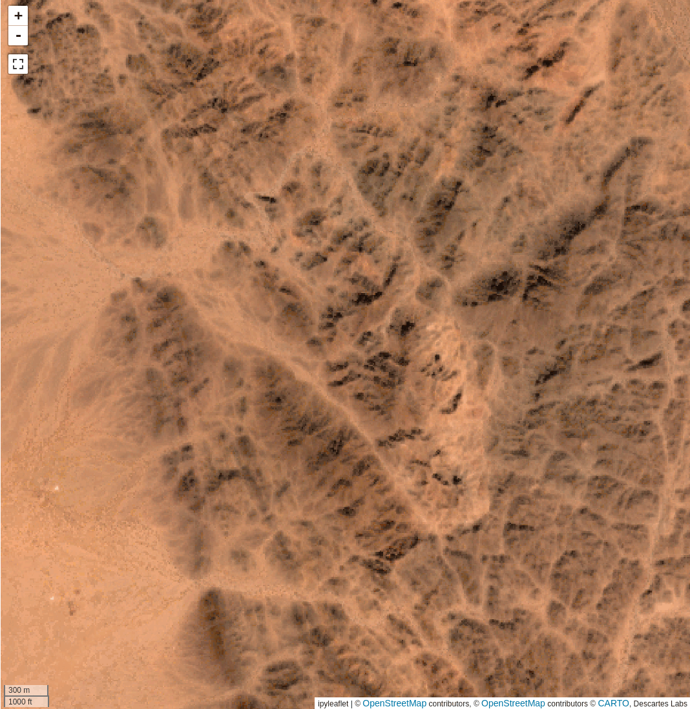

## Minimum noise fraction

Minimum noise fraction (MNF) is a transform closely related to [PCA](pca.md),
but with an added transformation to whiten any noise present in the data. The
resulting transform will be similar to a traditional PCA with the signal-
to-noise ratio maximized.

This image shows the input Bare Earth Composite, MNF Component 1, and MNF
component 15. As MNF orders the components by their signal to noise ratio, MNF
15 is almost completely noise.

### **Usage**

The MNF dialog allows you to select the [product](index.md#selecting-a-product)
and [bands](index.md#selecting-bands) for analysis in the same manner as PCA.
Two [AOI](index.md#selecting-an-aoi)s are required. The first
(`Area of interest`) contains the data from which the data covariances will be
computed, and the second (`Noise area`) contains the data for the noise
covariance. Input a name for the output, and click `Run MNF` to compute the
transformation.

<!-- prettier-ignore-start -->

!!! Tip
    Flat, spectrally homogenous areas work best for input to the noise area. Use the
    [spectral query](../spectra/spectra-query.md) tool to analyze the spectra of
    your data to help select an appropriate AOI.

!!! warning
    Although the transformation will be applied dynamically to the layer, keep in
    mind that it was computed over a specific AOI, and the variance and loadings are
    only valid over the input AOI. If you are moving to a new geologic regime, it is
    often necessary and wise to recompute the transformation in the new area instead
    of relying on the original statistics.

<!-- prettier-ignore-end -->

--8<-- "snippets/contact-footer.md"
