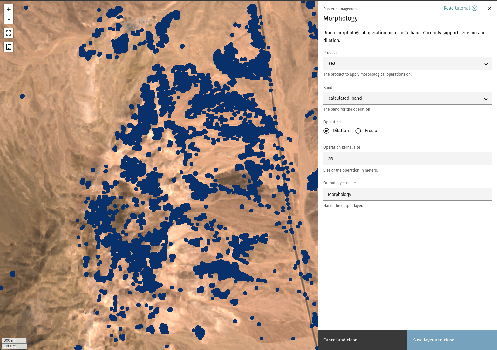
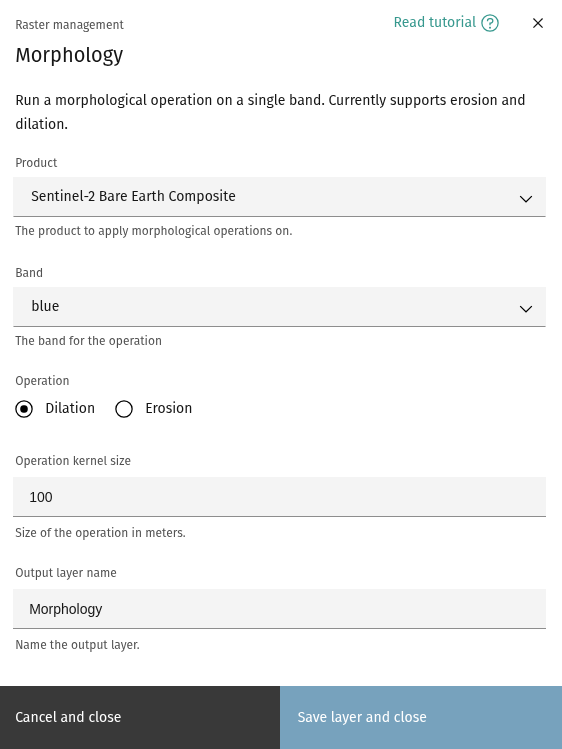

## Morphological operations

The **Morphology** tool offers a workflow for applying morphological operations
to a layer. Currently, the tool supports erosion and dilation of a single band.

<!-- prettier-ignore-start -->

!!! Tip
    Background on morphology can be found 
    [here](https://en.wikipedia.org/wiki/Mathematical_morphology).

<!-- prettier-ignore-end -->

### **Select input layer**

The Morphology dialog allows you to select the [product](index.md#selecting-a-product)
and an input band to apply the operation on.

### **Operation**

Select the operation to apply to the chosen layer and band. Currently supports
erosion and dilation.

### **Operation kernel size**

Size of the kernel, in meters.

<!-- prettier-ignore-start -->

!!! tip
    Kernel size is used as the radius of a disk-shaped element for applying the operation.

<!-- prettier-ignore-end -->

### **Output layer name**

Choose a name for the output layer.

--8<-- "snippets/contact-footer.md"
