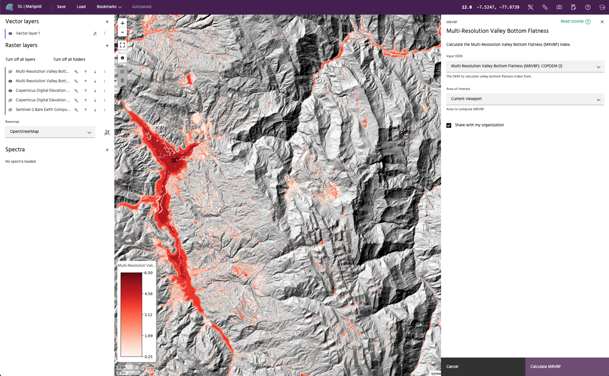

## Valley Bottom Flatness

The **Multi-Resolution Valley Bottom Flatness** (MRVBF) index (Gallant and
Dowling, 2003) assesses the flatness and lowness of terrain over multiple
scales and DEM resolutions in order to identify valley bottoms. This index
classifies degrees of valley bottom flatness, which may be related to depth
of deposit. The index can also be used to identify groundwater constrictions
and to delineate hydrologic and geomorphic units.

The algorithm uses transfer functions for the terrain slope and elevation
percentile to obtain a normalized value from 0-1. These normalized values
are then used to compute the valley flatness for each resolution step,
with the DEM resolution coarsening by a factor of 3 between each step.
The final MRVBF index is a cumulative index from all resolution steps.

<!-- prettier-ignore-start -->
!!! warning
    Valley Bottom Flatness requires access to
    [Compute](https://docs.earthone.earthdaily.com/guides/compute.html).

!!! note
    MRVBF values < 0.5 do not generally represent valley bottoms, values from
    0.5 to 1.5 represent the steepest resolvable valley bottoms, and
    flatter/larger valley bottoms are represented by values > 1.5. The
    implemented algorithm uses 6 steps, giving a maximum index value of 6.0.
<!-- prettier-ignore-end -->

### **Complementary Ridge Top Flatness Index**

A multi-resolution ridge top flatness index (MRRTF) is a separate index derived
in a very similar manner, except that the upper parts of the landscape are
identified from PCTL. For most pixels, either the MRVBF or MRRTF is less than
0.5, identifying that location as a ridge top or valley bottom. If both indices
are < 0.5, it is a hillslope. Areas where MRVBF and MRRTF overlap are somewhat
ambiguous, but the dominant character, ridge-like or valley-like, can be
inferred from the index with the larger value.

<!-- prettier-ignore-start -->
!!! note
    The Ridge top flatness index is automatically calculated as a second band
    within the MRVBF algorithm and added to the resulting catalog product. It
    is *not* automatically added to the map.
<!-- prettier-ignore-end -->

### **Usage**

The Valley bottom flatness dialog allows you to choose the elevation model from
the current [raster layers](index.md#selecting-a-product) to use as input data.
The elevation model must have either an 'elevation' or 'altitude' band. Select
`Run MRVBF` to create the output in the raster list. A compute job will be
kicked off to run the algorithm and the resulting layer will be added to the
map upon completion.

<!-- prettier-ignore-start -->
!!! note
    The input DEM will be resampled to a 30 meter resolution, regardless of
    the native resolution of the DEM.
<!-- prettier-ignore-end -->

--8<-- "snippets/contact-footer.md"
