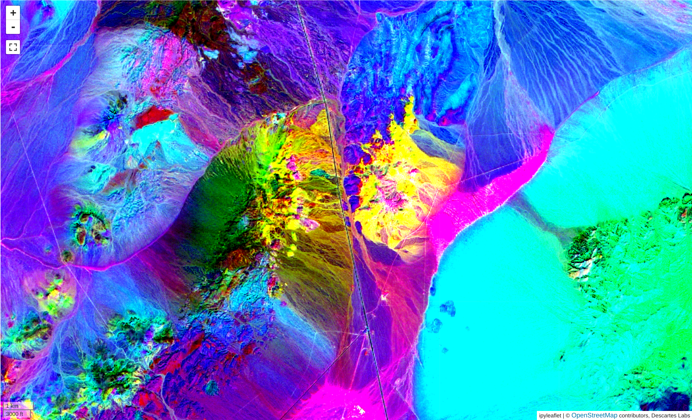
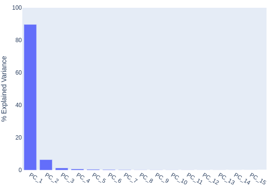
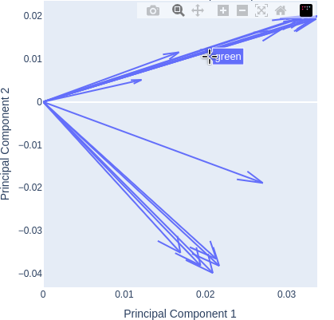

# Principal components analysis

Principal components analysis (PCA) is a technique for data analysis and
dimensionality reduction. The process computes a linear transformation of of the
data in such a way that the variations in the data are explained with fewer
components - in other words, instead of analyzing 20+ bands of a multispectral
dataset, you can analyze three principal components that explain 90% of the
data.

<!-- prettier-ignore-start -->

!!! Tip
    More detailed information about PCA, including the math behind it, can be found
    [here](https://en.wikipedia.org/wiki/Principal_component_analysis).

!!! Tip
    For noisy data, the [MNF](mnf.md) tool may be more appropriate.

<!-- prettier-ignore-end -->

## Computing the transformation

The PCA dialog is broken up into two steps. The first step allows you to select
the [product](index.md#selecting-a-product), [bands](index.md#selecting-bands)
and [AOI](index.md#selecting-an-aoi) for analysis, along with inputting a name
for the result. Click `Train PCA` to compute the transformation and load the
second page of the dialog.

<!-- prettier-ignore-start -->

!!! note
    PCA is not valid for one band data, at least two must be selected.

<!-- prettier-ignore-end -->

## Analysis and application

The second page of the dialog contains tools for quality control of the
transformation and a way to apply it to the full dataset.

<!-- prettier-ignore-start -->

!!! tip
    Use the `Previous` button to return to the first page to select different a
    different product or bands, or a different AOI.

<!-- prettier-ignore-end -->

### Explained variance plot

The explained variance plot shows what percentage of the data is explained by
each principal component. In the above example, we see that the first component
explains almost 90% of the data, meaning our input bands were highly correlated.

### Loadings plot

The loadings plot shows how strongly each input band affects the chosen
principal components. Hover over the arrows to show the bands represented. In
this example, computed from the Fused Bare Earth Composite, we can see that all
of the bands have a strong impact on component 1 (as they are positive along
that axis). The two clusters represent the Visible to NIR bands in Quadrant 1,
and the SWIR bands in Quadrant 2, showing that the Visible to NIR bands have a
positive effect on Component 2 while the SWIR bands have a negative one. The
clustering effect also indicates that these bands are highly correlated with
each other.

<!-- prettier-ignore-start -->

!!! tip
    Use the dropdowns to change the components represented in the loadings plot.

<!-- prettier-ignore-end -->

### Apply PCA

Use the `Apply PCA` button to apply the transformation to the layer, creating a
new layer with the chosen output name. By default the layer will be plotted with
Components 1, 2, and 3 mapped to RGB.

<!-- prettier-ignore-start -->

!!! note
    The transformed layer will have the same number of bands as were input into the
    transformation. For example, if all of the product's bands were chosen, the
    transformed layer will have the same number of bands as the input product.

!!! warning
    Although the transformation will be applied dynamically to the layer, keep in
    mind that it was computed over a specific AOI, and the variance and loadings are
    only valid over the input AOI. If you are moving to a new geologic regime, it is
    often necessary and wise to recompute the transformation in the new area instead
    of relying on the original statistics.

<!-- prettier-ignore-end -->

### Download PCA statistics

Use these buttons to download the PCA statistics to your computer in text format.
Options are available to download the eigenvectors (shown in the [loadings plot](#loadings-plot)),
eigenvalues, and the explained variance (shown in the [variance plot](#explained-variance-plot)).

--8<-- "snippets/contact-footer.md"
