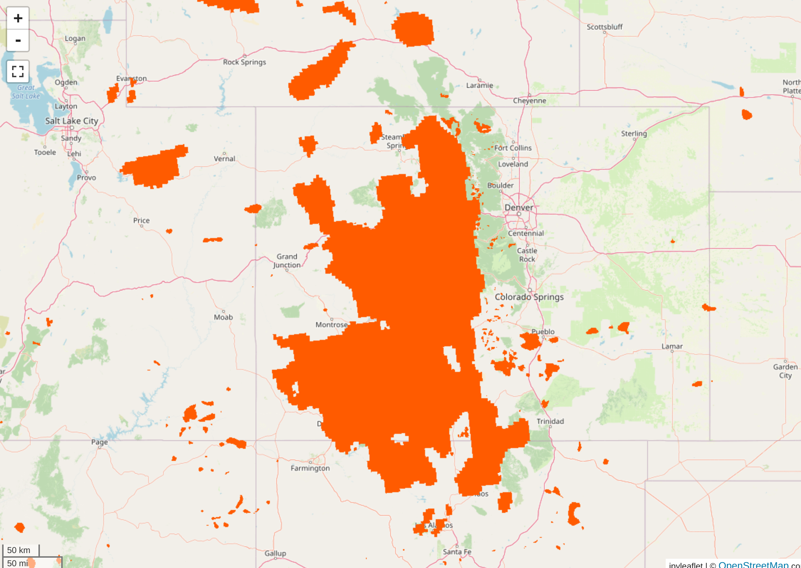
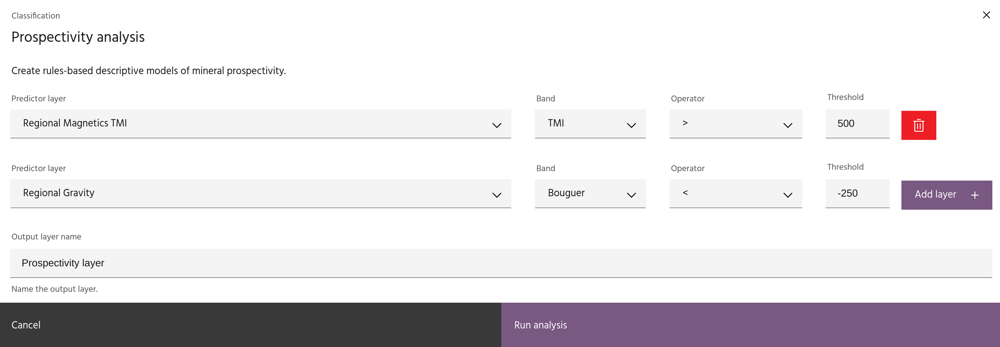

## Prospectivity analysis

The **Prospectivity analysis** dialog allows you to create a binary layer from
rules based on previously created layers.

### **Usage**

The prospectivity analysis dialog allows you to choose a layer, band, and rule
from all available raster layers and bands in your project. After defining a
rule for one layer and band, click `Add layer` to add another rule.

<!-- prettier-ignore-start -->

!!! warning
    Any number of layer/band combinations can be used to create rules, and no checks
    are made to ensure rules don't contradict each other.

<!-- prettier-ignore-end -->

When you have created all of your desired rules, click `Run analysis` to create
the prospectivity layer.

--8<-- "snippets/contact-footer.md"
