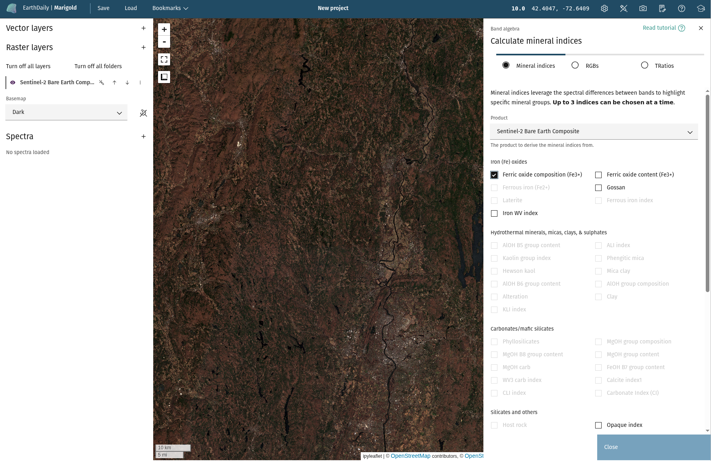
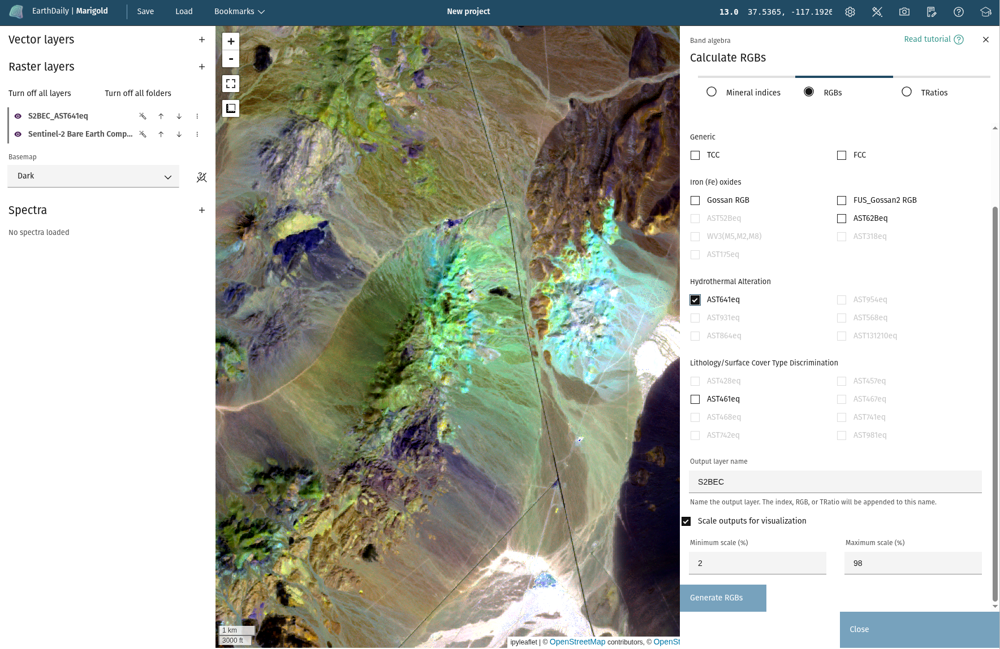

## Rapid mapping outputs

The **Rapid mapping outputs** tool builds on the [Mineral indices](mineral-indices.md) tool to
provide convenient presets that can be used to highlight specific mineral groups,
RBG layers, and TRatios for interpretation or classification alongside
other data derivatives.

<!-- prettier-ignore-start -->

!!! Tip
    More information on RGBs for Sentinel-2 can be found [here](https://custom-scripts.sentinel-hub.com/custom-scripts/sentinel-2/composites/).

<!-- prettier-ignore-end -->

**Usage:**

- Choose an available product from the **Product** dropdown menu. This menu
  includes the raster layers you've added to your session that have spectral
  bands.

<!-- prettier-ignore-start -->

!!! warning

    Hyperspectral data will be approximations. Indices will be available if the dataset contans a band that is less than 50nm from the target reference band, but there still may be differences in the output indices, since the indices were developed using different datasets.

<!-- prettier-ignore-end -->

- At the top, toggle between **Mineral indices**, **RGBs**, and **TRatios**. For each given type, you can select up to 3 indices to add as a separate layer to your map.

<!-- prettier-ignore-start -->

!!! note
    Not all indices will be available for all products. For example, the Sentinel-2
    Bare Earth Composite only has `swir1` and `swir2` shortwave infrared bands, so
    any index that requires another SWIR band will not be available for output from
    that product.
    
!!! note
    You will be taken to the **Mineral indices** page by default, but can access the other types of indices
    using the toggle button at the top.

<!-- prettier-ignore-end -->

- Once up to 3 indices have been chosen, select an output name, which will be included
  along with the name of the index for each product. Optionally, output layers may be
  scaled with a linear contrast stretch (similar to using the magic wand autoscale button)
  to aid in visualization. While the typical linear stretch goes between the 2nd and 98th
  percentile, you may choose to stretch these at different percentages. Click the **Generate indices** button to generate the selected indices.

--8<-- "snippets/contact-footer.md"
