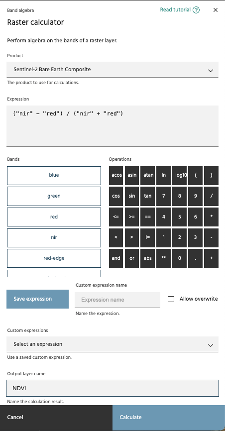
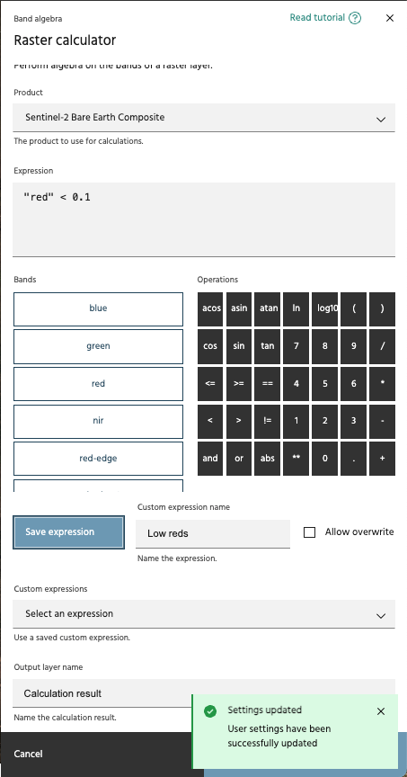
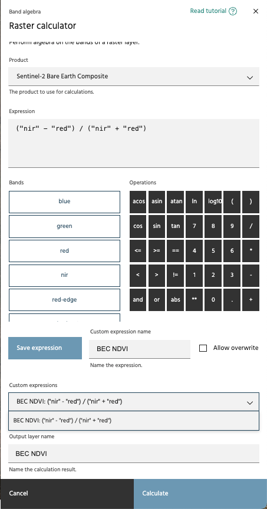

## Raster calculator

The **Raster calculator** executes mathematical expressions from bands and
arithmetic operators.

**Usage:**

- Click the **Raster calculator** link in the **Processing toolbox** dropdown
  menu.
- Choose an available product from the **Product** dropdown menu. This menu
  includes all the raster layers you've added to your session.

<!-- prettier-ignore-start -->

!!! Tip
    To select bands from different products, first use the
    [Merge layers](merge-layers.md) tool.

<!-- prettier-ignore-end -->

- Use the **Operations** and **Bands** buttons to create the expression you'd
  like to execute, or type the expression directly into the Expression dialog
  box.

<!-- prettier-ignore-start -->

!!! Tip
    The **Raster calculator** follows Python syntax.

!!! Tip
    To create a binary mask using logical operators, use parentheses to separate
    each condition in the **Expression** dialog box.

<!-- prettier-ignore-end -->

- If this is a common expression you may use again, you can save the expression
  with a given name. Unless the **Allow overwrite** box is checked, you cannot
  overwrite expression names.

<!-- prettier-ignore-start -->

!!! Tip
    Expressions will follow band names, so it may be useful to name something
    like "BEC NDVI" or "EnMAP NDVI". 

!!! Tip
    By default, expressions cannot be overwritten. If you would like to overwrite
    a name, select the **Allow overwrite** button.

<!-- prettier-ignore-end -->

- If you would like to use a previously saved expression, select it from the dropdown.
  The expression will populate within the expression window, so you can still edit it
  before applying, if desired.

<!-- prettier-ignore-start -->

!!! Tip
    Custom expressions can be deleted in the [Settings](../header.md#user-settings) dialog.

<!-- prettier-ignore-end -->

- Name the output layer by typing it into the **Output layer** name field.
  Examples include "NIR-R/NIR+R", "NDVI", and "S2 NDVI". If you using a
  saved expression, that name will be automatically populated here, though
  you can still overwrite it. After clicking `Calculate`, the new output
  will be added to the **Raster layers** index on the left side of the
  Marigold user interface.

--8<-- "snippets/contact-footer.md"
