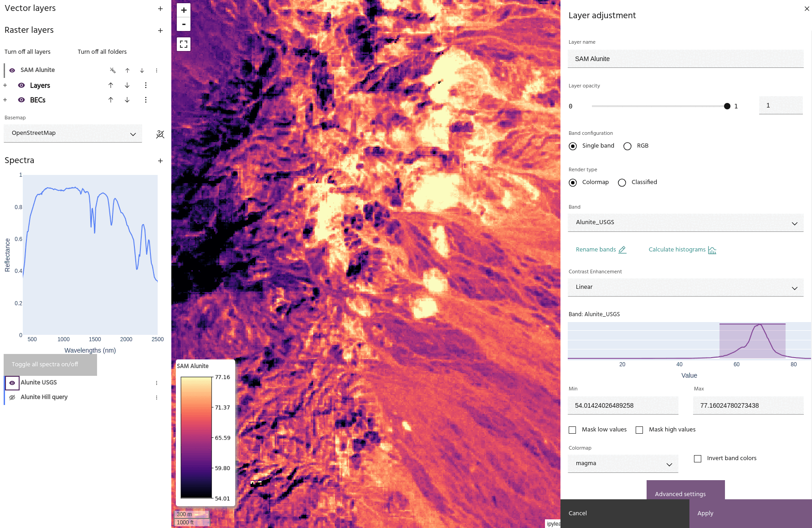

## Spectral angle mapper

The **Spectral angle mapper** can be used to find other areas of an
image that match a given spectrum. The spectrum can be drawn from either
[spectra](../spectra/index.md) previously added to the project, or a
spectrum can be computed on the fly using a
[vector layer](../vector-layers/index.md). The algorithm measures spectral
similarity by calculating the angle between the input raster dataset and
the targets, also known as
[cosine similiarity](https://en.wikipedia.org/wiki/Cosine_similarity).

<!-- prettier-ignore-start -->
!!! note
    For spectral input layers, using a vector layer as input is equivalent
    to [computing a spectrum from the vector](../spectra/spectra-vector.md)
    and using that spectrum as the target.
<!-- prettier-ignore-end -->

The above image shows two SAM results on the Fused Bare Earth Composite in
the Cuprite region of Nevada, with a goal of mapping Alunite. One result
comes from an Alunite spectrum from the [USGS library](../spectra/spectra-library.md),
and the other comes from a [spectral query](../spectra/spectra-query.md) on a
known Alunite area. Notice how the scores from the library spectrum are lower
than those coming from the data directly, but both results show the same trend.

<!-- prettier-ignore-start -->
!!! note
    Spectra will be automatically resampled to the data wavelengths if necessary.
<!-- prettier-ignore-end -->

### **Usage**

The spectral angle mapper dialog allows you to choose the
[raster layer](index.md#selecting-a-product) and [bands](index.md#selecting-bands)
to use as input data, and [vector](index.md#selecting-an-aoi) and
[spectra](index.md#selecting-spectra) to use as targets. Choose a name
for the output layer and select `Run SAM` to create the output in the
raster list. The output layer will have one band per chosen target.

<!-- prettier-ignore-start -->
!!! note
    Non-spectral input data will only allow vector targets.
<!-- prettier-ignore-end -->

--8<-- "snippets/contact-footer.md"
