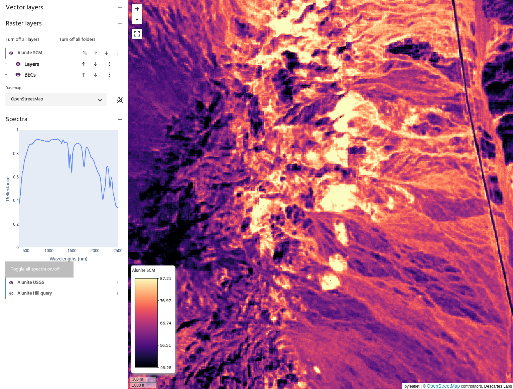

# Spectral correlation mapper

The **Spectral correlation mapper** (SCM) is an extension of
[spectral angle mapper](sam.md) that better discriminate between positive
and negative correlations. The algorithm uses the Pearsonian correlation
coefficient to compute the correlation angle between the input layer
and the chosen spectral targets.

<!-- prettier-ignore-start -->
!!! tip
    A detailed explanation and motivation for SCM, with an application for
    crop mapping, can be found [here](https://arxiv.org/pdf/1509.05767).
<!-- prettier-ignore-end -->

## Usage

The spectral correlation mapper dialog allows you to choose the
[raster layer](index.md#selecting-a-product) and [bands](index.md#selecting-bands)
to use as input data, and [vector](index.md#selecting-an-aoi) and
[spectra](index.md#selecting-spectra) to use as targets. Choose a name
for the output layer and select `Run SCM` to create the output in the
raster list. The output layer will have one band per chosen target.

<!-- prettier-ignore-start -->
!!! note
    Non-spectral input data will only allow vector targets.
<!-- prettier-ignore-end -->

--8<-- "snippets/contact-footer.md"
