# UMAP

The **UMAP dimensionality reduction** tool offers a workflow for dimensionality
reduction and clustering that is particularly useful for high dimensional data,
such as hyperspectral images. The tool uses UMAP (Uniform Manifold Approximation
and Projection) to reduce the dimensionality of the data, followed by
HDBSCAN (Heirarchical Density Based Spatial Clustering of Applications
with Noise).

<!-- prettier-ignore-start -->
!!! warning
    UMAP requires access to [Compute](https://docs.earthone.earthdaily.com/guides/compute.html).

!!! tip
    Mathematical details for both UMAP and HDBSCAN can be found in the
    original papers: [UMAP](https://arxiv.org/pdf/1802.03426) and
    [HDBSCAN](https://link.springer.com/chapter/10.1007/978-3-642-37456-2_14).
<!-- prettier-ignore-end -->

## Selecting data

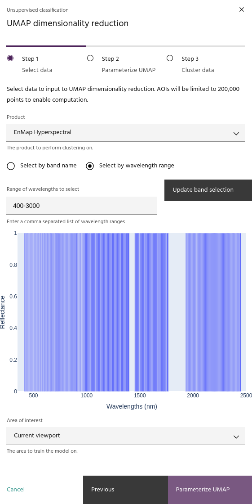

The UMAP dialog is broken into three steps. The first step allows you to
select the [product](index.md#selecting-a-product), [bands](index.md#selecting-bands)
and [AOI](index.md#selecting-an-aoi) for analysis. When you have selected
the data you want to analyze, click `Parameterize UMAP` to move to the
next step.

<!-- prettier-ignore-start -->
!!! warning
    Selected data cannot have any fully masked bands. If necessary, use the
    [data statistical analysis](data-stats.md) tool to clean data before running
    UMAP.

!!! note
    Data will be limited to 50,000 points to manage runtimes.
<!-- prettier-ignore-end -->

## Parameterize UMAP

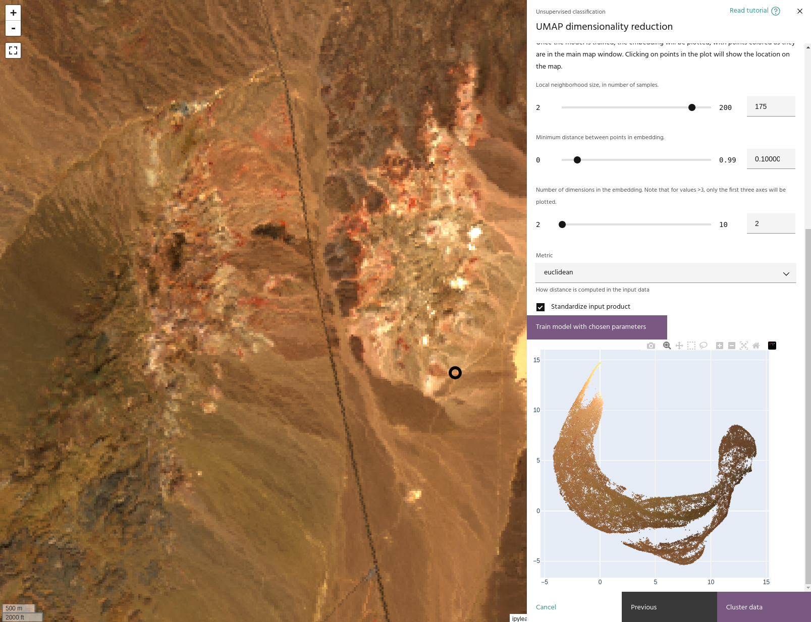

UMAP works by computing a manifold of the input data and projecting that manifold
to a lower dimensional space. Parameterizing UMAP, therefore, involves determining
how that manifold is built (the [neighborhood size](#local-neighborhood-size) and
[distance metric](#metric) used), how many [dimensions](#number-of-dimensions) to
use in the projection, and how [clustered](#minimum-distance) the low dimensional
projection is. The second step of the dialog allows manipulation of these parameters
and provides a plot of the embedding for analysis. When you have set parameters to your satisfaction, click `Train model with chosen parameters` to train the model and generate
a plot of the embedding, and when you are satisfied with your model click `Cluster data`
to move to the [clustering](#cluster-data) step.

<!-- prettier-ignore-start -->
!!! tip
    More details on parameters can be found
    [here](https://umap-learn.readthedocs.io/en/latest/parameters.html)

!!! tip
    Points in the embedding plot will be colored according to the colors of the layer
    on the map. Clicking on a point in the plot will show its location on the map.

!!! note
    The first time training a model with a given choice of [metric](#metric), the
    K nearest neighbors will be computed and stored. This enables faster parameter
    testing, without needing to run this step each time.
<!-- prettier-ignore-end -->

### Local neighborhood size

The number of points that UMAP will use when building the data manifold. This
parameter allows a balance between local and global structure of the data in the
embedding - low values will focus on local structure, and large values will focus
on global structure.

### Minimum distance

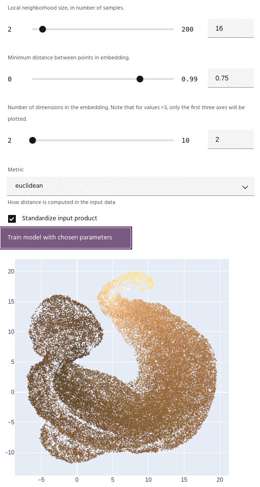

The minimum distance between points in the final embedding. Lower values will create
a clumpier embedding, while larger values will spread points farther apart.

<!-- prettier-ignore-start -->
!!! tip
    This parameter has a strong effect on the number of [clusters](#cluster-data)
    generated - small values tend to create fewer large clusters, and large
    values create more small clusters.
<!-- prettier-ignore-end -->

### Number of dimensions

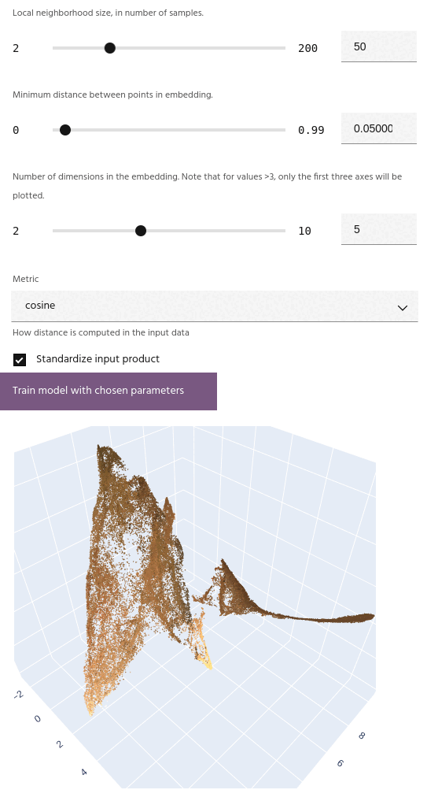

Number of dimensions for the embedding. Unlike simpler embedding algorithms
such as T-SNE, UMAP can successfully embed into more than three dimensions.

<!-- prettier-ignore-start -->
!!! note
    If the number of dimensions is greater than 3, the embedding plot will show
    the first three axes.
<!-- prettier-ignore-end -->

### Metric

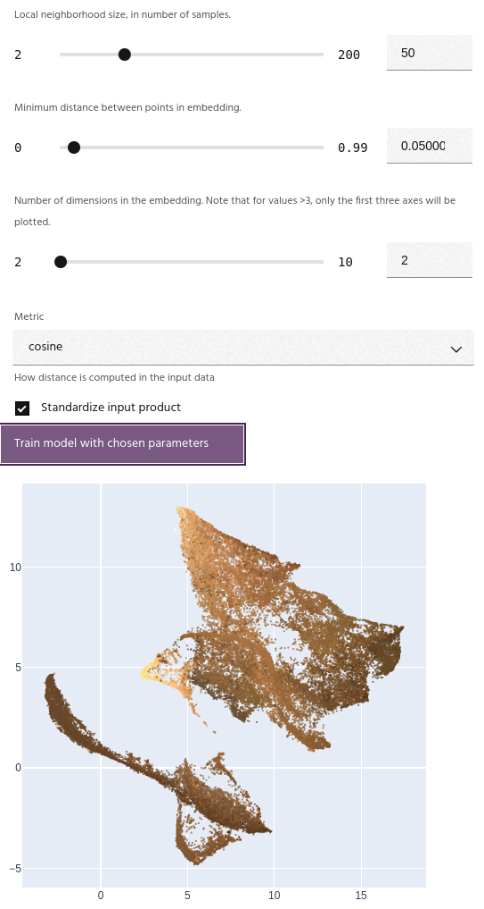

The metric for computing distances in the input data. Available metrics are:

- [Euclidean](https://en.wikipedia.org/wiki/Euclidean_distance): Simple Euclidean
  distance between points.
- [Manhattan](https://en.wikipedia.org/wiki/Taxicab_geometry): Manhattan, or
  "Taxi cab" distance, measures the sum of the distance along each axis.
- [Chebyshev](https://en.wikipedia.org/wiki/Chebyshev_distance): The Chebyshev
  metric defines the distance between points as the greatest of their differences
  along any axis.
- [Cosine](https://en.wikipedia.org/wiki/Cosine_similarity): Cosine distance
  is the cosine of the angle between the vectors.
- [Correlation](https://en.wikipedia.org/wiki/Distance_correlation): Correlation
  distance between the vectors, measuring the dependence between them.

<!-- prettier-ignore-start -->
!!! tip
    Euclidean, Manhattan, and Chebyshev distances can easily be visualized by their
    behavior on a chess board. Chebyshev distance corresponds to the number of moves
    a King makes getting from one square to the other, Manhattan distance behaves
    like a Rook, and Euclidean distance is an ant moving without regard for the
    board:

    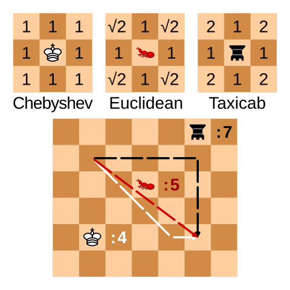
<!-- prettier-ignore-end -->

### Embeddings plot

After training a model, the embedding will be plotted on either a 2D or 3D scatterplot,
depending on the choice of [dimension](#number-of-dimensions). Points on the plot
will be colored the same as they are on the map, and clicking on plotted point will
show the location on the map in a [vector layer](../vector-layers/index.md) called
`selected points`.

<!-- prettier-ignore-start -->
!!! note
    The axes for the embedding are dimensionless, and simply represent a new spatial
    position for the input points relative to all of the others.
<!-- prettier-ignore-end -->

## Cluster data

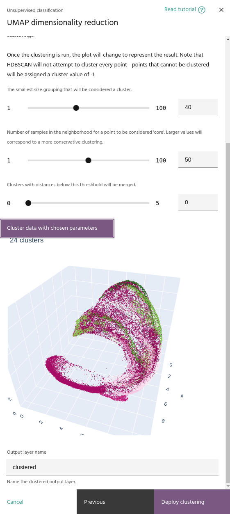

Once the low dimensional manifold is built, the UMAP tool uses HDBSCAN to cluster
the data in an unsupervised manner. HDBSCAN is a better clustering algorithm than
[k-means](k-means.md) for the unique shapes that are generated with UMAP, as it
can find clusters with varied shapes, whereas k-means builds clusters as balls.
Use the `Cluster data with chosen parameters` button to run the clustering on your
embedded data.

<!-- prettier-ignore-start -->
!!! tip
    HDBSCAN will not attempt to cluster outlier points, and will instead classify
    them separately as noise.

!!! tip
    When you run a clustering, the [embeddings plot](#embeddings-plot) will change
    to show the clusters instead of the pixel RGBs.
<!-- prettier-ignore-end -->

### Minimum cluster size

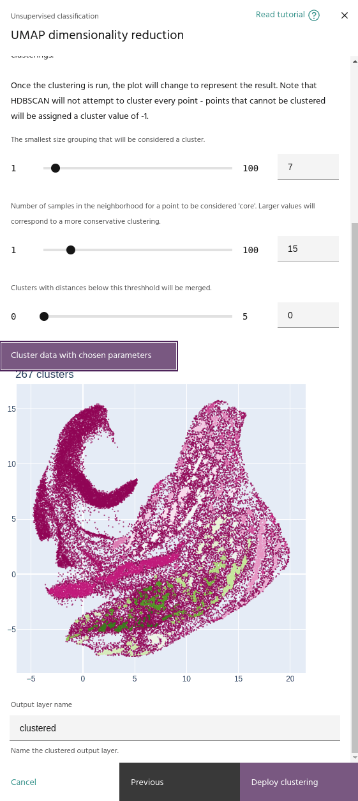

The smallest number of points that can be considered a cluster. Lower values tend to
create more clusters.

### Minimum number of samples

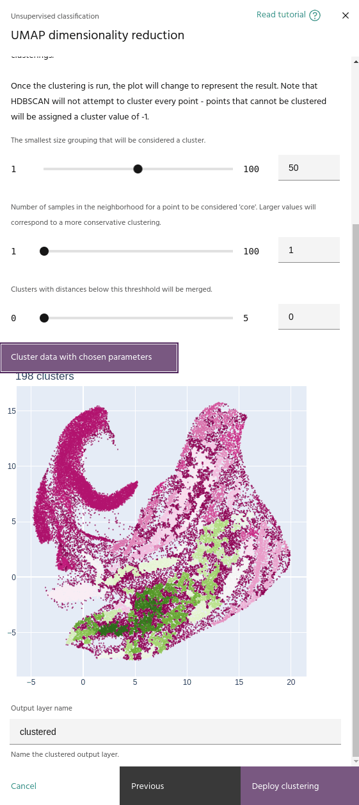

The minimum number of samples in the neighborhood of a point for it to be considered
a "core" sample, and therefore considered for clustering instead of noise.

### Cluster selection epsilon

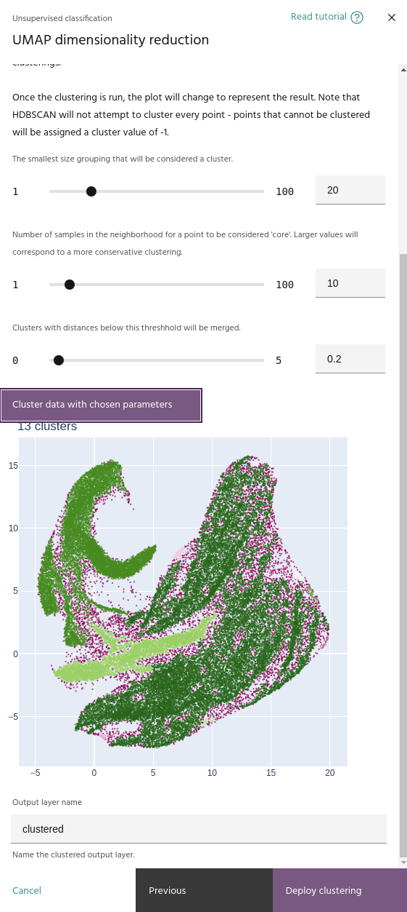

This parameter merges clusters that are closer than this value. This will help
if your clustering contains a large number of small, nearby clusters.

### Deploy clustering

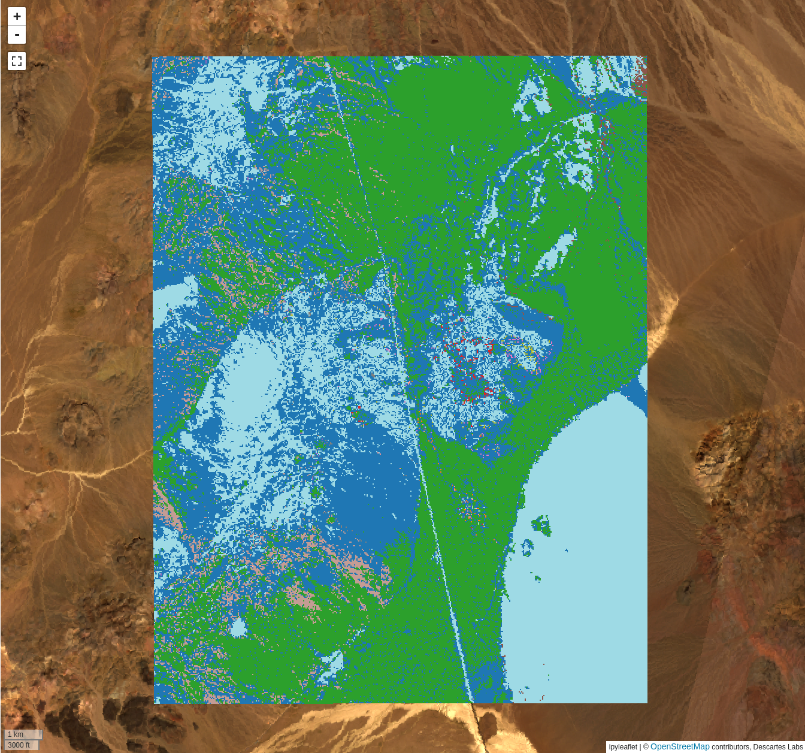

When you are happy with the clustering parameters, click the `Deploy clustering`.
This will deploy a [Compute](https://docs.earthone.earthdaily.com/guides/compute.html)
function that will apply the UMAP and HDBSCAN models over your chosen AOI, and
add the result to the map.

<!-- prettier-ignore-start -->
!!! tip
    Progress on the Compute task can be found [here](https://earthone.earthdaily.com/compute).

!!! note
    Images for the clustered result will appear on the map as they are completed, but
    you may need to override the map's cache to see the latest images. This can be
    accomplished by moving around the map, or changing the settings of the layer.

!!! warning
    Only the AOI where data were [selected](#selecting-data) will be clustered.
    As the models are build using these data, applying the models to areas outside this
    AOI is not valid.
<!-- prettier-ignore-end -->

--8<-- "snippets/contact-footer.md"
