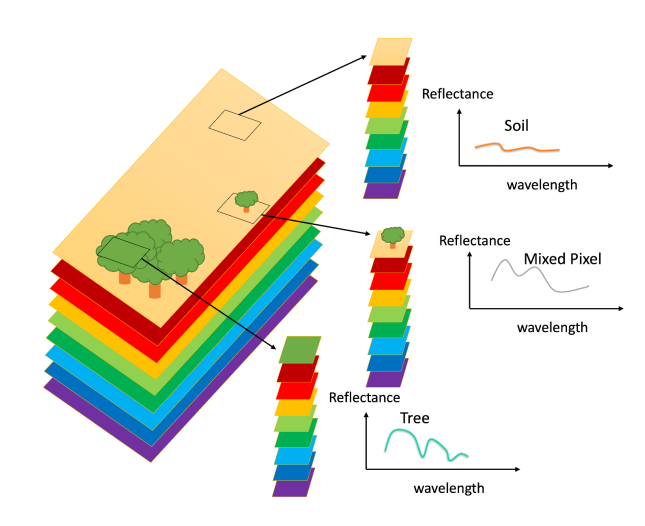
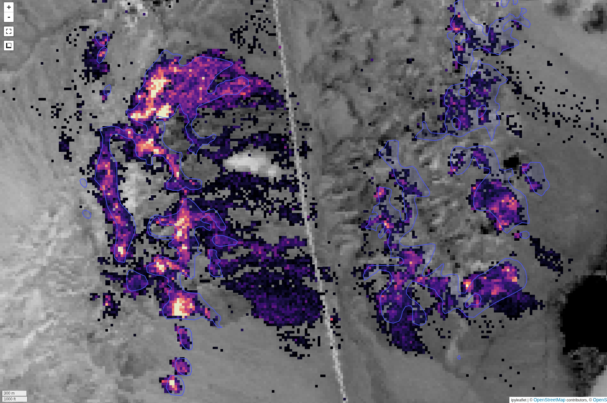
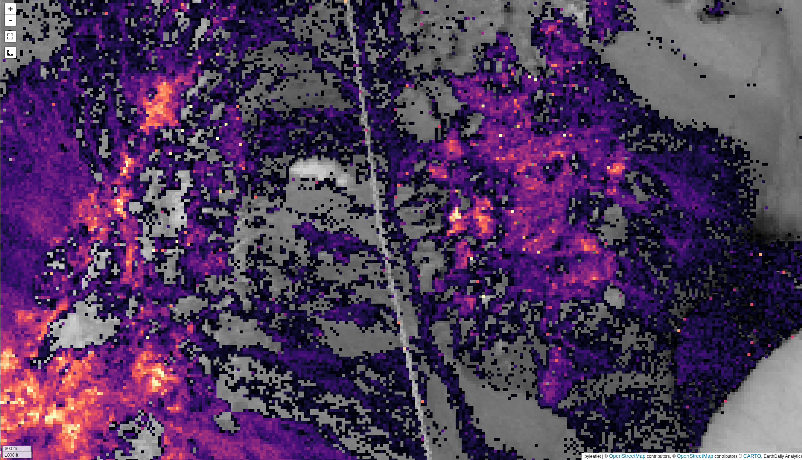
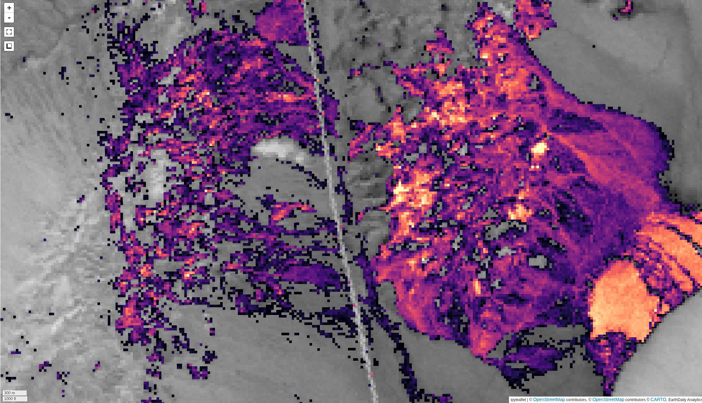
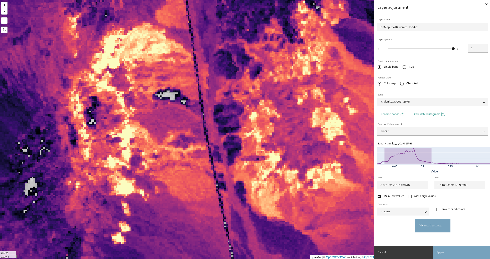
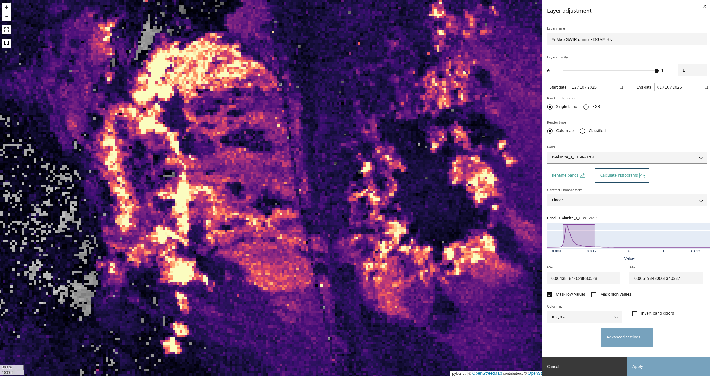
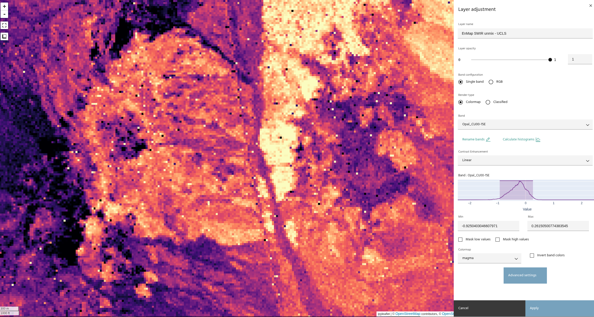
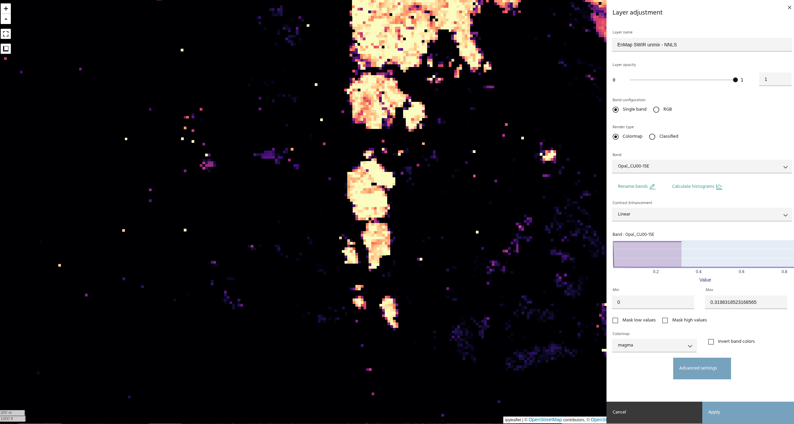

## Spectral unmixing

The **Spectral unmixing** tool is used to separate an image into its component
spectra. The user selects a set of [spectra](../spectra/index.md), termed
"endmembers", from the project, and the chosen algorithm will generate abundance
maps for each spectrum. These maps represent the contribution of each endmember
to the input pixel.

<!-- prettier-ignore-start -->
!!! warning
    Unmixing requires access to 
    [Compute](https://docs.earthone.earthdaily.com/guides/compute.html).
<!-- prettier-ignore-end -->

### **Background**

Depending on the resolution of the data, most of the pixels in a remote sensing image
will be "mixed," meaning they contain information from several different materials. The
spectrum of the resulting pixel can be represented as a weighted sum of the spectra for
all materials present in the pixel, with the weights representing the proportion of each
material. Unmixing, then, is the process of recovering the weights given an image and a
set of endmember spectra. The image above, from
[here](https://hal.science/hal-04180307v1/file/GRSM_HySUPP.pdf), shows a simple example
of pure versus mixed pixels.

<!-- prettier-ignore-start -->
!!! tip
    Proper selection of endmember spectra is the most important step of the unmixing process.
<!-- prettier-ignore-end -->

### **Selecting data**

The unmixing dialog allows you to choose the [raster layer](index.md#selecting-a-product)
and [bands](index.md#selecting-bands) to use as input data, and
[spectra](index.md#selecting-spectra) to use as endmembers.

<!-- prettier-ignore-start -->
!!! note
    Spectra will be automatically resampled to the data wavelengths if necessary.
<!-- prettier-ignore-end -->

### **Output layer**

The output layer that is generated will have one band per endmember spectrum, representing
the relative abundance for each endmember. The above image shows an example output from the
Cuprite region for Alunite, compared with an interpretation from ground truth data (ground
truth from [here](https://pubs.usgs.gov/publication/70196084))

In addition, an error band is generated, representing the RMS error between the input image
and the image as reconstructed by the abundance maps.

### **Unmixing parameters**

Several parameters are available to control the unmixing process.

### Method

#### Least squares

Solve the mixture problem via a least-squares optimization. Background for this method
is available [here](https://ieeexplore.ieee.org/document/911111).

#### Distance geometry-based

Utilizes a geometry-based restating of the unmixing problem. Background is available
[here](https://ieeexplore.ieee.org/document/6495715)

### Hull normalization

Applies a hull normalization process to the data and spectra before unmixing. This is
useful for matching the shapes of the spectra, without concern for amplitudes.

The images above compare unmixing without (top) and with (bottom) hull normalization.
Note that the results have similar trends, with a much tighter histogram on the
normalized data.

### Constraints

Two constraints for the solution are available:

- Non-negativity: Ensures that all abundance maps are strictly positive
- Sum-to-one: Ensures that the abundance maps all sum to one. This allows a physical
  interpretation of the abundance maps as true mixture percentages.

These images show the difference between an unconstrained least squares and the
non-negativity constraint.

<!-- prettier-ignore-start -->
!!! note
    Constraints are not selectable with Distance geometry-based unmixing, as the
    constraints are built into the method.
<!-- prettier-ignore-end -->

--8<-- "snippets/contact-footer.md"
