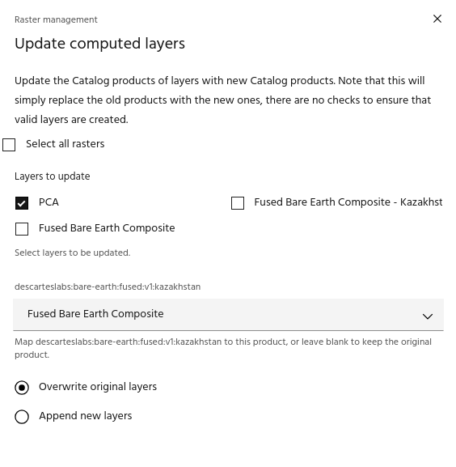

## Update computed layers

The **Update computed layers** tool can be used to replace the input catalog
layer after running it through a series of processes in Marigold. For example,
if a mineral map was created using a local dataset, this tool can be used to
re-run the process when a global dataset is available.

### **Usage**

The update computed layers dialog allows you to select raster layers that are in
your project. When a layer is selected, a new dropdown will be created for each
[Catalog](https://docs.earthone.earthdaily.com/guides/catalog.html) product that is
used in the layer. Select a replacement Catalog product for each input product
if desired, or leave the dropdown blank to keep that product the same in the
final result. Select whether to overwrite the initial layers, or if new layers
should be created and added to the raster list, and click `Update layers` to
update the layers.

<!-- prettier-ignore-start -->

!!! warning
    In theory, this tool can be used to replace any Catalog product with any other,
    with no restrictions specified. However, most processes will access specific
    components of the product, such as band names, and if these are not available in
    the replacement product the output layer may be invalid.

<!-- prettier-ignore-end -->

--8<-- "snippets/contact-footer.md"
