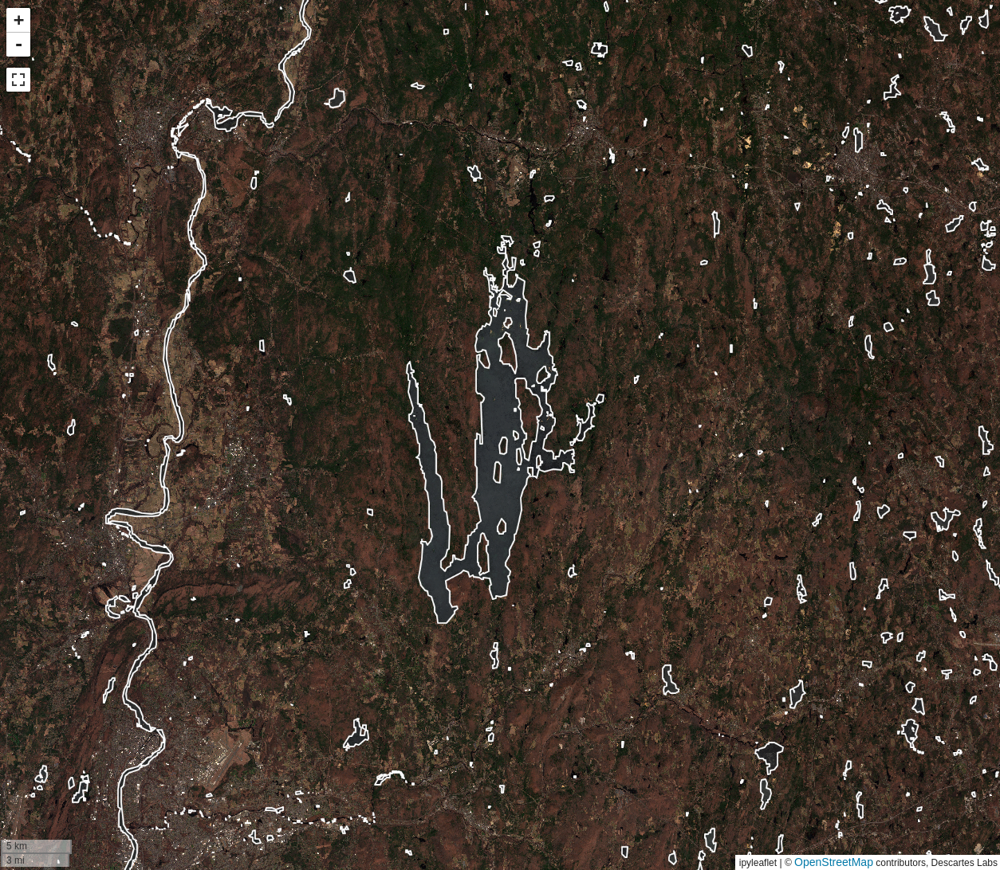
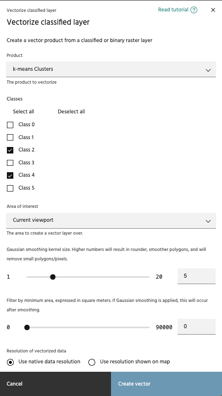
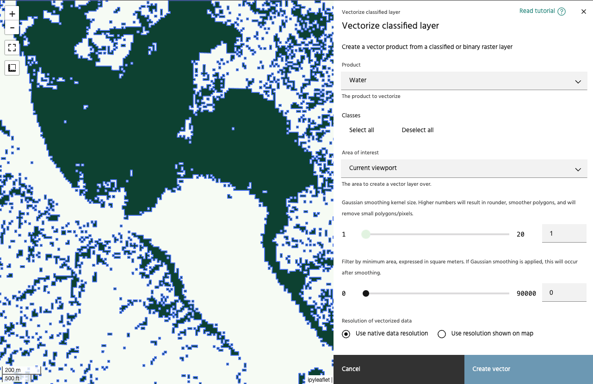

# Vectorize classified layer

The **Vectorize classified layer** tool is used to generate a
[vector layer](../vector-layers/index.md) from a binary or classified raster
layer. The operation will generate a vector that corresponds to either the
selected classes or the `True` values of a binary layer.

## Usage

### Select product and classes

The vectorize classified layer tool allows you to select a binary or classified
layer from your raster layers, then select the classes for which vectors will be
generated.

<!-- prettier-ignore-start -->

!!! note
    Only binary and classified layers will appear in the Product dropdown.

<!-- prettier-ignore-end -->

### Select an AOI

Select the AOI over which vectors will be generated. Note that unlike most
Marigold tools, this tool will not generate the vectors dynamically as you move
the map around - vectors will only exist within this chosen AOI.

### Smooth output polygons

Gaussian smoothing can be applied to the data before vectoring. Higher numbers will create a larger smoothing kernel, which will create smoother polygons, and remove smaller polygons that you may be interpretting as noise.

### Minimum area

Use this slider to adjust the minimum size for the generated vectors. The minimum and
maximum values of the slider will change based on the resolution of the data selected,
and will be from 1x1 pixel to 10x10 pixels. If Gaussian smoothing is applied, size filters will be applied following the smoothing process.

<!-- prettier-ignore-start -->

!!! warning
    Using a small value for minimum area can generate a lot of vectors, which will
    degrade performance when displayed.

<!-- prettier-ignore-end -->

### Vectorized data resolution

Choose whether to compute the resolution of the vectorized data from the map view, or
to use the resolution of the underlying data.

<!-- prettier-ignore-start -->

!!! note
    The map's resolution is based on the zoom level currently viewed, meaning that your
    vectorization results will change when the process is run for two different zoom levels.

<!-- prettier-ignore-end -->

--8<-- "snippets/contact-footer.md"
