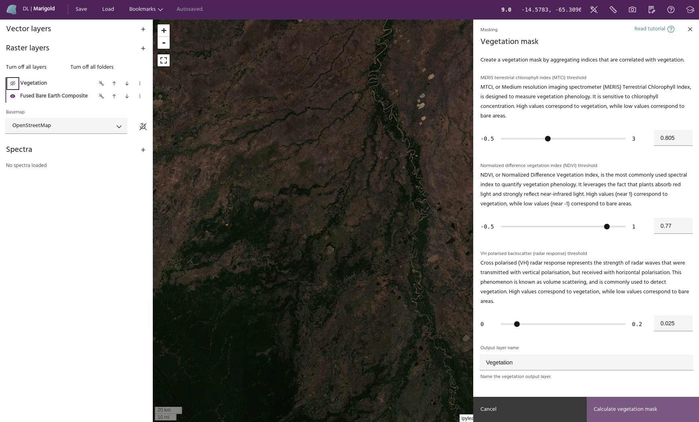

## Vegetation mask

The **Vegetation mask** tool is used to identify and mask out vegetation in a
layer when you do not want to consider vegetated areas in your analysis.
Creating a vegetation mask is often one of the first steps in a mineral
exploration workflow as vegetation conceals the underlying geology.

### **Usage**

- Use the **MERIS terrestrial chlorophyll index (MTCI) threshold** slider in the
  preview pane to detect and mask out healthy vegetation. The lower the value,
  the more vegetation will be masked out.
- Use the **Normalized difference vegetation index (NDVI)** threshold slider to
  accentuate differences between reflected near infrared (NIR) light, which
  plants generally don't absorb, and red light, which plants generally do absorb
  as a source of energy and photosynthesis. Because vegetation produces a high
  NDVI value and bare areas produce a low value, setting a low threshold value
  mask out more vegetation.
- Use the **VH cross polarized backscatter (radar response) threshold** slider
  to take advantage of a phenomenon called deep polarization that occurs when
  radar waves hit vegetation. As with the other indices, a low threshold setting
  will mask out more areas and a high threshold will mask out fewer areas.
- To save your vegetation mask, click the **Calculate vegetation mask** button
  at the bottom of the preview pane. The mask will now be available to apply to
  a layer using the [Apply a mask](apply-a-mask.md) tool.

<!-- prettier-ignore-start -->

!!! Tip
    As you adjust the threshold sliders, at least two out of three of the indices
    must agree that a given pixel is vegetation for it to be marked as such in the
    output mask.

<!-- prettier-ignore-end -->

--8<-- "snippets/contact-footer.md"
