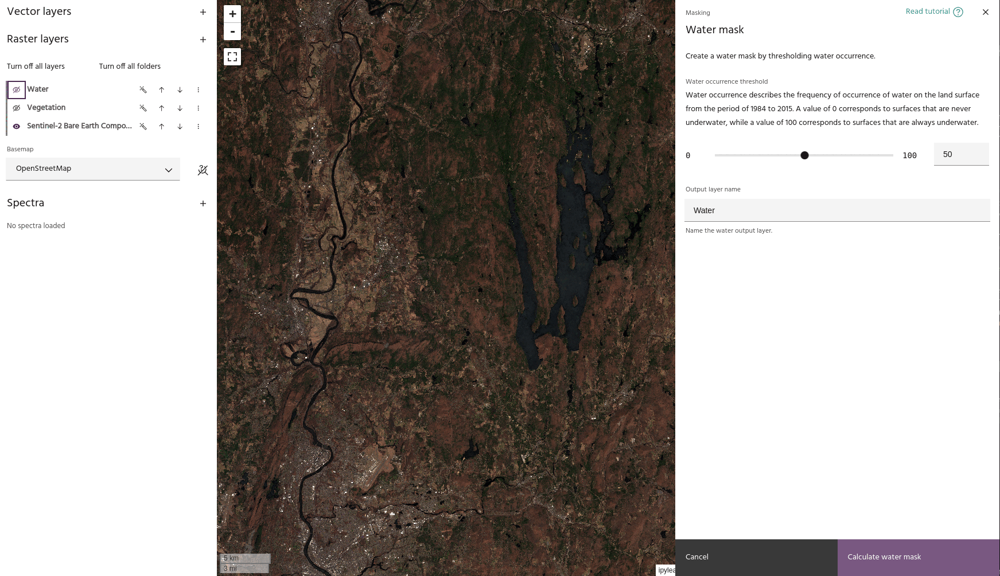

## Water mask

The **Water mask** tool is used to identify and mask out water in a layer when
you do not want to consider areas under water in your analysis.

### **Usage**

- Use the single slider to select the frequency of scenes for which a pixel
  marked as water must have water in it. A low value, such as 10, will reveal
  many pixels marked as water, compared to a higher value, such as 90.

<!-- prettier-ignore-start -->

!!! Tip
    The **Water mask** tool uses a method that describes the frequency of water
    occurrence on a land surface from the period of 1984 to 2015. A value of 0
    corresponds to surfaces that are never under water, while a value of 100
    corresponds to surfaces that are always under water. To create your own water
    mask based on different dataset(s) or methods, use the
    [Raster calculator](raster-calculator.md) tool.

<!-- prettier-ignore-end -->

- When you set a value that you like, click the **Calculate water mask** button
  to save your water mask in the **Raster layers** dropdown menu. The mask will
  now be available to apply to a layer using the [Apply a mask](apply-a-mask.md)
  tool.

<!-- prettier-ignore-start -->

!!! Tip
    Using the settings dialog of a mask layer, you can
    [hide low values](../raster-layers/layer-settings.md#extrema-masking) to show
    only the areas identified as water.

<!-- prettier-ignore-end -->

--8<-- "snippets/contact-footer.md"
