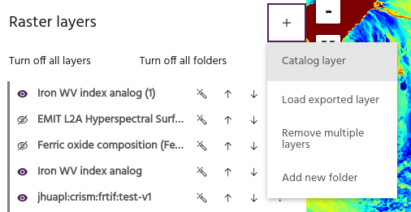
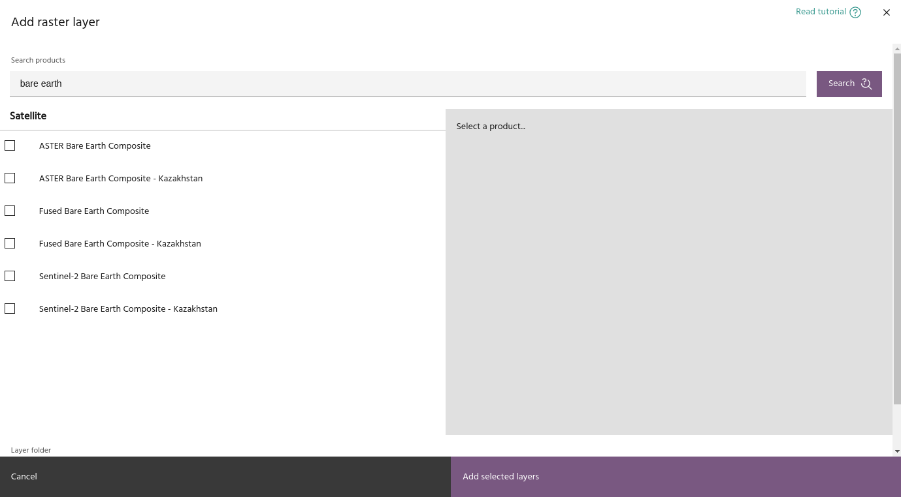
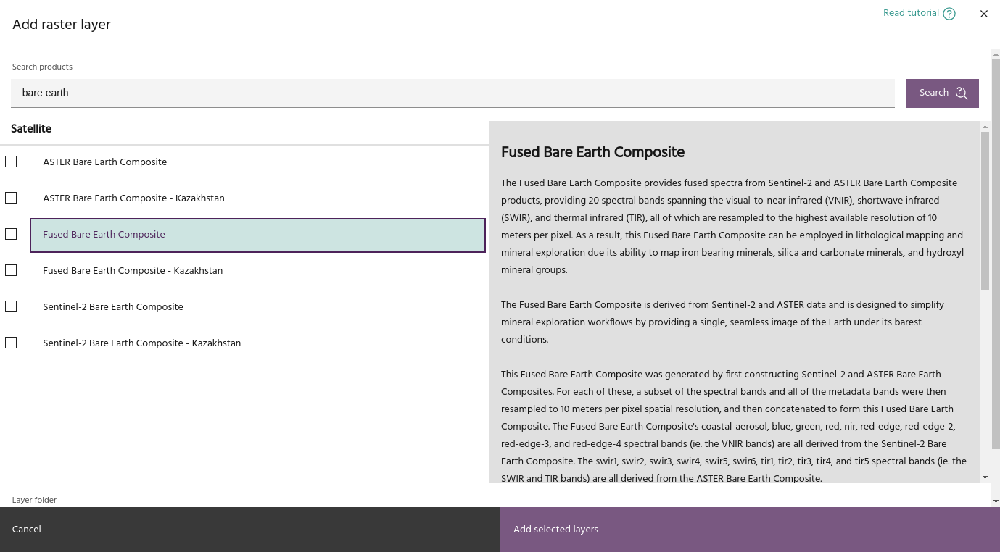
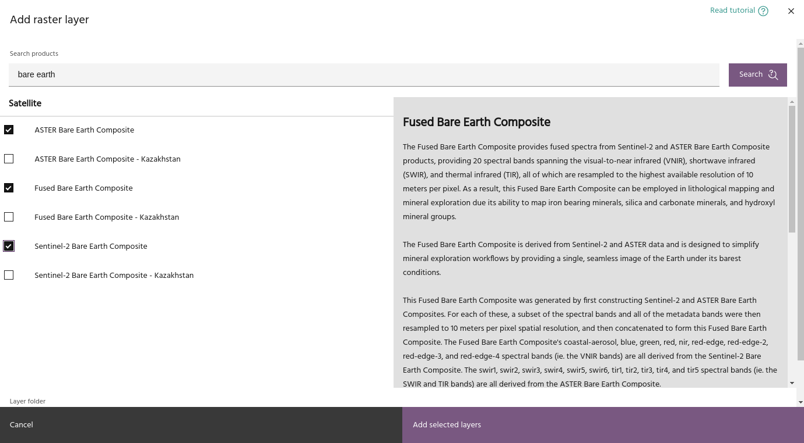
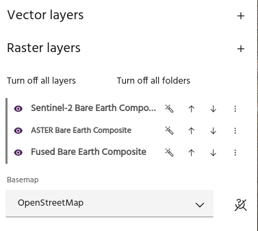
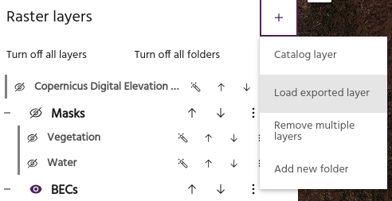
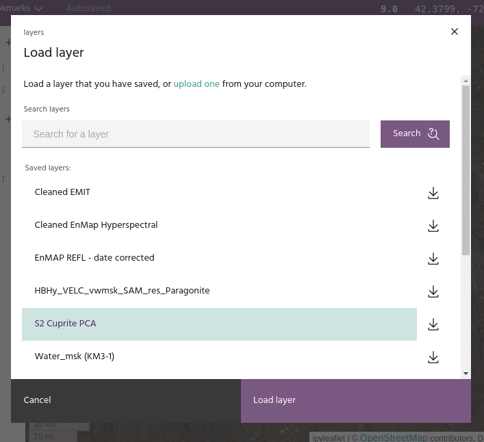

## Add raster layers to a Marigold project

### **Add a raster layer from the Catalog**

Click the plus sign next to **Raster layers** and select **Catalog layer** to
add a layer from Catalog. Note that a layer needs to have a `marigold` tag to be
visible to this dialog, contact [support](mailto:support@earthdaily.com) for
assistance with correctly loading data.

Catalog products will be organized by type for layers where such information is
available, and can easily be searched using the bar at the top of the dialog.

Click on a name to display information about that layers.

Use the checkboxes to select the layers to add to the project.

<!-- prettier-ignore-start -->

!!! tip
    Select a [folder](folders.md) to automatically add all the layers to the folder.

<!-- prettier-ignore-end -->

Click `Add selected layers` to add the layers to the project.

### **Add an exported raster layer**

Layers that have been [exported](layer-export.md#export-a-layer-for-marigold)
from another Marigold project can be imported into new ones.

A dialog similar to the [load project](../save-and-load.md) dialog will load
with a list off all the layers available.

As in the load project dialog, layers can be downloaded and uploaded to and from
your local computer.

--8<-- "snippets/contact-footer.md"
