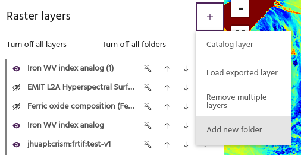
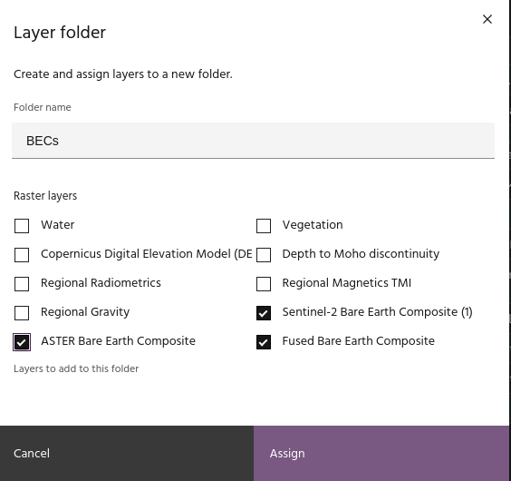
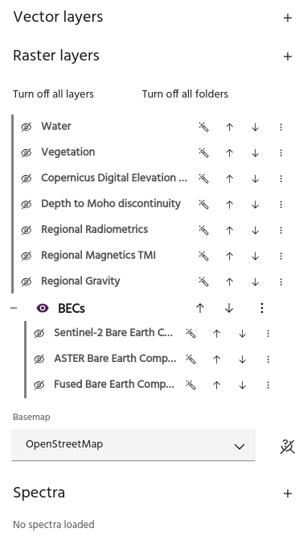
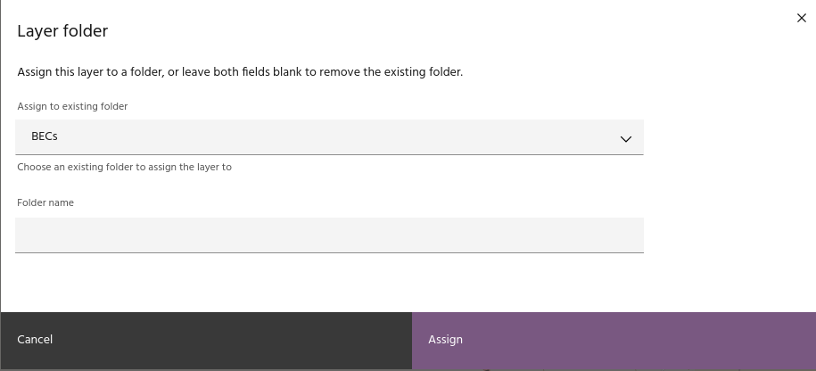
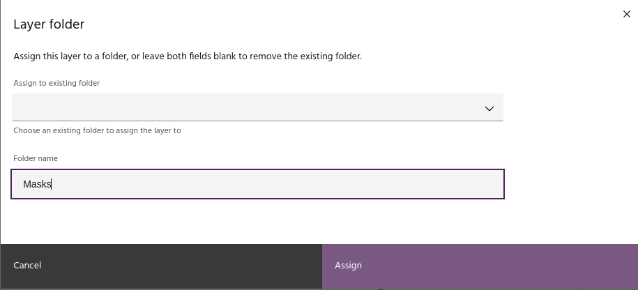
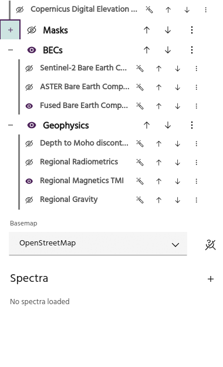
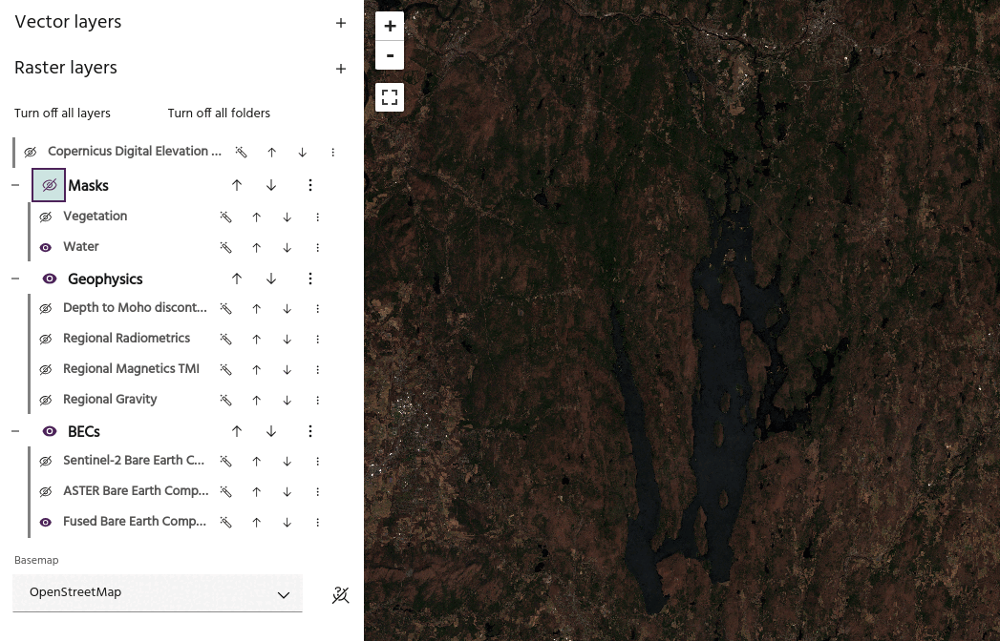
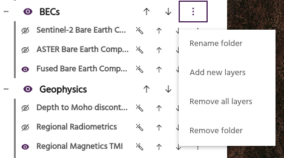
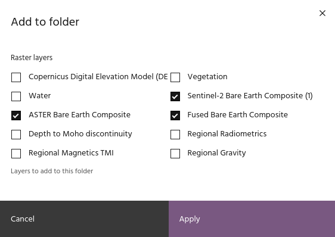

# Layer organization

For Marigold projects with many raster layers, folders offer a way to organize
layers in a natural way.

## Create a new folder and add existing layers

To create a folder in the project, select `Add new folder` from the Raster menu.

Give the folder a name and select the layers to add. Click `Apply` to add the
folder to the project with the selected layers.

<!-- prettier-ignore-start -->

!!! tip
    Layers without a folder will always appear "above" layers in folders.

<!-- prettier-ignore-end -->

## Add single layer to folder

The `Folder management` option of a layer is useful for adding or removing a
single layer from a folder.

Select an existing folder from the dropdown to add a layer to that folder.

Type the name of a new folder to create it and add this layer.

Or leave both fields blank to remove the layer from its current folder.

## Folder configuration

Configuring folders is similar to configuring
[individual layers](index.md#basic-layer-configuration).

### Expand and collapse layers

Use the plus/minus icon to show or hide the layers in the folder.

### Folder visibility

Use the eye icon to toggle visibility of the layers in the folder on and off.
When turning visibility off, the layers in the folder that are currently visible
will turn off.

<!-- prettier-ignore-start -->

!!! tip
    The visibility icon of the visible layers won't change when you turn off folder
    visibility, so you can easily identify which layers will be visible.

<!-- prettier-ignore-end -->

### Move layers

Use the up and down arrows to rearrange the folder order, thus rearranging all
of the layers inside the folders.

### Rename folder

Give the folder a new name.

### Add new layers

Add layers to this folder by checking the layers you want to add.

<!-- prettier-ignore-start -->

!!! tip
    Unchecking layers currently in the folder will remove them.

<!-- prettier-ignore-end -->

### Remove all layers

Remove all of the layers in this folder from the Marigold project.

<!-- prettier-ignore-start -->

!!! warning
    Layers that have been removed from the project will need to be added or created
    again!

<!-- prettier-ignore-end -->

### Remove folder

Remove the folder itself, keeping all of the layers in the project.

--8<-- "snippets/contact-footer.md"
