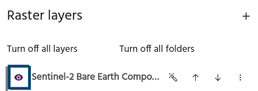
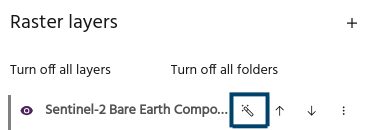
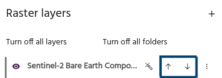
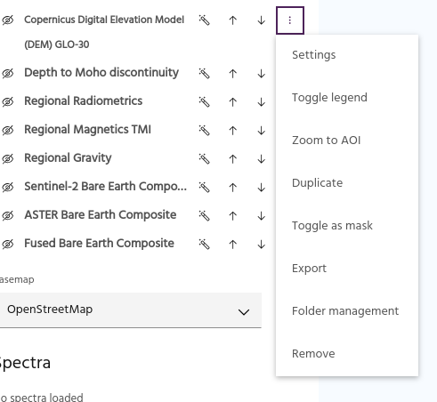
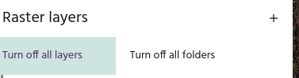
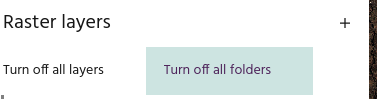
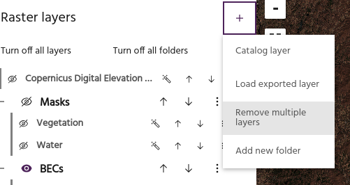
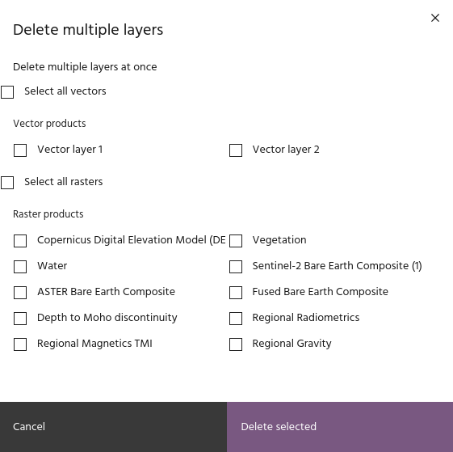

# Raster layers

Raster layers are the primary data object in a Marigold session. Add layers to
your maps and configure your layer settings using the **Raster layers** section
on the left side panel. Marigold will display layers "top down," meaning that
layers at the top of the list will appear above layers underneath.

## Add raster layers

Raster layers can be added from
[Catalog](add-layers.md#add-a-raster-layer-from-the-catalog), or layers
[exported](add-layers.md#add-an-exported-raster-layer) from other Marigold
projects.

## Basic layer configuration

Visibility and ordering settings can be modified from a layer's row in the list.

### Toggle visibility

Use the eye icon to toggle layer visibility on and off.

### Autoscale

Use the magic wand icon to autoscale layers using a linear stretch. By default,
this stretch will clip the lowest 2% and the highest 2% of values to eliminate
extreme bright and dark regions, and stretch the remaining values across the
dynamic range of values to enhance contrast. The AOI used to pull data from defaults
to the **Current viewport**.

<!-- prettier-ignore-start -->

!!! tip
    Default stretch values and AOIs can by modified in your [settings](../header.md#user-settings).

<!-- prettier-ignore-end -->

### Move layers

Use the up and down arrows to rearrange the layer order.

## More configuration options

More advanced configuration options are available from the overflow menu in the
layer's row.

### Layer settings

Detailed settings of a layer such as name, visible bands, contrast, etc can be
accessed from the [layer settings](layer-settings.md) menu.

### Add a legend

Select **Toggle legend** to turn the legend for a layer on and off. Legends will
be stacked when turned on for multiple layers.

<!-- prettier-ignore-start -->

!!! tip
    The position of legends and the size of legends for ternary layers can be modified
    in [user settings](../header.md#user-settings).

<!-- prettier-ignore-end -->

### Zoom to AOI

If the underlying imagery of the layer is localized, you can quickly jump to the
latest available image by selecting `Zoom to AOI` in the kebab menu.

<!-- prettier-ignore-start -->

!!! warning
    If the selected layer has too many images, a warning notification will be
    generated.

<!-- prettier-ignore-end -->

### Duplicate a layer

Select **Duplicate** to add a copy of the layer to the map.

### Toggle as mask

Select **Toggle as mask** to mark the layer as a `mask` that can be used for
[masking other layers](../processes/apply-a-mask.md).

### Export

Select **Export** to
[export a layer](layer-export.md#export-a-layer-for-marigold) for import into
another Marigold project.

### Folder management

Select **Folder management** to modify the
[folder](folders.md#add-single-layer-to-folder) of a layer.

### Remove a layer

Select **Remove** to remove a layer from the Marigold project.

<!-- prettier-ignore-start -->

!!! warning
    Layers that have been removed from the project will need to be added or created
    again!

<!-- prettier-ignore-end -->

## Bulk layer operations

Shortcuts are available for manipulating several layers at once.

### Turn off all layers

Turns off the [visibility](#toggle-visibility) for all layers.

### Turn off all folders

Turns off the [visibility](folders.md#folder-visibility) for all folders.

### Remove multiple layers

Remove multiple vector and raster layers at once. Selecting this option will
load a dialog where raster and vector layers can be selected for deletion.

--8<-- "snippets/contact-footer.md"
