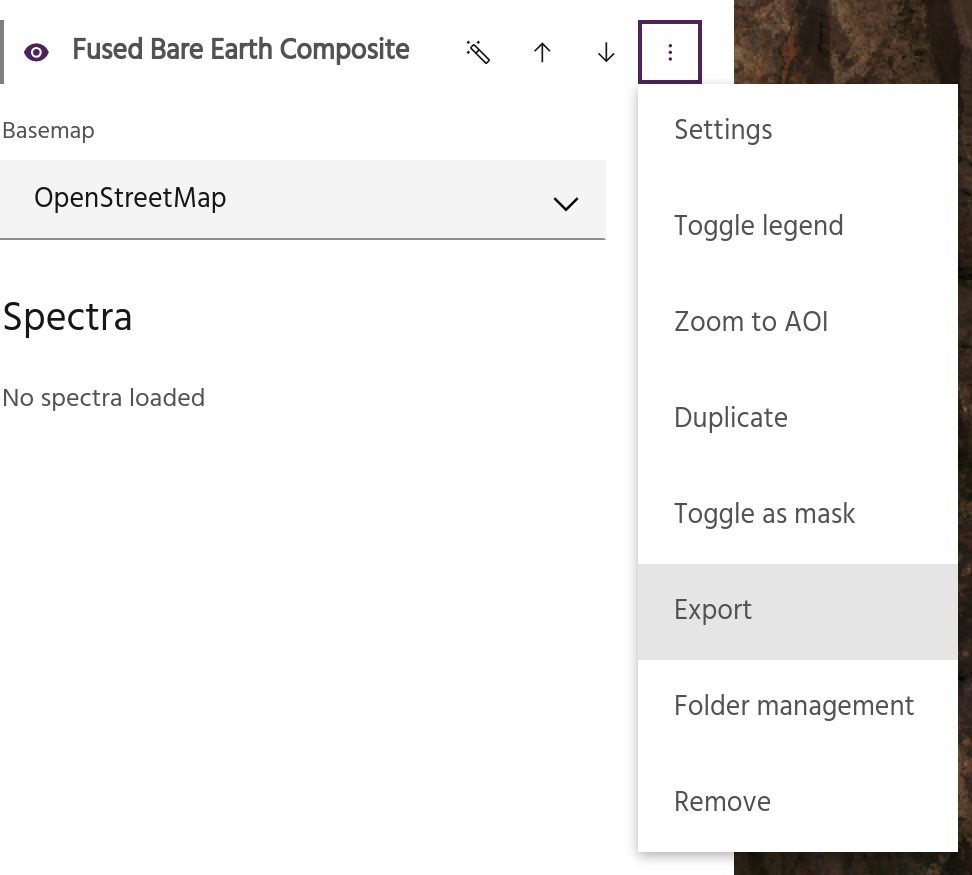
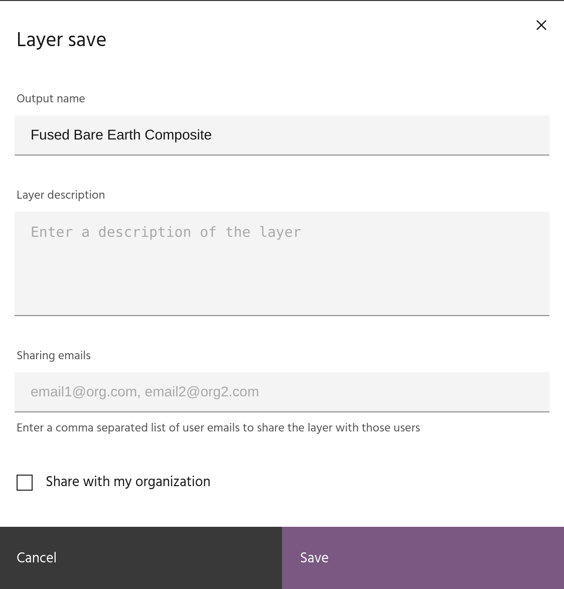
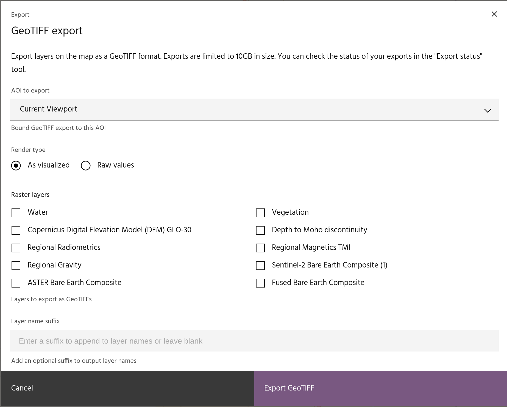
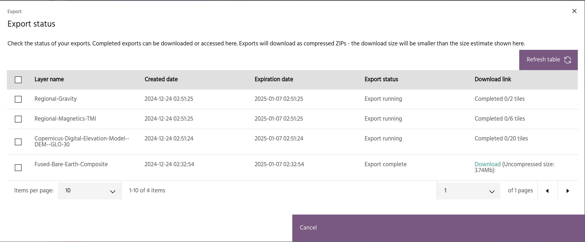

# Exporting layers

Layers can be exported for input into other Marigold projects, or as Geotiffs
for use in other GIS packages.

## Export a layer for Marigold

Individual layers can be exported, shared with other users, and
[imported](add-layers.md#add-an-exported-raster-layer) into new Marigold
projects.

Select `Export` from the layer overflow menu.

### Layer name and description

In the export dialog, give your layer a name and description.

<!-- prettier-ignore-start -->

!!! warning
    Exported layer names must be unique!

<!-- prettier-ignore-end -->

### Sharing emails

If desired, type in a comma separated list of emails of users to share the layer
with. Shared layers will appear in their layer list with a `(shared)` indicator.

### Organization sharing

This checkbox can be used to share the layer with all users in your
organization.

Click `save` to export the layer. It will now appear in your list of exported
layers, ready to [import](add-layers.md#add-an-exported-raster-layer) into a new
project.

## Export to Geotiff

If you need to view or analyze data in packages other than Marigold (such as
QGIS), you can export layers as GeoTIFFs by using the GeoTIFF export tool. After
setting the parameters in the dialog, clicking `Export GeoTIFF` will start tasks
to export the chosen layers.

### AOI to export

Choose a polygon vector layer over which to export data, or select
`Current viewport` to export the data over the current map view.

<!-- prettier-ignore-start -->

!!! warning
    There is a 10Gb limit for exported data - large AOIs with high resolution layers
    may not be allowed.

<!-- prettier-ignore-end -->

### Render type

There are two options for exporting the data:

- `As visualized` will export the data exactly as they are currently visualized
  as 8-bit integers. The currently visualized bands are selected, data are
  scaled 0-255, and for single band images, the colormap will be mapped to
  corresponding RGB values. Any visualization options such as
  [extrema masking](layer-settings.md#extrema-masking) or
  [hillshades](layer-settings.md#apply-hillshade-to-layer) will be applied to
  the exported layer.
- `Raw values` outputs all bands of the data at their full dynamic range as
  32-bit floats.

<!-- prettier-ignore-start -->

!!! warning
    `As visualized`, as the name implies, is useful for getting the exact display
    from Marigold into another package, but the exported data will not be useful for
    further processing.

<!-- prettier-ignore-end -->

### Raster layers

Select the layers to be exported.

<!-- prettier-ignore-start -->

!!! warning
    Restricted data, such as the Bare Earth Composites, cannot be export as
    `Raw values`.

<!-- prettier-ignore-end -->

### Layer name suffix

If desired, select a suffix to add to the exported name.

## Export status

After starting a GeoTIFF export, you can track the status and download the
result using the `Export status` tool.

Each exported layer will be represented by a row in this table. The rows will
show:

- The layer name, with any [suffix](#layer-name-suffix) if one was added.
- Date the export was created.
- Date the export will expire.

<!-- prettier-ignore-start -->

!!! note
    Exports will be automatically deleted after two weeks.

<!-- prettier-ignore-end -->

- Status of the export - either running, complete, or failed.

<!-- prettier-ignore-start -->

!!! tip
    Failed exports can be retried by selecting the row and clicking `Retry exports`.

<!-- prettier-ignore-end -->

- A status for the export while it is running, or a download link if it has
  completed.

<!-- prettier-ignore-start -->

!!! tip
    Data are split into tiles for export. For easily loading all tiles at once, a
    VRT containing metadata for the tiles is created, and all of the GeoTIFFs and
    the VRT are zipped together so that only one file needs to be downloaded.

<!-- prettier-ignore-end -->

--8<-- "snippets/contact-footer.md"
