# Layer settings

A layer's settings dialog offers many options for modifying properties of your layer.

<!-- prettier-ignore-start -->
!!! Tip
    The layer will update dynamically as you change settings, but you can always
    undo your changes with the `Cancel` button!
<!-- prettier-ignore-end -->

## Basic layer settings

The first page of the dialog contains basic layer settings such as name, visible bands,
and display contrast.

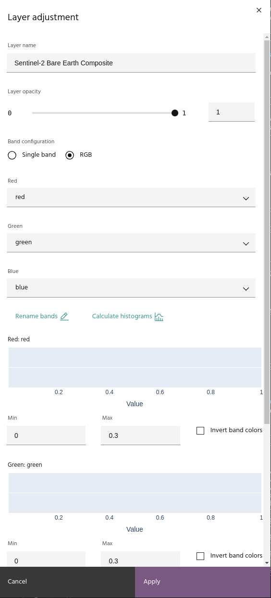

### Rename a layer

Click the **Layer name** text box in the **Layer adjustment** dialog
box and edit the layer name. The name will change in the layer list automatically.

### Adjust layer transparency

Use the slider or text box to adjust the opacity of the layer (0 is
completely transparent).

### Date selection

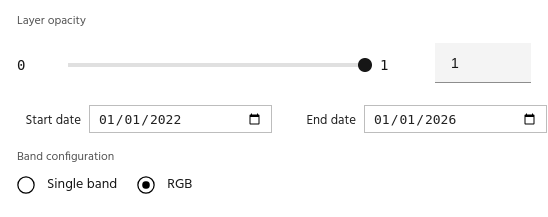

For layers that contain data from multiple dates, use the available selectors
to set the start and end dates for the layer.

<!-- prettier-ignore-start -->
!!! Tip
    Layers derived from products with temporal settings can also have the date 
    changed and will recompute using the new input data automatically.

!!! Tip
    For Hyperspectral data, the [HSI image explorer](../processes/hsi-image.md)
    can be used to explore images at individual dates.
<!-- prettier-ignore-end -->

### Rename bands

Click Rename bands. Use the text boxes to update band names, then click
**Update band names** to save.

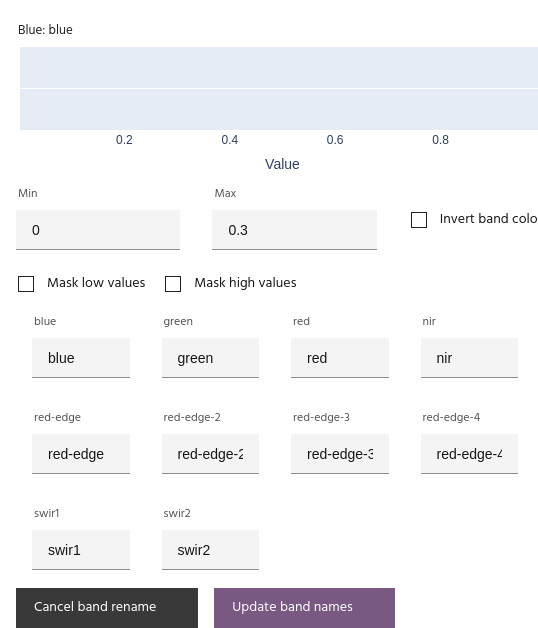

### Calculate histograms

Click **Calculate histograms** to see the distribution of values for
each of the bands selected in the visualized channels. You can use this
information to manually rescale the bands, use as a reference for custom
expressions in the [Raster calculator](../processes/raster-calculator.md),
or simply gain an understanding of the data distribution.

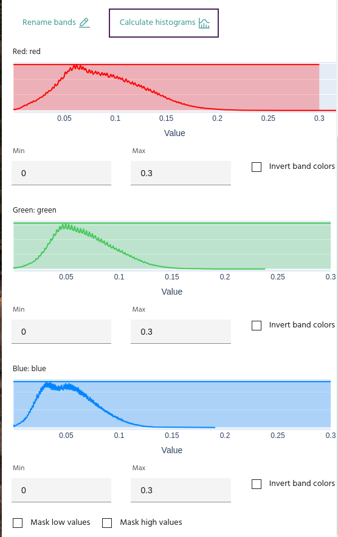

### Rescale bands

Use the **Min** and **Max** text boxes to enter the minimum and maximum
values for the corresponding band. If you have histograms calculated, a
shaded box covering the selected range will appear over the histogram.

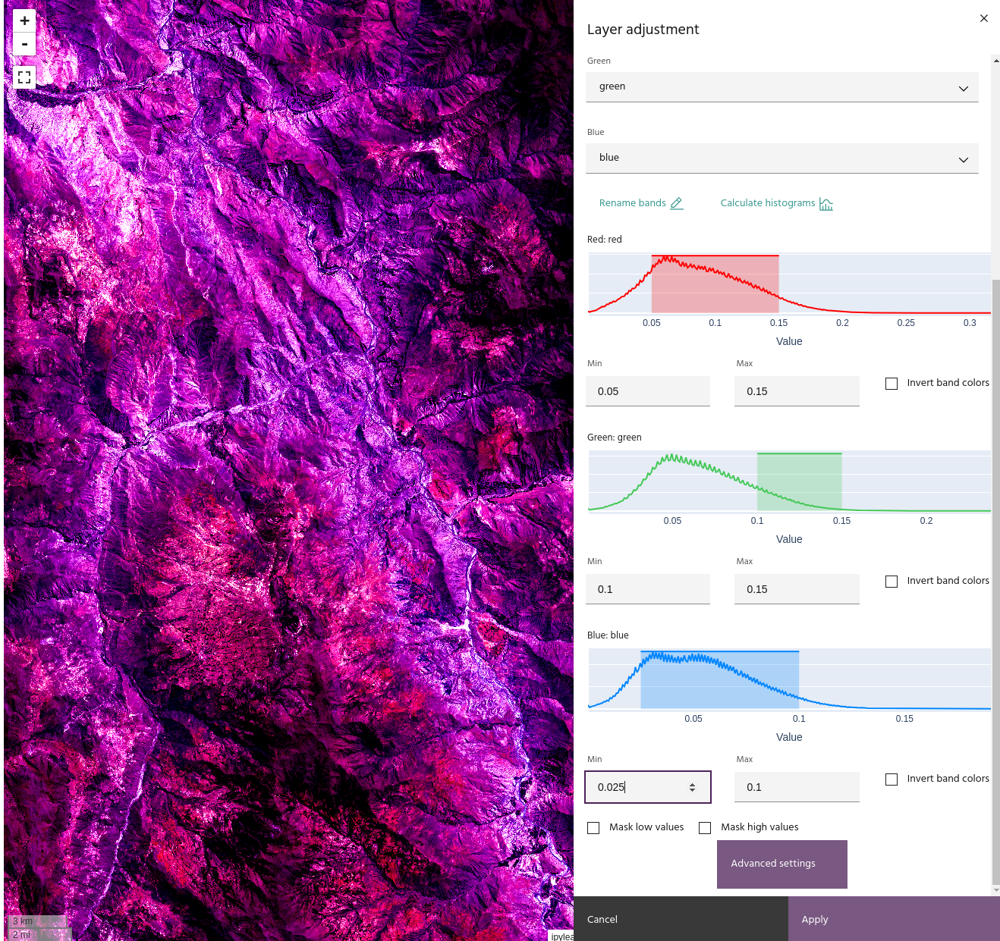

Selecting `Invert band colors` will display the data with the minimum value
as the brightest color instead of the darkest, and vice versa for the maximum.

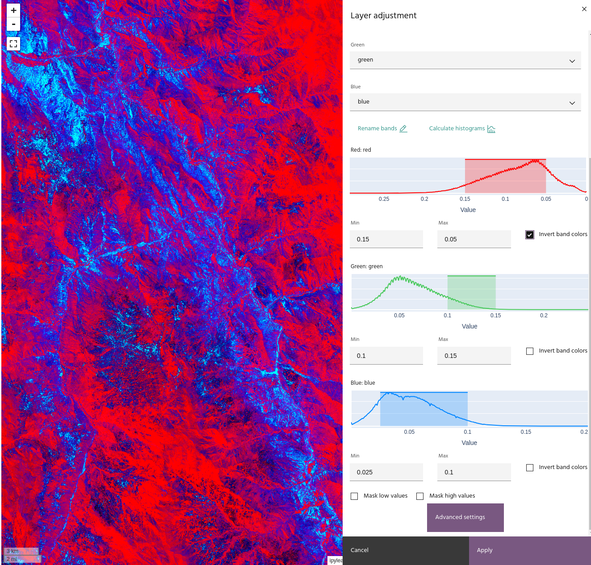

<!-- prettier-ignore-start -->
!!! Tip
    When inverting a band, the histogram will display the "flipped" data.
<!-- prettier-ignore-end -->

### Apply a colormap to a layer

Single band images are displayed using a colormap. Select **Single band**
from the band configuration, and choose the desired band in the **Band**
dropdown. Select the colormap you want to apply from the **Colormap** dropdown
menu to display the band with that colormap.

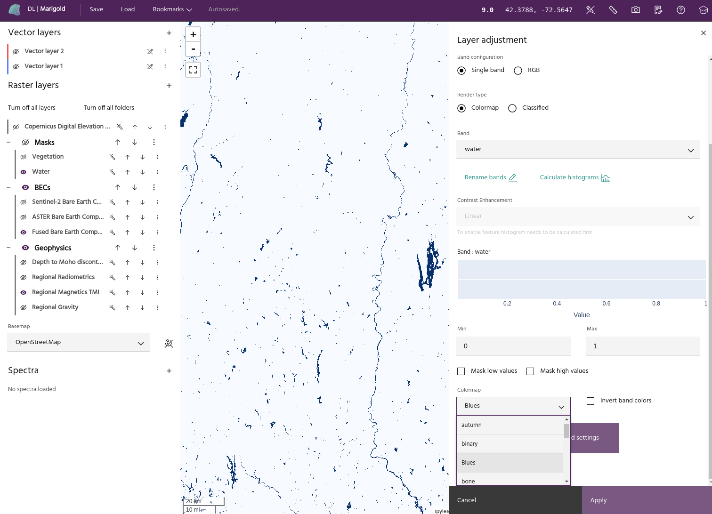

<!-- prettier-ignore-start -->
!!! info
    Marigold uses Matplotlib colormaps to display single band data. More information
    about these colormaps can be found [here](https://matplotlib.org/stable/users/explain/colors/colormaps.html)
<!-- prettier-ignore-end -->

### Extrema masking

Low and/or high values can be masked by selecting `Mask low values` and
`Mask high values`.

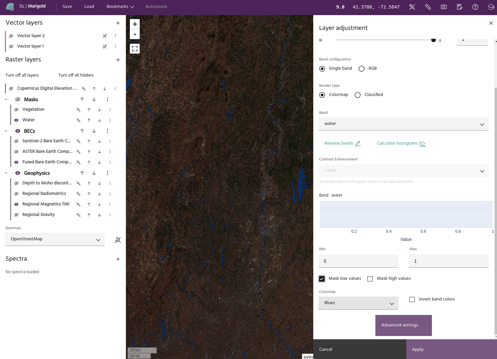

<!-- prettier-ignore-start -->
!!! tip
    For RGB layers, masks will be applied when all bands values are outside of the
    limits. This has the effect of masking black pixels for low masking and white pixels
    for high masking.
<!-- prettier-ignore-end -->

## Advanced layer settings

Clicking the `Advanced layer settings` at the bottom of the dialog will bring
up advanced visualization options for the layer.

<!-- prettier-ignore-start -->
!!! warning
    Advanced visualization settings are not yet available for Classified layers.
<!-- prettier-ignore-end -->

### Apply hillshade to layer

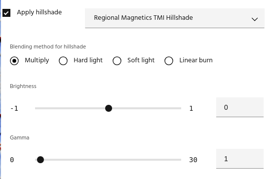

<!-- prettier-ignore-start -->
!!! note
    Only layers created by the [hillshade dialog](../processes/hillshade.md) can be
    used as a hillshade.
<!-- prettier-ignore-end -->

Once you have a hillshade layer in your project, you can apply it to a layer using
several blending options:

- Multiply: simply multiply the hillshade and the base layer.

$$
Shaded = Base \cdot Hillshade
$$

<!-- prettier-ignore-start -->
!!! tip
    Since hillshade values are from 0-1, Multiply blending will always darken the base
    layer.
<!-- prettier-ignore-end -->

- Hard light: A combination of `Multiply` and its inverse that darkens low shade areas
  and brightens brighter ones.

$$
Shaded = \begin{cases}
    2 \cdot Base \cdot Hillshade & \text{if } Hillshade < 0.5 \\\\
    1 - 2 \cdot ( 1 - Base ) \cdot ( 1 - Hillshade ) & \text{otherwise}
\end{cases}
$$

- Soft light: A gentler combination of Multiply and its inverse, used for more subtle
  effects.

$$
Shaded = (1 - 2 \cdot Base) \cdot Base^2 + 2 \cdot Hillshade \cdot Base
$$

- Linear burn: Darkens the image by the brightness of the Hillshade

$$
Shaded = Base + Hillshade - 1
$$

In addition, the hillshade itself can have its brightness or gamma adjusted
using the sliders. The hillshade is adjusted by

$$
AdjustedShade = (Hillshade + Brightness)^{1/\gamma}
$$

before being applied using the chosen blend method.

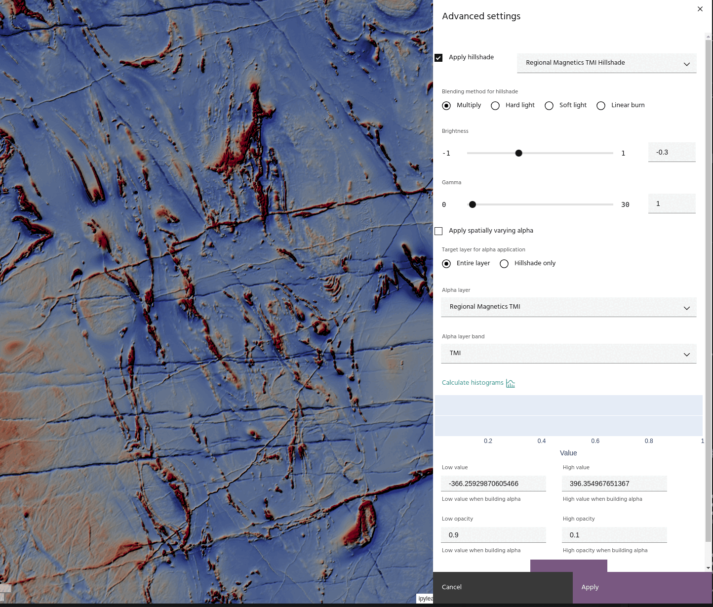
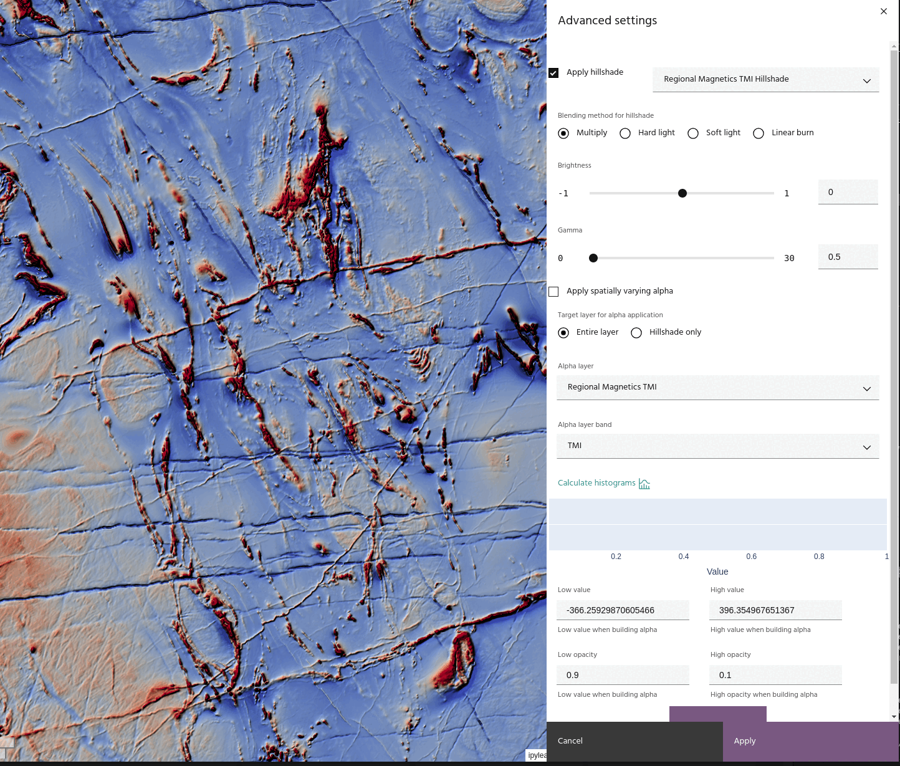

### Apply a layer as an Alpha band

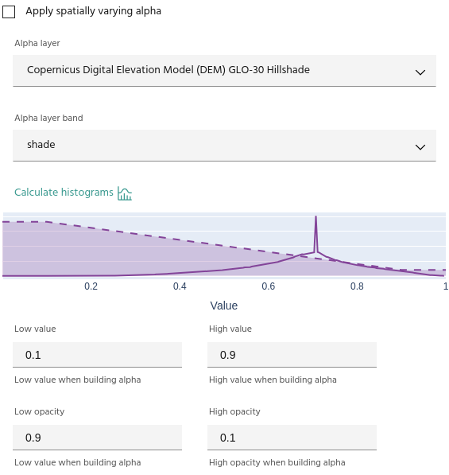

For more advanced displays, layers can be used as spatially-varying Alpha bands
for other layers. To use a layer as an Alpha band:

- Choose a layer and band to use as an Alpha.
- Opacity values are defined using four points: the minimum/maximum opacity values,
  and the data values to which each corresponds.

<!-- prettier-ignore-start -->
!!! tip
    Use the `Compute histogram` button to see the opacity curve over the data histogram.
<!-- prettier-ignore-end -->

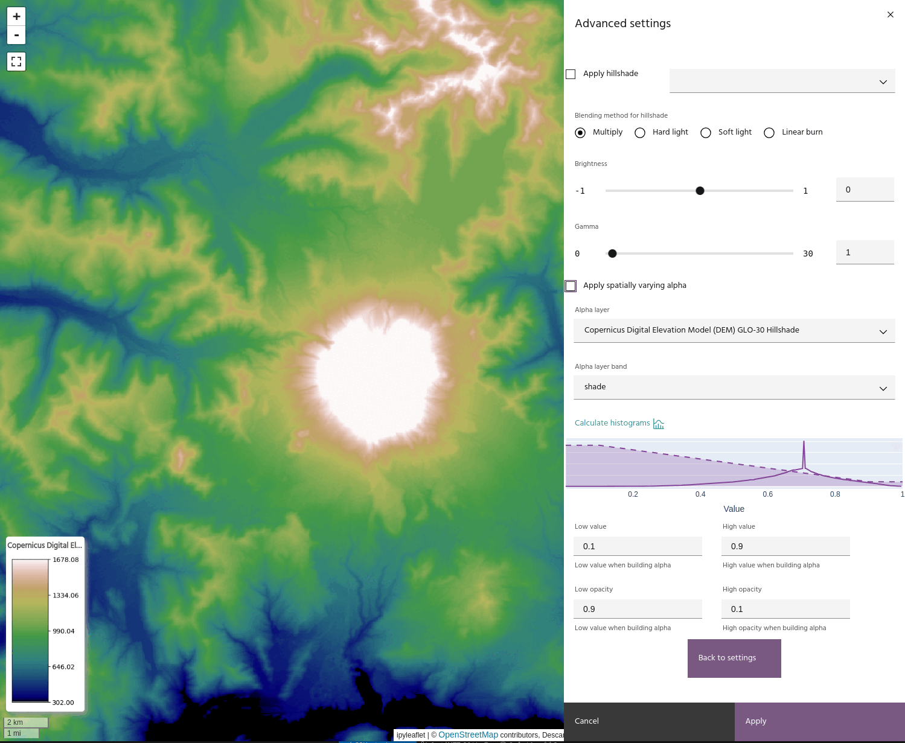

If you have a hillshade applied to the layer, you can apply the Alpha band to the
hillshade instead of the layer. This has the effect of bringing back the brightness
that can be lost when using blending modes like [Multiply](#apply-hillshade-to-layer).

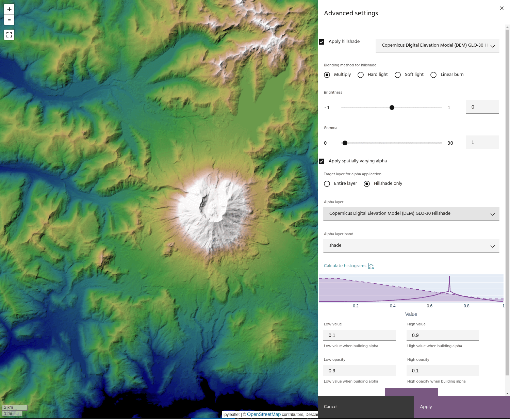

--8<-- "snippets/contact-footer.md"
