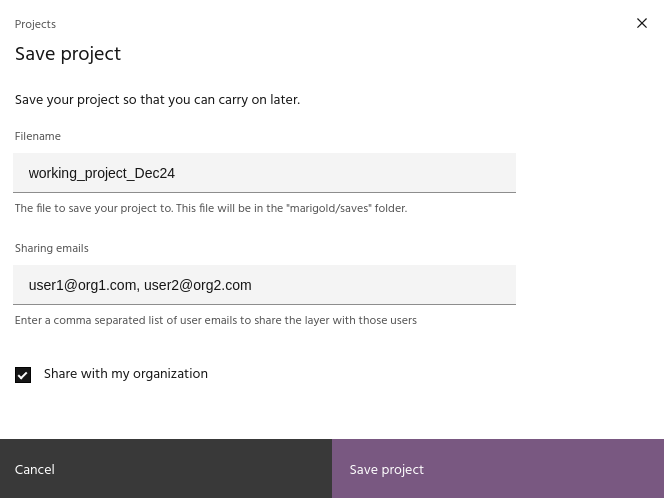
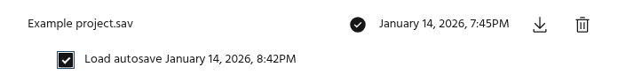
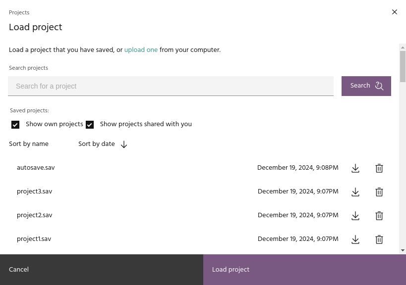

## Saving and loading projects

Marigold projects can be saved, shared with other users, and loaded again.
Saving a project provides a working snapshot of everything in the project,
including all raster layers, vector layers, and spectra. When you load a saved
project, the map will go to the location where the project was saved, load all
of the layers and spectra, and set the visualization of everything exactly how
it was when it was saved.

### **Saving a project**

Click the `Save` button on the [header bar](header.md) to save your project.

### Filename

Type in a name for your saved project. Projects are saved using
[Blob Storage](https://docs.earthone.earthdaily.com/guides/catalog.html#blobs).

<!-- prettier-ignore-start -->

!!! tip
    Blob storage supports using folders in filenames to keep your projects
    organized.

<!-- prettier-ignore-end -->

### Sharing emails

If desired, type in a comma separated list of emails of users to share the
project with. Shared projects will appear in there project list with a
`(shared)` indicator.

### Organization sharing

This checkbox can be used to share the project with all users in your
organization.

### **Autosaves**

Marigold will autosave your project after operations such as loading layers from
[Catalog](raster-layers/add-layers.md#add-a-raster-layer-from-the-catalog) or
running many of the [processes](processes/index.md) available. An indicator on
the header bar will appear after the project is autosaved. Autosaves are generated
for each project individually - if a project has an autosave available, you will
have the option in the [load project](#loading-a-project) dialog to load the
manual or autosaved version.

### **Loading a project**

The `Load` button on the [header bar](header.md) will bring up a dialog allowing
you to load previously saved projects. Projects can be sorted by either name or
date, and you have the option of listing only your own projects or projects that
were shared with you.

<!-- prettier-ignore-start -->

!!! tip
    After loading a project, if you save it again, the name will be pre-populated in
    the [filename](#filename) field of the save dialog.

<!-- prettier-ignore-end -->

### Uploading and downloading saves

Use the `Download` icon next to the project date to download a copy of the file
to your local computer. Such files can be uploaded using the link in the loading
dialog, which will add them to your project list for future use.

### Deleting saves

Use the `Delete` icon next to the Download icon to delete a saved file.

<!-- prettier-ignore-start -->

!!! note
    Shared projects cannot be deleted by anyone other than the owner.

<!-- prettier-ignore-end -->

--8<-- "snippets/contact-footer.md"
