# Spectra in Marigold

Spectral information, whether computed from a multi or hyperspectral dataset,
collected from a spectrometer in the field, or assayed in a lab (phrasing bad),
are a critical component of a remote sensing workflow. Marigold has several
tools for integrating spectra from disparate sources into a project.

## Compute spectra from raster data

Once a multispectral or hyperspectral layer is loaded into Marigold, spectral
information can be computed directly from the layer bands. Note that the bands
need to have their wavelength information stored in the Platform product. Data
managed by EDA, such as the Bare Earth Composites and public hyperspectral
datasets, have this by default. For personal products, ensure that at least the
`wavelength_nm_center` property is defined for all spectral bands. Contact
[support](mailto:support@earthdaily.com) for assistance with correctly loading data.

[Spectral query](spectra-query.md) - Compute spectra of individual points\
[Compute spectrum over vector](spectra-vector.md) - Compute average spectrum
over a vector.

## Load spectra from external source

Spectra can be brought in from external sources, such as field spectrometers or
ENVI formatted files. In addition to loading external spectral files, the
[USGS spectral library](https://pubs.usgs.gov/publication/ds1035) is available
for all users. Similar libraries can be hosted as well, contact
[support](mailto:support@earthdaily.com) for more information.

[Load from file](spectra-file.md) - Load spectra from a file such as an ASCII
from ENVI or .ASD from a spectrometer\
[Add from library](spectra-library.md) - Load spectra from the USGS (or others
if available) spectral library

## Save a spectral library

Spectra in a Marigold project can be saved to a
[spectral library](spectra-library.md) or exported to a Marigold or text files.

### Save to a library

1. From the Spectra menu, select `Save spectra to spectral library`.\
   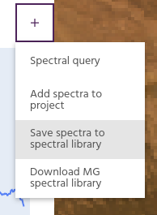
2. Select spectra to export, add a description to each, and add the name of the
   project. If the project was [loaded](../save-and-load.md) from a previous
   project, the name will already be loaded.\
   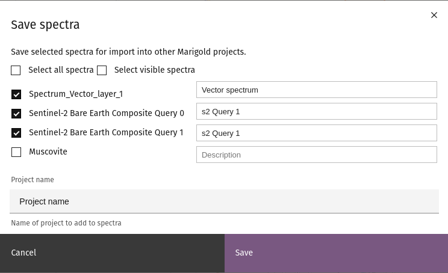
3. Click `Save` to export the spectra to your spectral library. All spectra will
   be saved to the same library that can be accessed in the
   [Add from library](spectra-library.md) dialog.

### Save to an external file

1. From the Spectra menu, select `Download MG spectral library`.\
   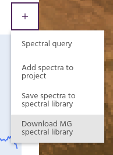
2. Select spectra to export. For convenience, all spectra or visible spectra can
   be selected with one click.\
   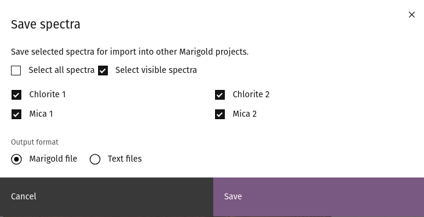
3. Choose whether to save the spectra as a Marigold library which can be
   [imported into a new Marigold session](spectra-file.md#marigold-spectral-library),
   or as text files.
4. Click `Save` to save the file to your local computer.

## Enlarge the spectral plot

Once spectra are loaded in the project, the plot can be enlarged to explore them
in more details. Select `Enlarge plot` to generate a larger plot.

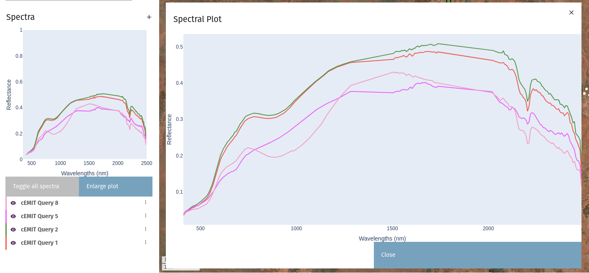

## Operations on Spectra

Once spectra are in your project, there are a few operations that can be
performed on them.

### Resample spectrum

Often, spectra from labratory spectrometers can be much higher resolution than
the multispectral imagery against which they are compared. Such high resolution
spectra can be resampled to the resolution of a raster layer for better
comparisons.

1. From the overflow menu of a spectrum, select `Resample`.\
   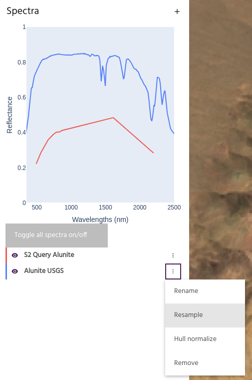
2. Choose the layer and bands to which you want to resample the spectrum, and
   choose to resample using Gaussian functions or true instrument spectra. Note
   that instrument spectra are only available for EarthOne Bare Earth
   Composites.\
   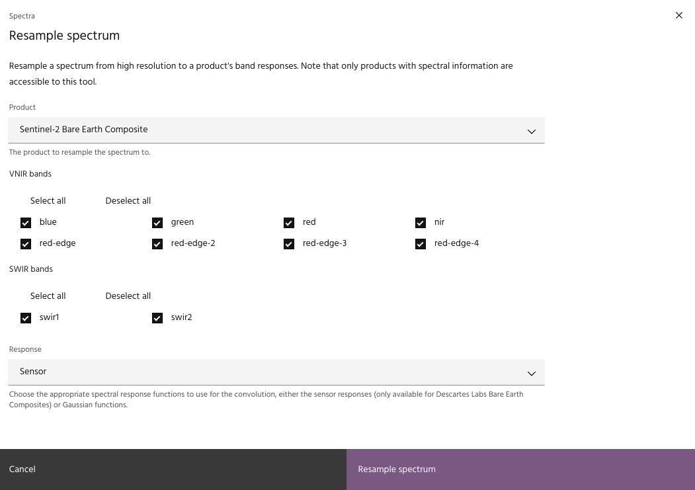
3. Click `Resample spectrum` to load the resampled spectrum into the project. \
   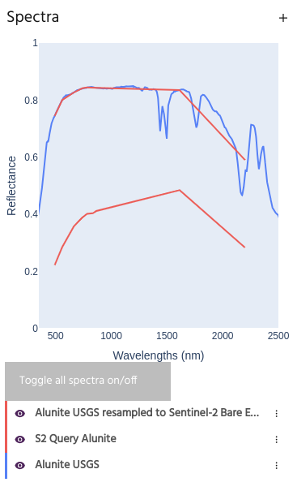

### Hull normalization

Hull normalization is a process where the spectrum is normalized by its
[convex hull](https://en.wikipedia.org/wiki/Convex_hull). This process is used
to highlight absorption features of spectra, and is a useful for step for
further compositional mapping.

1. From the overflow menu of a spectrum, select `Hull normalize`.\
   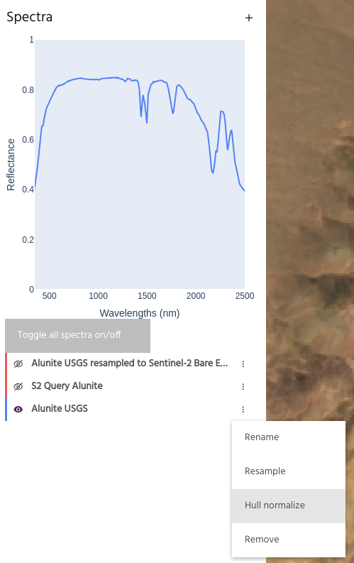
2. Type in a name for the new spectrum, and if desired enter a minimum
   and maximum wavelength over which to compute the hull normalization.
   Click `Hull normalize spectrum` to generate the spectrum over the given
   wavelengths.\
   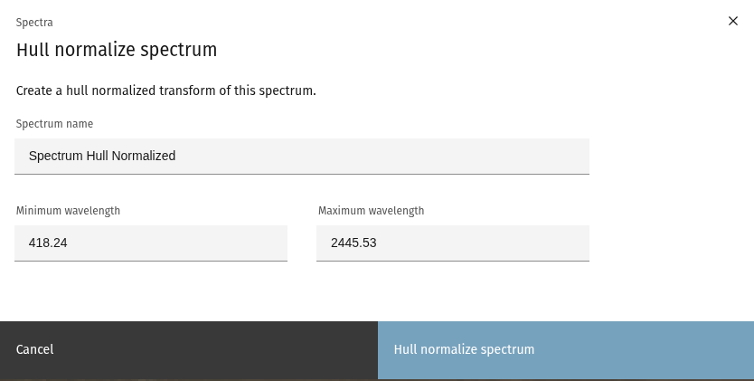
3. The hull normalized spectrum is now loaded into the project.\
   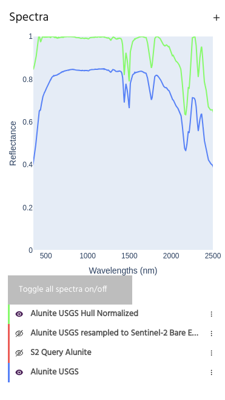

--8<-- "snippets/contact-footer.md"
