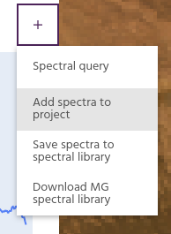
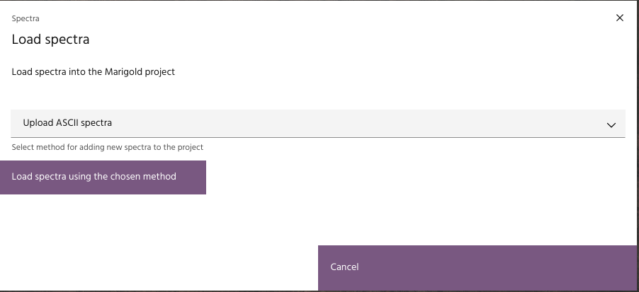
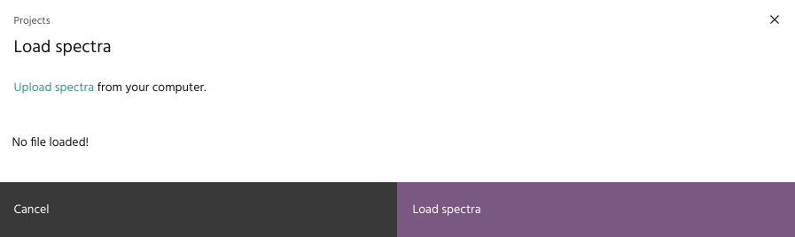
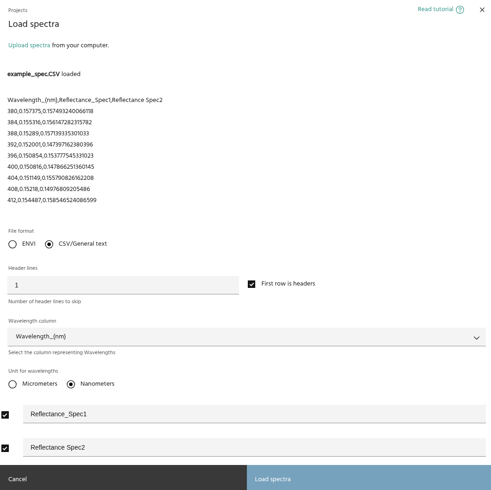
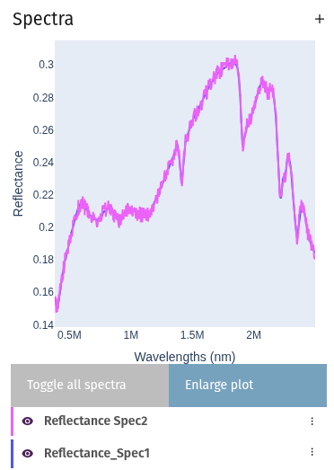
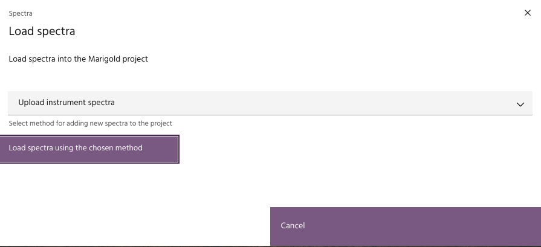
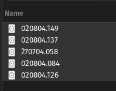
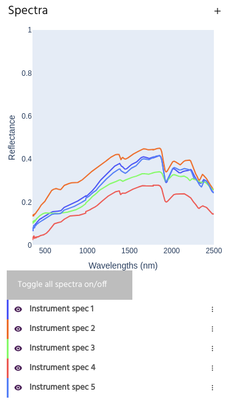
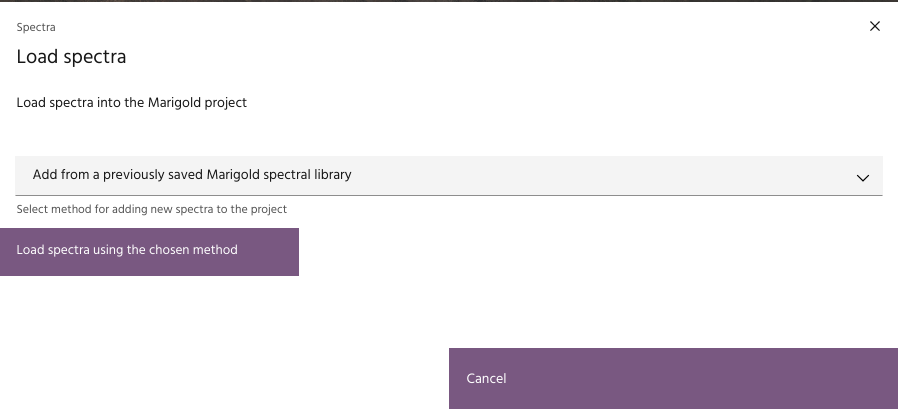
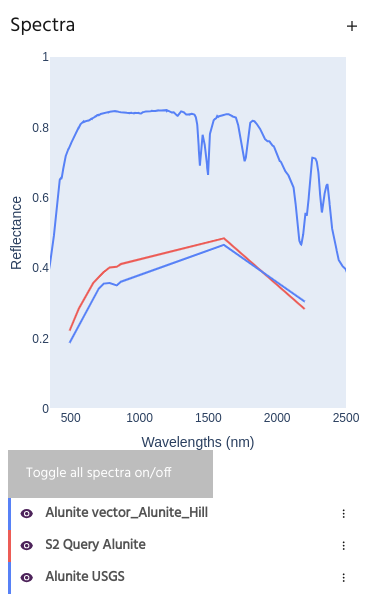

# Load spectra from external file

Spectra can be brought into Marigold from several types of sources:

- [ASCII spectra](#ascii-spectra)
- [Instrument spectra](#instrument-spectra)
- [A Marigold spectral library](#marigold-spectral-library)

All of these methods are available by opening the Spectra menu and selecting
`Add spectra to project`.

## ASCII spectra

ASCII spectral libraries can be loaded into Marigold.

1. Select `Upload ASCII spectra` and click
   `Load spectra using the chosen method`.\
   
2. Click the `Upload spectra` link on the resulting dialog and choose an
   appropriate file. A preview of the file will be shown in the dialog.\
   \
   
3. For generic text files such as CSVs, set the number of header lines.
   If the first line in the file represents header values, check the box.\
4. Set the appropriate column for `Wavelength` information and whether
   wavelengths are defined in micrometers or nanometers.\
5. Select and name thedesired spectra and click `Load spectra`. Spectra are
   now available for further use.\
   

## Instrument spectra

Marigold can load binary files from spectrometers such as _what are some brands
of these things_.

1. Select `Upload instrument spectra` and click
   `Load spectra using the chosen method`.\
   
2. Select the files you want to load.\
   
3. A dialog will pop up allowing you to rename each spectrum, if desired.
4. Spectra will be loaded into the project for further use.\
   

## Marigold spectral library

Spectra that have been
[saved from another Marigold project](index.md#save-a-spectral-library) can be
loaded into a new project.

1. Select `Add from a previously saved Marigold spectral library` and select
   `Load spectra using the chosen method`.\
   
2. Choose the appropriate Marigold spectral library. Spectra will be loaded
   automatically, along with any associated point or vector files.\
   

--8<-- "snippets/contact-footer.md"
