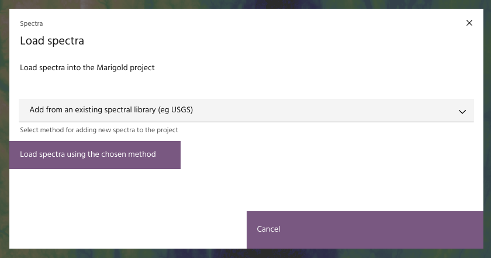
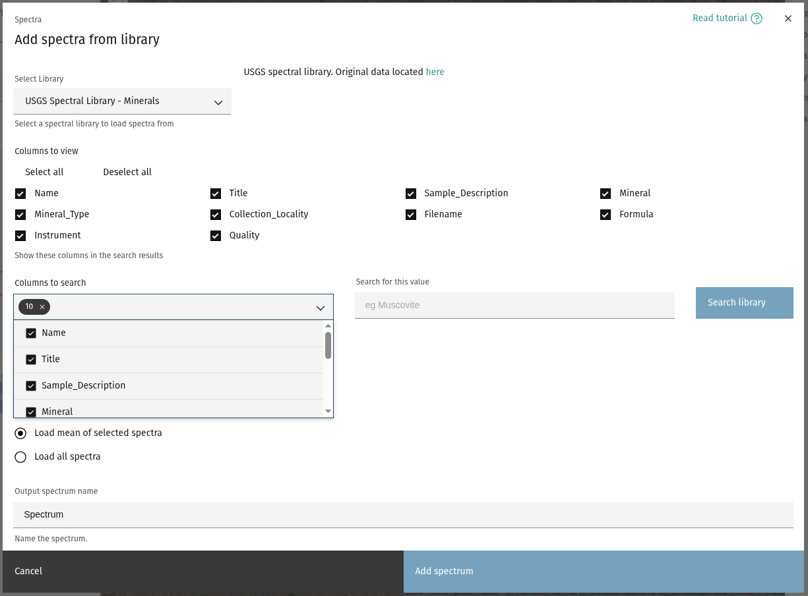
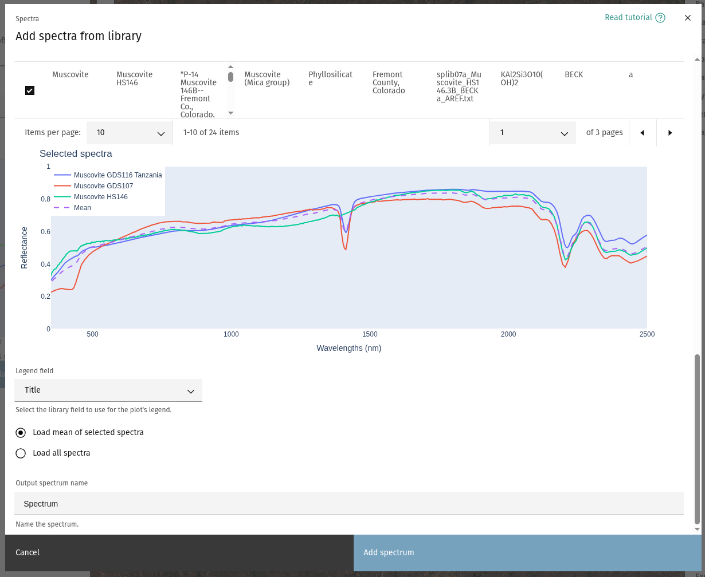
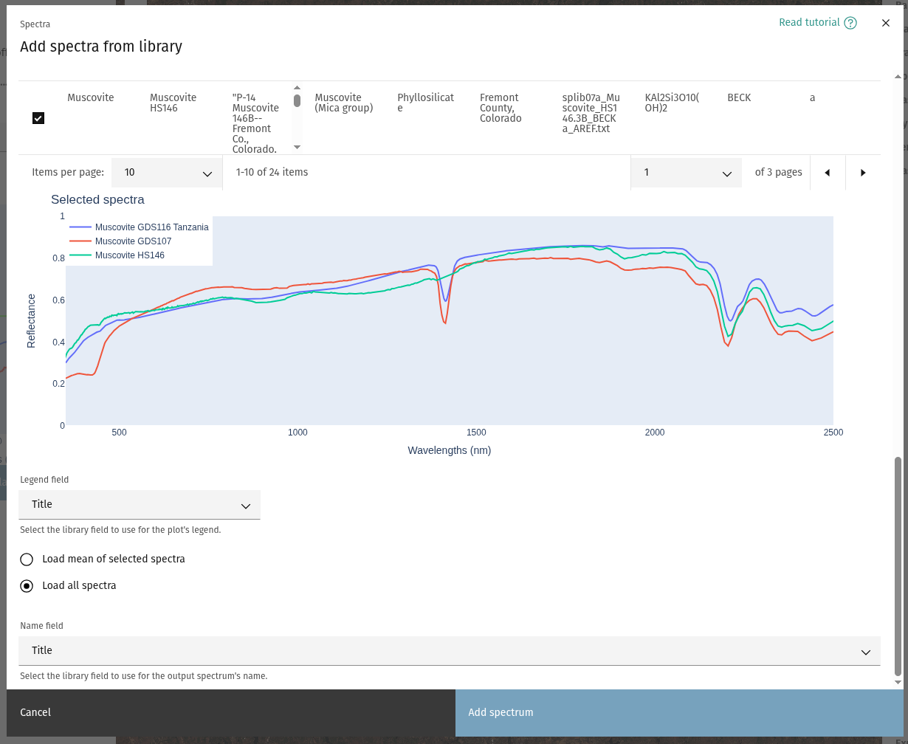
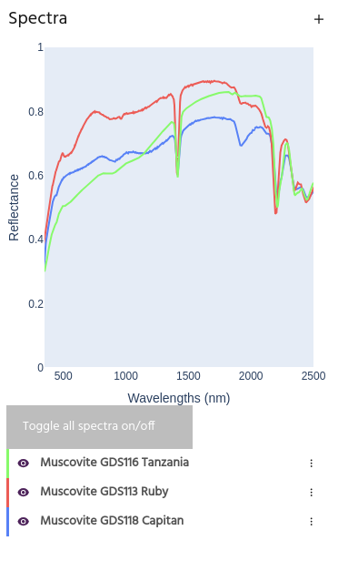

## Load spectra from library

Spectra can be loaded from an available spectral library. The USGS Spectral
Library is available for all users, as well as any user
[exported spectra](index.md#save-to-a-library). Additional libraries may be
imported as well, contact [support](mailto:support@earthdaily.com) for additional support.

1. From `Spectra` header, select `Add spectra to project`.\
   
2. From the dropdown, select `Add from an existing spectral library` and click
   the `Load spectra using the chosen method` button.\
   
3. If multiple libraries are available, they will appear in the `Select Library`
   dropdown. Select the proper library, the columns in the library you wish to
   view, and which columns to use for the search. Click `Load mineral` to search
   the chosen library.\
   

<!-- prettier-ignore-start -->

!!! tip
    Leaving the search field blank will return the whole library.

<!-- prettier-ignore-end -->

4. Select representative samples of the chosen minerals. If more than one sample
   is chosen, spectra can be loaded either as individual samples, or the mean of
   all selected spectra will be loaded.\
   \
   

<!-- prettier-ignore-start -->

!!! tip
    Use the `Legend field` dropdown to change the value used in the plot's legend.

<!-- prettier-ignore-end -->

5. If loading the mean spectrum, provide a name for the output, or else choose the
   field that will be used to name the output spectra. Click “Add spectrum” to load
   the chosen spectra, which will now be available for use.

--8<-- "snippets/contact-footer.md"
