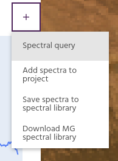
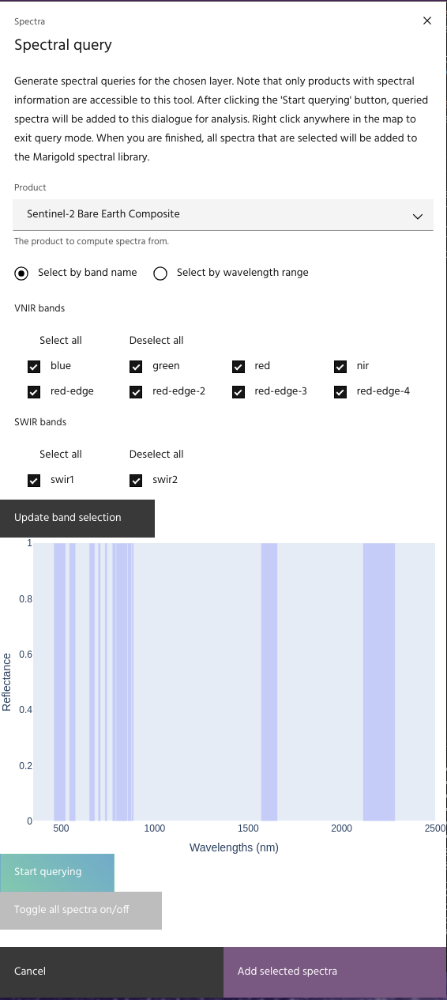
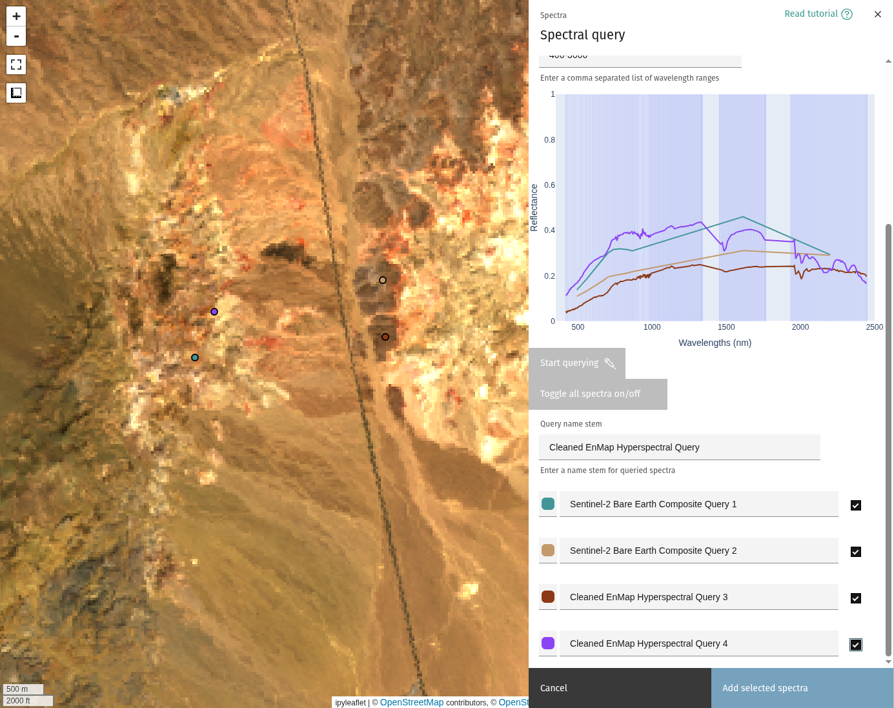
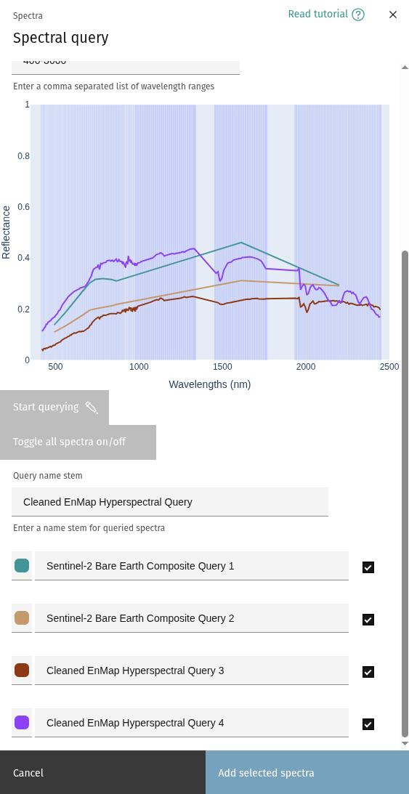
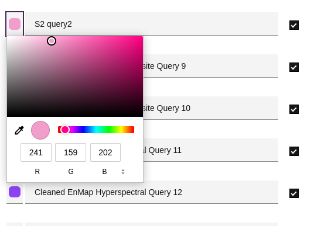
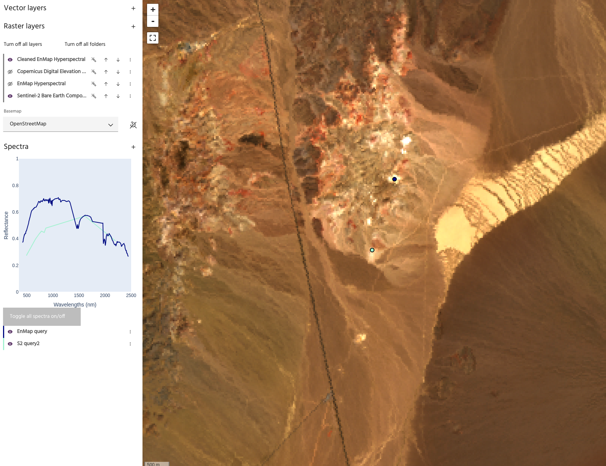

# Spectral Query

Spectral information in a raster layer can be extracted in two ways: individual
points Spectral query, or [extracted from vector layers.](spectra-vector.md). Note
that the bands need to have their wavelength information stored in the Platform
product. Data managed by EDA, such as the Bare Earth Composites and public
hyperspectral datasets, have this by default. For personal products, ensure that
at least the `wavelength_nm_center` property is defined for all spectral bands. Contact
[support](mailto:support@earthdaily.com) for assistance with correctly loading data.

1. From the `Spectra` header, select `Spectral query`.\
   
2. Select the layer and bands to query.\
   

3. Click `Start querying`. The cursor will change to a crosshair to indicate
   that querying is enabled.
4. Clicking the map will extract the values of the chosen layer at the selected
   point and add it to the plot. Note that the color of the point on the map
   will match the color of the spectrum in the plot.
   

<!-- prettier-ignore-start -->

!!! tip
    Query names will follow the `Query name stem` parameter in the dialog
    (`Custom name 1`, `Custom name 2`, etc)

<!-- prettier-ignore-end -->

5. Right clicking on the map will exit the querying session, and clicking
   `Start querying` again will begin a new one.
6. Changing the layer or bands in the dialog will change the queried data going
   forward. \
   
7. Points can be renamed or given a different color.\
   
8. When all points have been queried, click `Add selected spectra` to add all of
   the currently visible spectra to the project. Unselected spectra will not be
   added.\ \
   

<!-- prettier-ignore-start -->

!!! tip
    Point geometry associated with spectral queries can be downloaded using the
    overflow menu of the individual spectra.

<!-- prettier-ignore-end -->

--8<-- "snippets/contact-footer.md"
