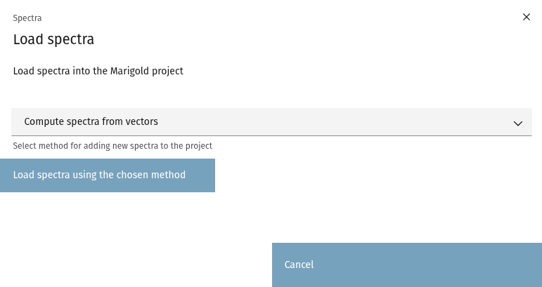
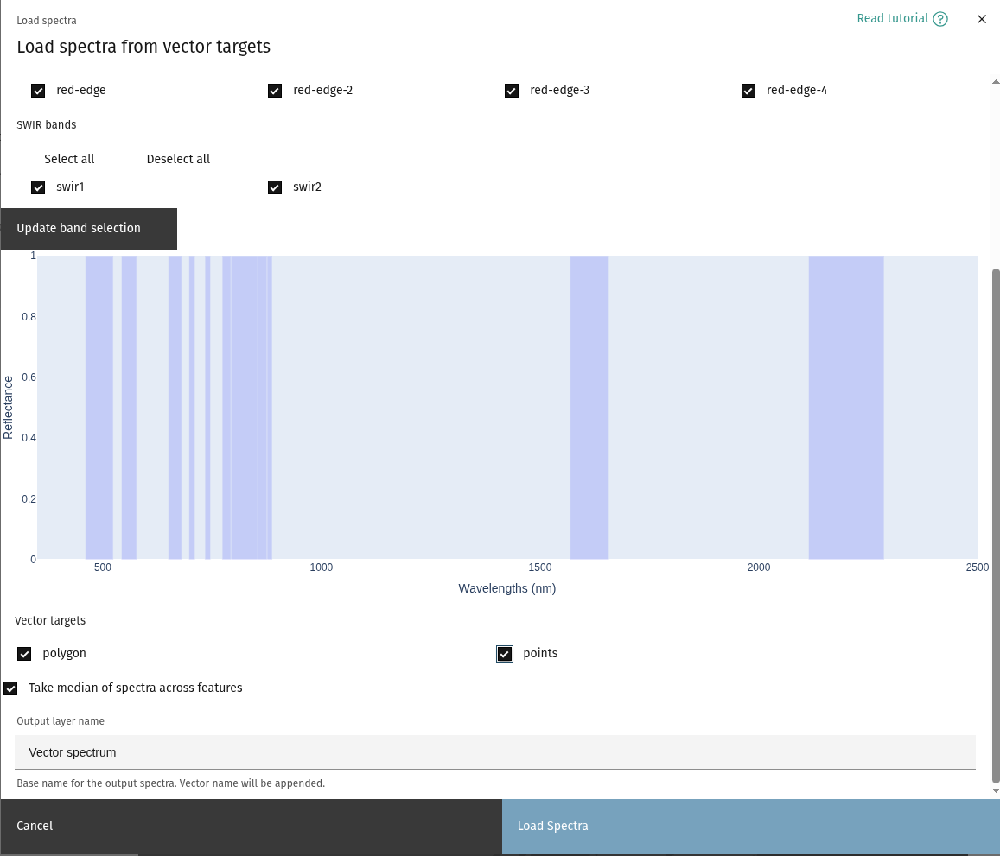
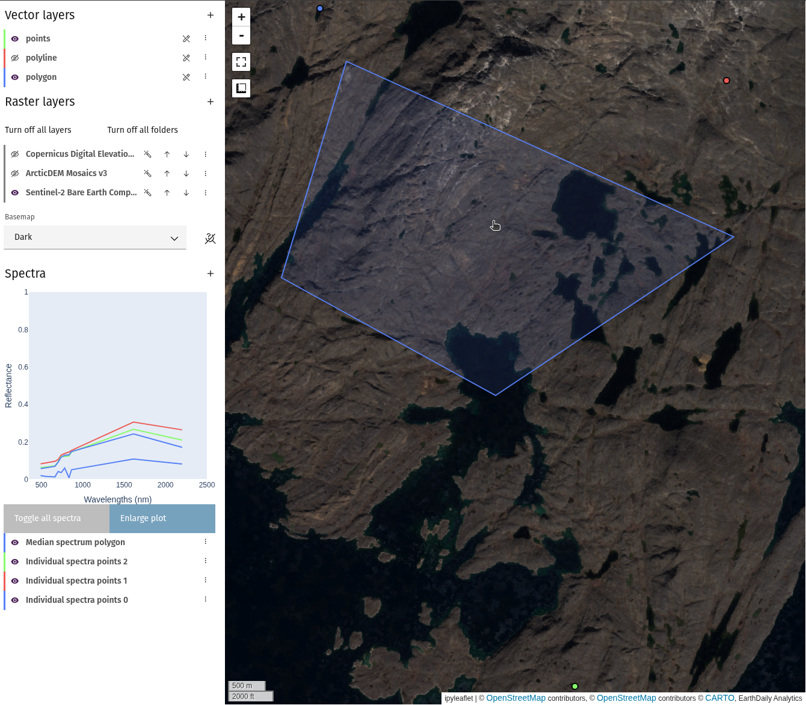

## Compute spectra over vector

Spectral information in a raster layer can be extracted in two ways: individual
points ([Spectral query](spectra-query.md)), or extracted from vector layers. Note
that the bands need to have their wavelength information stored in the Platform
product. Data managed by EDA, such as the Bare Earth Composites and public
hyperspectral datasets, have this by default. For personal products, ensure that
at least the `wavelength_nm_center` property is defined for all spectral bands. Contact
[support](mailto:support@earthdaily.com) for assistance with correctly loading data.

1. From `Spectra` header, select `Add spectra to project`.\
   
2. From the dropdown, select `Compute spectra from vectors` and click
   the `Load spectra using the chosen method` button.\
   
3. Choose the raster layer to extract a spectrum from, and the bands to use.
4. Choose at least one target vector. One spectrum will be computed for each AOI
   chosen.\
   

<!-- prettier-ignore-start -->

!!! note
    Only polygon and point vectors are available with this tool.

<!-- prettier-ignore-end -->

5. Select whether to compute spectra for each feature in the vector, or to take
   the median across the features.

<!-- prettier-ignore-start -->

!!! tip
    If computing a point vector, unselecting the median option is equivalent to taking
    [spectral queries](spectra-query.md) of each point in the layer.

<!-- prettier-ignore-end -->

5. Choose a base name for the spectra and click `Load Spectra`. If
   `Take median of spectra across features` is selected, one spectrum per selected
   vector will be generated. Otherwise, it will generate one spectrum per feature.
   

--8<-- "snippets/contact-footer.md"
