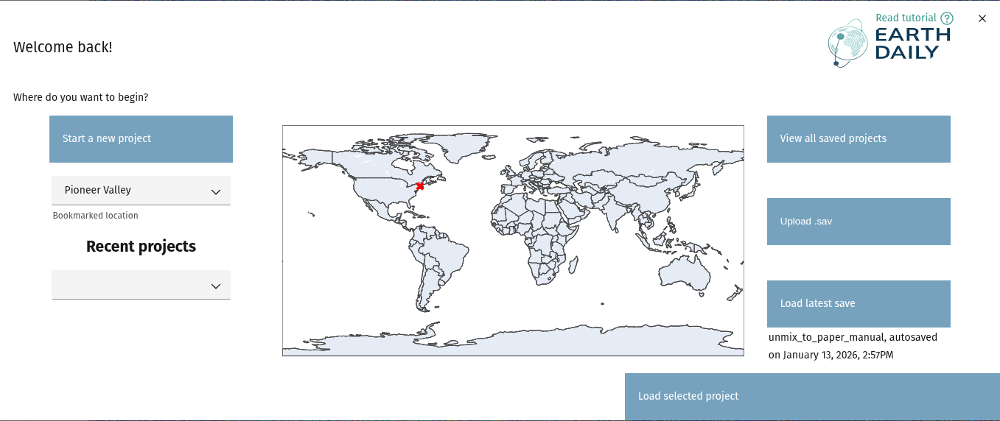
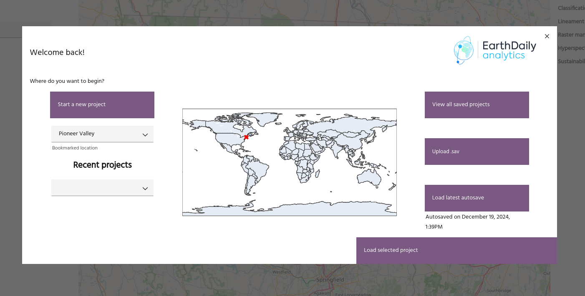

# Starting a Marigold session

When you load the Marigold app, you will see a splash screen with options for
easily loading your projects and bookmarks.

## Start a new project

This option will start a new Marigold project at the current map location. By default,
the Sentinel-2 Bare Earth Composite will be loaded into your session. This option is
useful if you are starting a new analysis workflow.

## Bookmarks

A list of your saved [bookmarks](header.md#bookmarks) will appear here.
Selecting one will move the Marigold map to the bookmarked location, as well as indicate
the location on the inset map.

<!-- prettier-ignore-start -->

!!! tip
    You can set a default bookmark in your [user settings](header.md#user-settings).

<!-- prettier-ignore-end -->

## Recent projects

A list of your seven most recent projects will appear here. As with bookmarks,
selecting one will indicate on the map where the save is located.

<!-- prettier-ignore-start -->

!!! note
    The first time you select a project on the splash screen, there will be a brief
    loading period for the geometry to be extracted from the save. This operation
    only needs to be run once per save file.

<!-- prettier-ignore-end -->

Click the `Load selected project` button to load the project selected from the
dropdown.

## View all saved projects

This button will bring up the standard
[load project](save-and-load.md#loading-a-project) dialog for access to all of
your saved projects.

## Upload .sav

This option will allow you to upload a saved project from your computer. Once
uploaded, this project will be at the top of the
[recent projects](#recent-projects) list.

## Load latest save

This option loads the most recent [save](save-and-load.md).

<!-- prettier-ignore-start -->

!!! tip
    The dialog will indicate if your latest save is an 
    [autosave](save-and-load.md#autosaves).

<!-- prettier-ignore-end -->

--8<-- "snippets/contact-footer.md"
