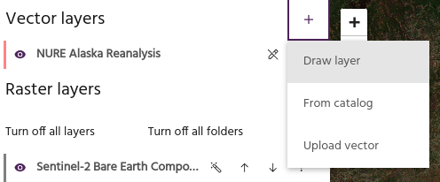
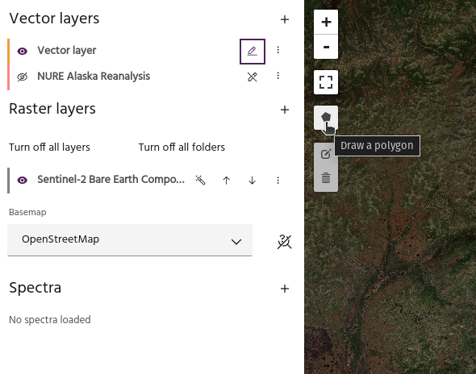
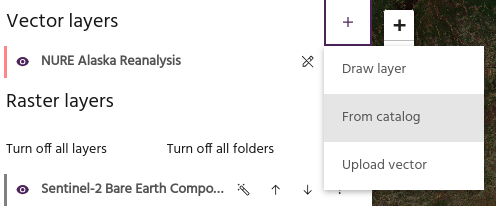
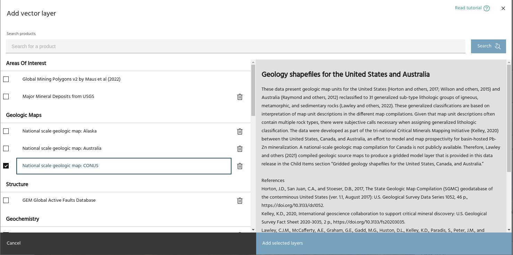
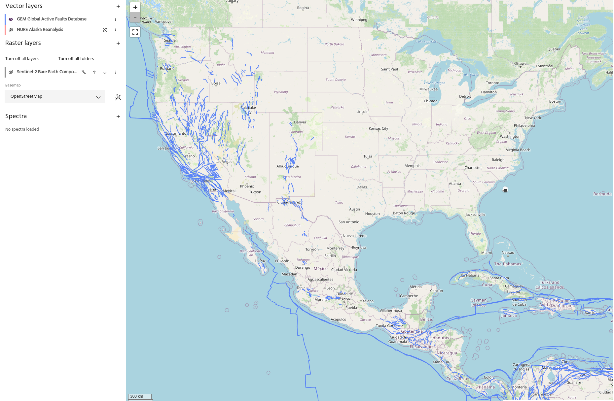
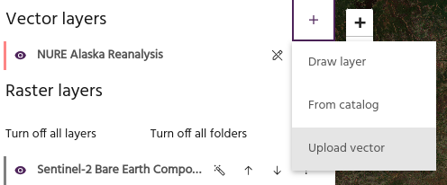

## Add vector layers to a Marigold project

Marigold supports several methods for adding vector layers to your project.

### **Draw a vector layer**

Select `Draw layer` to create a vector layer by manually drawing one on the map.

The dialog allows you to type a name for the vector and select the geometry
type. Available options are `Polygon`, `Polyline`, and `Points`. After clicking
the `Add layer` button, the new vector will appear in the layer list. Click the
[draw](index.md#toggle-drawing) icon to toggle drawing, then click the new icon
on the map to begin the drawing session.

<!-- prettier-ignore-start -->

!!! tip
    The icon on the map will indicate whether the drawn layer will be a polygon,
    point, or polyline.

<!-- prettier-ignore-end -->

Click on the map to draw the desired vector object.

- For polygons, finalize the polygon by clicking the first point to close the
  polygon.
- For polylines, finalize by clicking the last point.
- For points, each individual point will be drawn separately.

<!-- prettier-ignore-start -->

!!! tip
    When you are finished drawing, click the draw icon to store the updated
    vector in Marigold.

<!-- prettier-ignore-end -->

### **Add a vector layer from the Catalog**

Similar to raster layers, objects stored in the
[Vector service](https://docs.earthone.earthdaily.com/guides/vector.html) with the
appropriate tags are available to load into Marigold. Contact
[support](mailto:support@earthdaily.com) for assistance with correctly loading data.

Click on a layer to see any available details, then click `Add layer` to add the
layer to the map.

<!-- prettier-ignore-start -->

!!! tip
    Large vector files, such as the global fault database shown above, will be
    significantly more responsive when loaded from Catalog than when loaded from
    local files (geojsons, shapefiles, etc).

!!! warning
    Development for vector layers from Catalog is ongoing, and not all features are
    supported yet.

<!-- prettier-ignore-end -->

### **Upload a vector layer**

Select the `Upload vector` option to load a vector layer from your local
computer. Valid formats for loading vectors include:

- GeoJSONs
- Shapefiles (as `.zip` archives)
- GeoPackage (`.gpkg`)
- CSVs
- Parquet
- AutoCAD DXF
- KML/KMZ

<!-- prettier-ignore-start -->

!!! warning
    Vector files have a large amount of variability from one software package to the
    next. Marigold attempts to load vectors using the
    [GeoPandas](https://geopandas.org/en/stable/docs/reference/api/geopandas.read_file.html)
    package, which is successful for most vector files from common sources (QGIS,
    Arc, etc). For help loading non-standard vector layers, contact 
    [support](mailto:support@earthdaily.com).

<!-- prettier-ignore-end -->

--8<-- "snippets/contact-footer.md"
