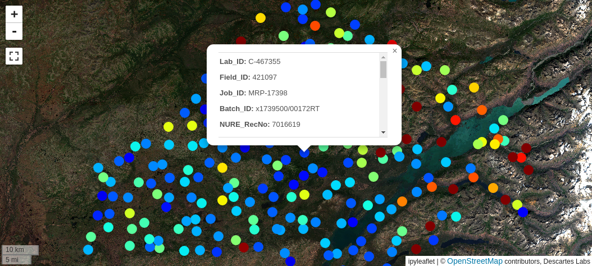
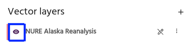
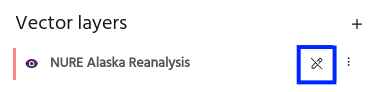
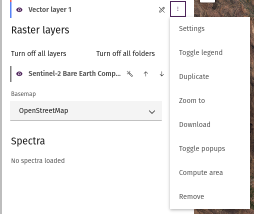

# Vector layers

Marigold supports adding and displaying a wide variety of vector layers.
Add layers to your maps and configure your layer settings using the
**Vector layers** section on the left side panel. Marigold will display layers
"top down," meaning that layers at the top of the list will appear above
layers underneath.

## Add vector layers

Vector layers can be added to the project from several sources:

- Vector tile layers uploaded to [Catalog](add-layers.md#add-a-vector-layer-from-the-catalog)
- Vector [files](add-layers.md#upload-a-vector-layer)
- Manually [drawing](add-layers.md#draw-a-vector-layer) a new layer

## Layer properties

Vector layers that have properties associated with features will show the properties in
a popup window when clicking on a feature. This feature can be toggled on and off, and will be toggled off by default.

<!-- prettier-ignore-start -->
!!! note
    Property popups are not available for Vector tile layers with Point geometries.
<!-- prettier-ignore-end -->

## Basic layer configuration

Similar to [raster layers](../raster-layers/index.md), vector layers can be configured
from the layer's row in the list.

### Toggle visibility

Use the eye icon to toggle layer visibility on and off.

### Toggle drawing

Use the draw toggle to modify the layer by [drawing](add-layers.md#draw-a-vector-layer).

## More configuration options

More advanced configuration options are available from the overflow menu in the layer's
row.

### Settings

Detailed layer settings can be accessed from the [layer settings](vector-settings.md)
menu.

### Toggle legend

If the vector layer is colored by a [property](vector-settings.md#color-by-property),
this option will toggle a legend for the layer.

### Duplicate

Add a copy of the layer to the map.

### Zoom to

Zooms the map to the layer's location.

### Download

Download the vector layer as a geojson.

<!-- prettier-ignore-start -->
!!! note
    Vector tile layers will be downloaded over the current map view.
<!-- prettier-ignore-end -->

### Toggle popups

Toggle property popups when clicking the layer on and off.

### Compute area

Use this option to show the area of Polygon layers.

### Remove

Select **Remove** to remove a layer from the Marigold project.

<!-- prettier-ignore-start -->
!!! warning
    Layers that have been removed from the project will need to be added or
    created again!
<!-- prettier-ignore-end -->

--8<-- "snippets/contact-footer.md"
