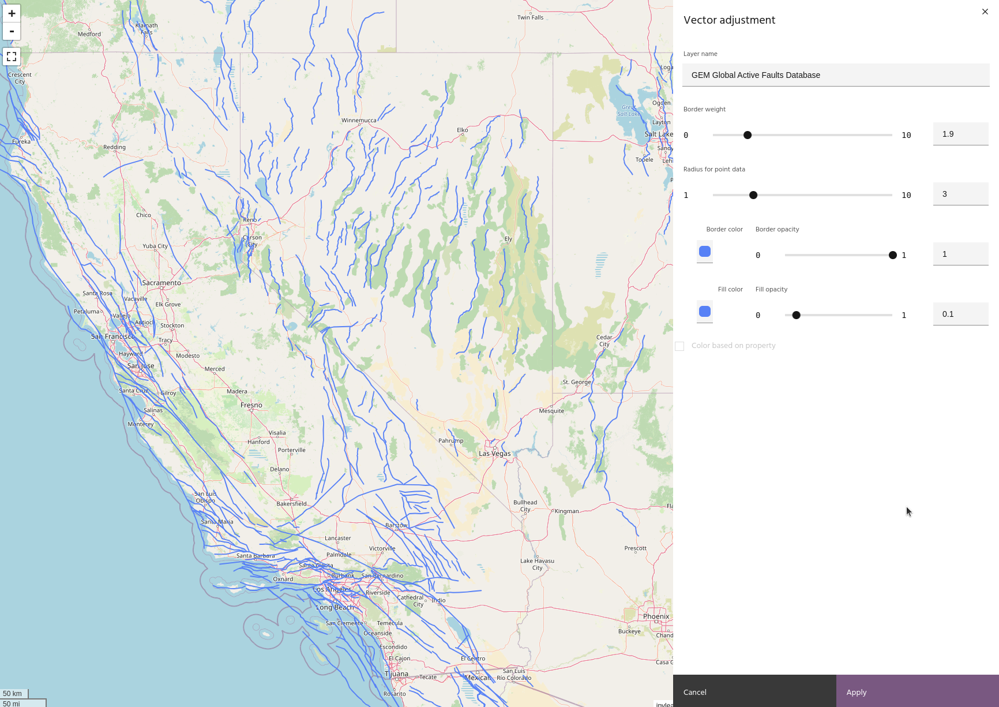
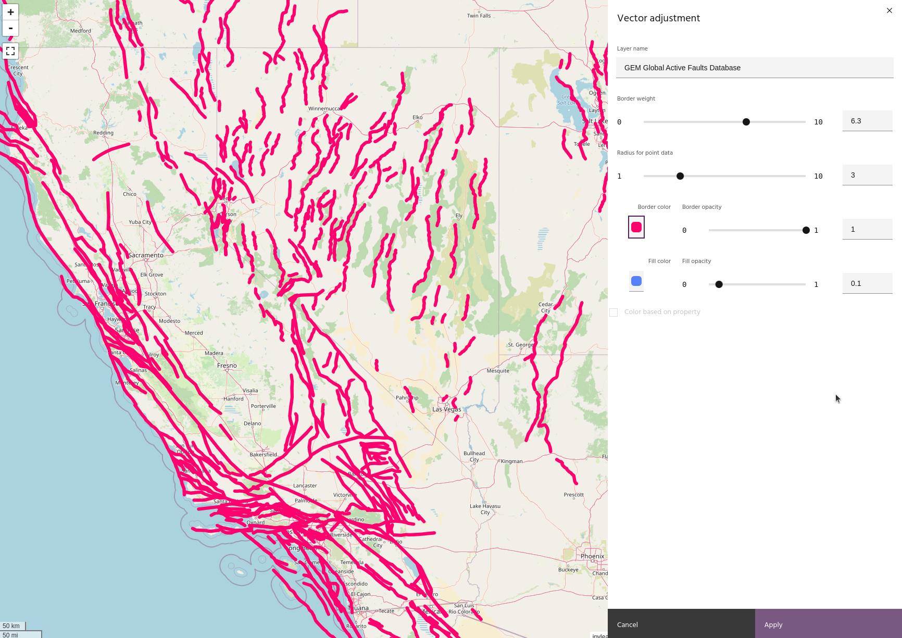
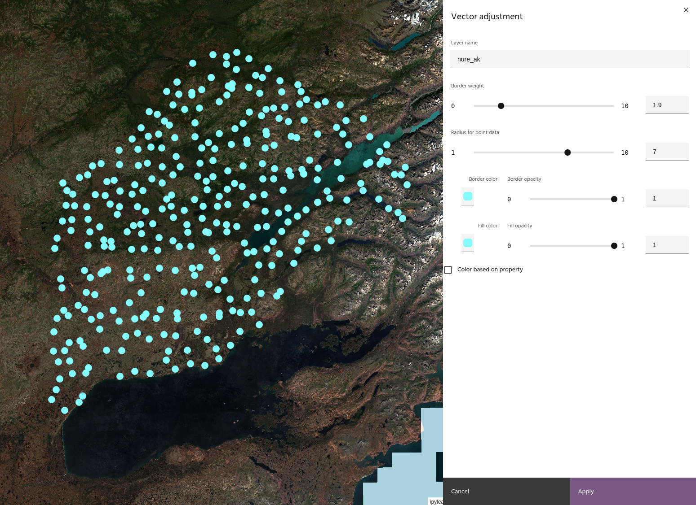
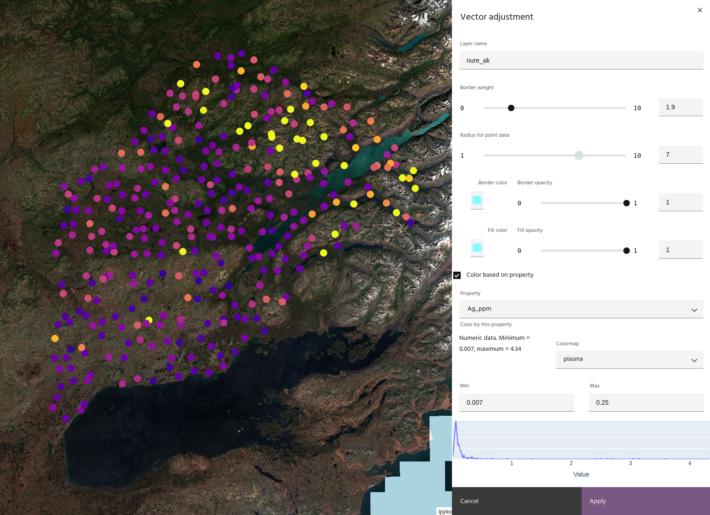
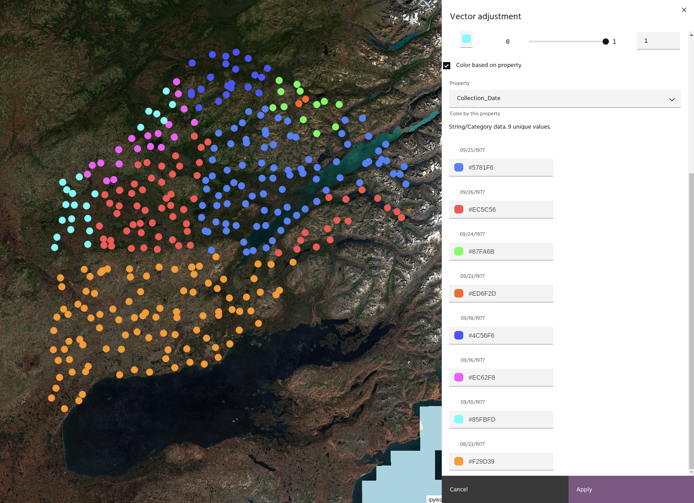

# Vector layer settings

As with [raster layers](../raster-layers/layer-settings.md), vector layers have
a settings dialog to modify visualization properties of the layer.

<!-- prettier-ignore-start -->

!!! Tip
    The layer will update dynamically as you change settings, but you can always
    undo your changes with the `Cancel` button!

<!-- prettier-ignore-end -->

## Rename a layer

Modify the `Layer name` field to change the name of the layer. The name will
change in the list automatically.

## Border weight

Adjust the weight of the border lines of the vector.

## Radius for point data

Adjust the radius for point data.

## Border and fill color and opacity

Adjust the border and fill color and opacity.

<!-- prettier-ignore-start -->

!!! note
    Fill color and opacity only have meaning for point or polygon layers

<!-- prettier-ignore-end -->

## Color by property

If your vector data has properties, such as geochemical samples or geologic
units, the properties can be used for coloring the layer.

Marigold will attempt to determine whether the property is continuous or
categorical. For continuous data, a histogram of the property values will be
shown. Choose the min and max values along with a colorbar to plot the data in
that color.

<!-- prettier-ignore-start -->

!!! warning
    Coloring using date properties may not have the desired effect due to the
    way different systems handle date formatting.

<!-- prettier-ignore-end -->

Categorical data will show a list of the categories and color values for each
one. Color values can be modified by clicking on the box.

--8<-- "snippets/contact-footer.md"
