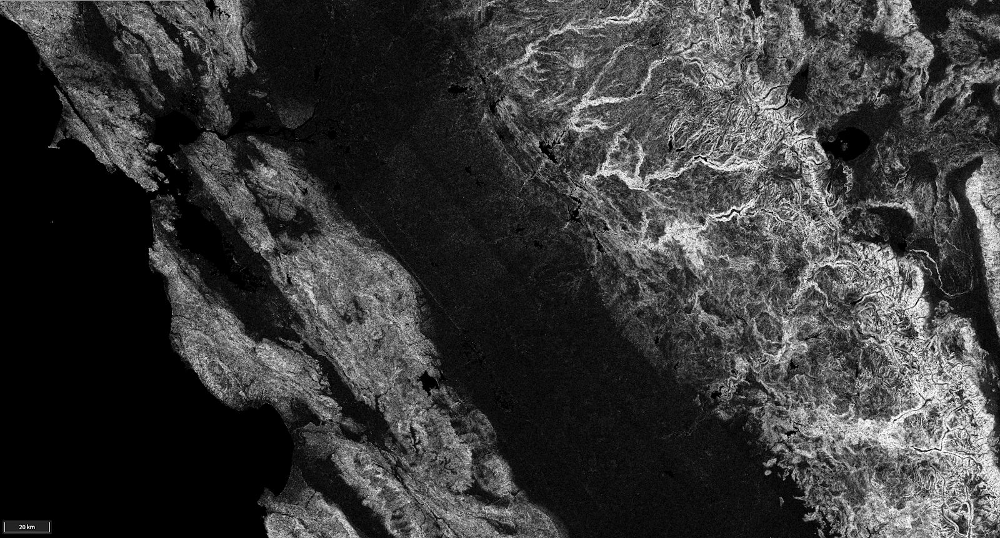
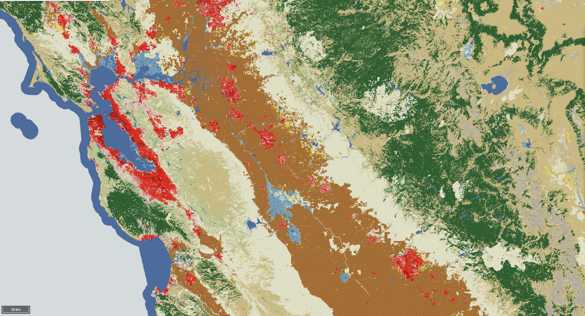
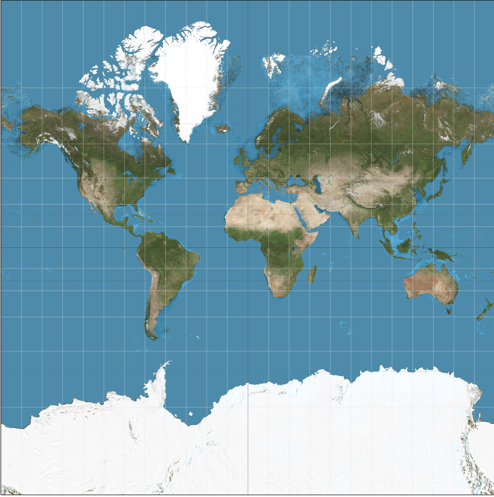

# Geospatial 101

## Introduction

This reference describes the main geographic concepts that will help you
learn the fundamentals of geospatial data and analysis. The Earth is
round, and [we map it in flat
space](https://www.jasondavies.com/maps/transition/), so any and all
earth observation is based on a combination of cascading representations
of reality described here. We also review widely adopted technologies
used for global analysis.

## Data Models

### Raster

The raster data model represents data over a grid of evenly spaced rows
and columns of cells, with a data value assigned to each cell. Digital
images, including aerial and satellite imagery, are stored using this
data model. Read more about EarthOne raster applications in our
[Remote Sensing 101](rs101.md) Reference.

**Continuous Data vs. Discrete Data**

*The [Shuttle Radar Topology Mission](https://www2.jpl.nasa.gov/srtm/) (SRTM) product (top) contains slope data expressed in degrees, and is an example of continuous data.*

*The [National Landcover Classification Database](https://www.usgs.gov/core-science-systems/national-geospatial-program/land-cover) (NLCD) displays categorical information, such as “urban” or “agriculture”, and is an example of discrete data.*

Rasters are well-suited to represent both continuous and discrete
phenomena.

**Discrete** - Discrete features can be represented in raster space
where each cell is assigned a value corresponding to a category, such as
land cover (forest, water bodies, etc.) or categories of wildfire risk
(high, medium, low). Discrete data is also referred to as thematic or
categorical data.

**Continuous** - Variables that are continuous across space, such as
elevation, atmospheric carbon dioxide, or surface temperature, are
typically represented in raster space where each cell represents the
measured or modeled value of the variable over that location.

The most common type of continuous data you’ll encounter on our platform
is an image. Image data is often based on reflected electromagnetic
radiation that can be manipulated to create photograph-like
representations. Red, green, and blue are the visual segments of the
electromagnetic (EM) spectrum used to create a true-color image that
most closely matches what we would expect to see looking from a
satellite or airplane. We can create false-color images by visualizing
portions of the EM spectrum outside of the visual range, which can
provide new information. For example, near-infrared reflectance is often
used to better visualize vegetative health.

!!! note
    EarthOne stores individual images as scenes or images. You can search
    for images and load data using the Catalog API.

**Common file formats**: GeoTIFF, JPG/JPEG, netCDF

### Vector

The vector data model is used to represent discrete features using
points, lines, and polygons. Data is stored using x, y coordinates that
define the vertices of the features, such as locations of dams (points),
roads (line), or political borders (polygon).

Common file formats: Shapefile, GeoJSON, KML

## Coordinate Systems

A coordinate system is a method to define the unique position on a plane
or in space of geometric elements using combinations of numbers called
coordinates. There are two types of Earth coordinate systems: geographic
and projected.

**Geographic coordinate systems** Geographic coordinates are perhaps the
most familiar way of representing coordinates on the Earth’s surface. In
these coordinates systems, a location is represented by its latitude
(north-south position) and longitude (east-west position). Latitude and
longitude are defined using an ellipsoidal representation of the Earth.
Because the coordinates are defined on a curved surface, the physical
distance covered by one degree of longitude will vary from north to
south (due to convergence at the poles), as will latitude from east to
west (due to the ellipsoid shape). Placing coordinates on a flat surface
requires a map projection, described in the next section.

**Map projections and projected coordinate systems** For many practical
purposes, we need to project coordinates onto a 2D plane. A projected
coordinate system is defined on a flat, two-dimensional surface.
Projected coordinate systems describe locations in linear units (such as
meters or feet).

Since map projection are abstractions of a 3D Earth onto a 2D plane,
distortions are inevitable. These distortions differ for each map
projection but are well known and studied. Distortions that can occur
with a flat map include those related to: - shape - area - distance -
direction

While it is impossible to maintain all the native spatial elements of
your geometries once projected, you can prioritize the most important
element for your maps purpose. Projections often use descriptive names
like “conformal”, “equidistant”, “equal-area”, and “azimuthal” to
describe the properties that they preserve. A projection can accurately
preserve one property (either shape, area, distance or direction) but
not others. For this reason, it’s important to choose a projection that
preserves the properties that are relevant to your application. For
example, the Mercator projection is used for navigation because it
preserves the angle between any two curves (conformal projection).

*Mercator Distortion: [The Mercator projection](https://en.wikipedia.org/wiki/Mercator_projection) is area distorting, resulting in land masses near the poles to appear much larger relative to those at the equator.*
