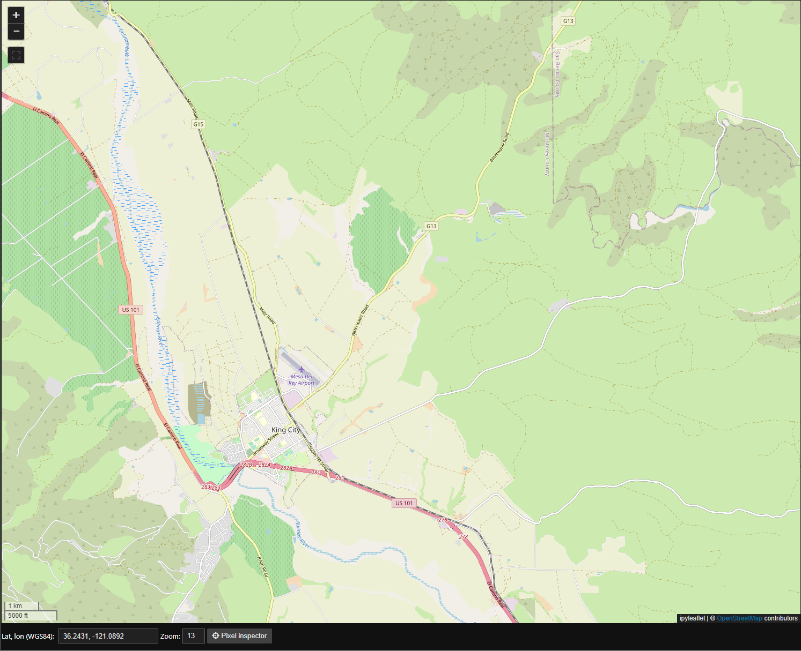
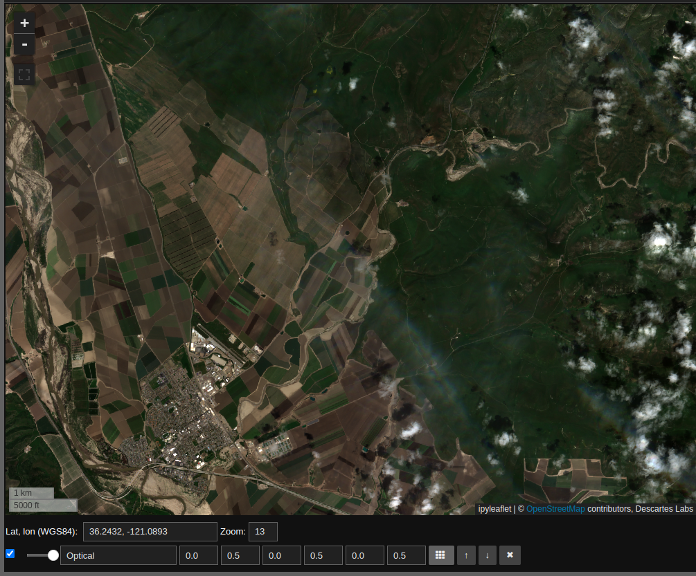
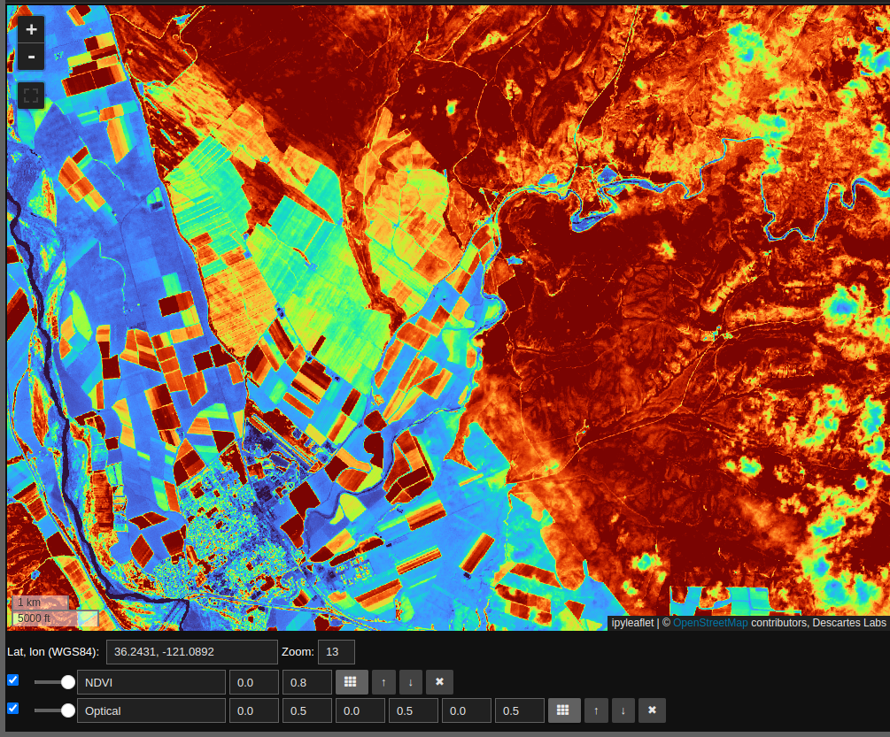
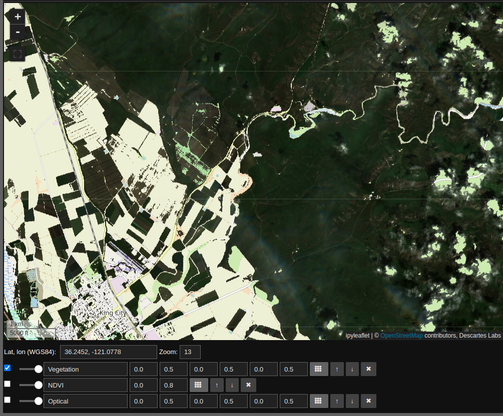
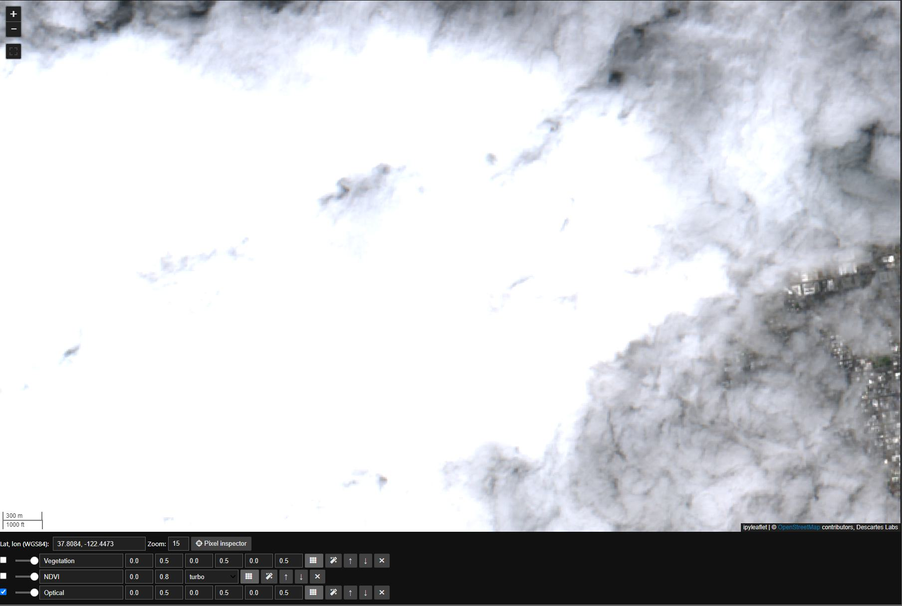
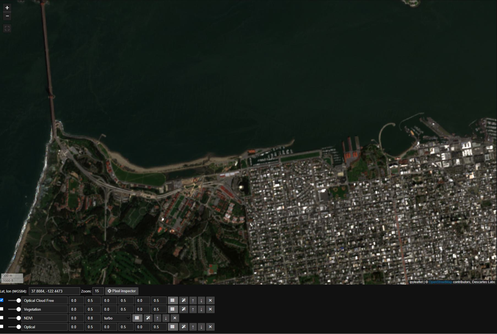
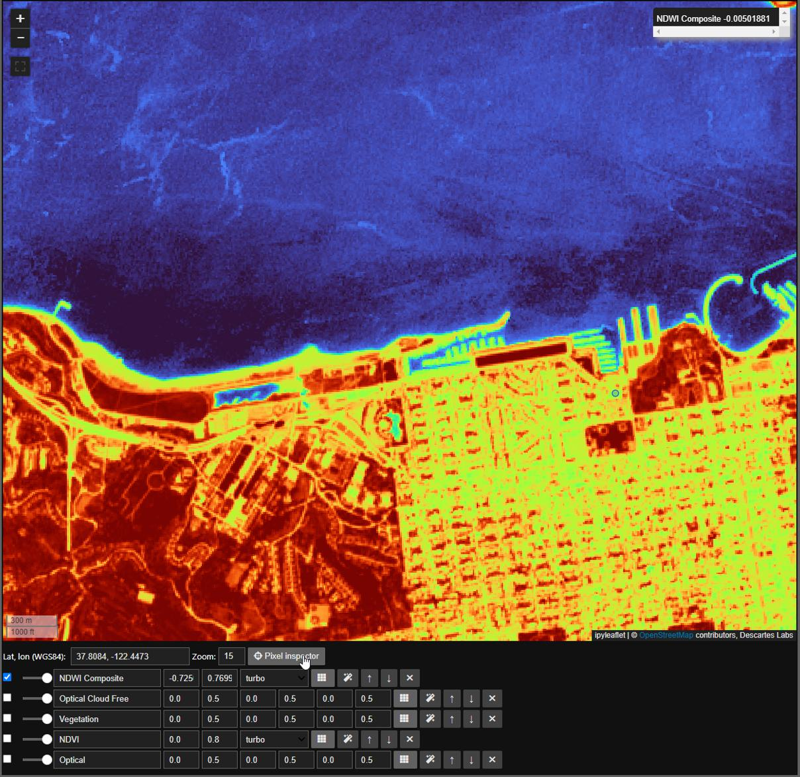
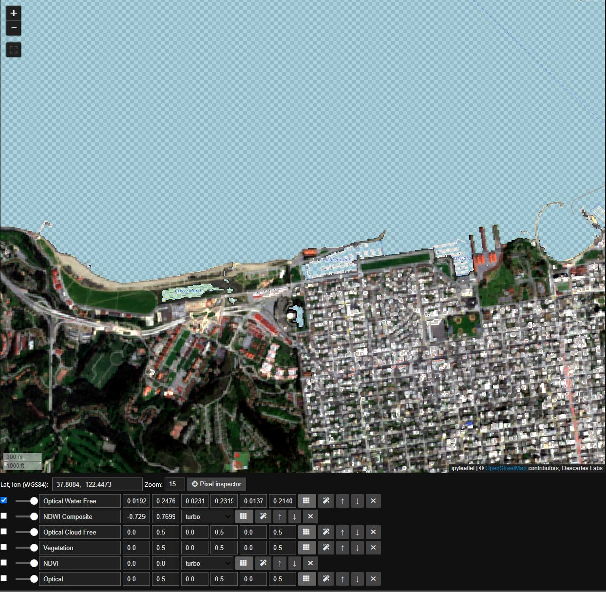

# Dynamic Compute

Dynamic Compute is a computation engine for rapid analysis of geospatial
data. Dynamic Compute aims to provide a similar capability to its
predecessor Workflows.

With Dynamic Compute one composes operations on geospatial entities. The
results are then rendered as concrete data based on a particular
geographic region. Dynamic Compute provides two notable benefits. First,
one can write analytic code without reference to geographic coordinates
or array indices. Second, because Dyanmic Compute provides a map view of
results, analyses can be developed interactively and tested in new areas
by changing the map view. Results are generated on the fly.

This quick-start guide provides examples to demonstrate some of the
basic features of Dynamic Compute. This guide's prerequisite is a
notebook environment that includes the EarthOne Python client and
supports ipyleaflet and ipywidgets.

## Installation

If you are using Workbench, Dynamic Compute will come already installed
on your Python environment. If you are using another environment,
install the Dynamic Compute client through Pypi by running:

```bash
pip install earthdaily-earthone-dynamic-compute
```

## Getting Started

The Dynamic Compute capability is available within the EarthOne client
and can be imported into a notebook with:

```python
import earthdaily.earthone.dynamic_compute as dc
```

Once imported, one can create an interactive Dynamic Compute map with:

```python
m = dc.map
```

Our first example is to render some optical data on the map. We will
start by looking at agriculture in California's Central Valley. One can
pan the map to the area of interest, or programmatically set the map's
location and zoom level with:

```python
m.center = 36.2431, -121.0892
m.zoom = 13
```

In the above code snippet the first line sets the map's center to the
specified latitude and longitude, while the second line sets the zoom
level of the map where the higher the number the more the map is zoomed
in. Once we evaluate a notebook cell with the `map` variable we can view
the interactive component, note that we have not yet added any imagery
layers to our viewport :

```python
m
```



## Mosaics

Now we will start to work with image data. We instantiate one of the
most basic Dynamic Compute objects, a `Mosaic`, with the following code:

```python
sentinel_2_mosaic = dc.Mosaic.from_product_bands(
  "esa:sentinel-2:l2a:v1",
  "red green blue nir",
  start_datetime="2023-03-01",
  end_datetime="2023-05-01"
)
```

The above code creates a `Mosaic` with the following parameters:

1.  `"esa:sentinel-2:l2a:v1"` is the name of the EarthOne Catalog
    Product we wish to use. This particular product is optical imagery
    from ESA's Sentinel-2 program.
2.  `"red green blue nir"` is a space-separated list of `Bands` we would
    like.
3.  `start_datetime="2023-03-01"` indicates that we should only consider
    Sentinel-2 imagery collected on or after March 1, 2023.
4.  `end_datetime="2023-05-01"` indicates that we should only consider
    Sentinel-2 imagery collected on or before May 1, 2023.

The variable `sentinel_2_mosaic` is now a `Mosaic` object representing
these selections. Note that the `sentinel_2_mosaic` variable is not
specific to any geographic location, and, by itself, does not contain
any geographic data.

A `Mosaic` object is used to combine data within the specified
parameters to create a single layer. Where there are multiple data, the
most recent is used.

## Accessing Data

To access data we need to provide a geographic area, and there are two
ways to do this. First, we can render the data on the map. The map can
render three bands, which are assumed to be red, green and blue, or a
single band in conjunction with a colormap. We pick the desired bands
for viewing from the mosaic with the `pick_bands` function as follows:

```python
rgb = sentinel_2_mosaic.pick_bands(
  "red green blue"
  )
```

The variable `rgb` is another `Mosaic` and contains only the red, green
and blue bands. We can render this on our map with the `visualize`
function as follows:

```python
rgb.visualize(
  "Optical", m, scales=[[0, 0.5], [0, 0.5], [0, 0.5]]
  )
```

The parameters here are:

1.  "Optical", which is the name of the layer on the map.
2.  "m", our `dc.map` object, which is the map on which to display the
    data.
3.  `scales=[[0, 0.5], [0, 0.5], [0, 0.5]]` specifies the scalings for
    the red green and blue bands. Note that the input data can exceed
    these bounds, and anything below or above these bounds will be
    rendered as zero or the maximum, respectively, for the band in
    question.

With this one should see Sentinel-2 optical imagery on the map as
follows:



In response to panning and zooming, the map will request relevant data
associated with the `rgb` `Mosaic` object. The second way to access data
is to request it as an array using the `compute` function as follows:

```python
result = rgb.compute(m.geocontext())
```

The `compute` function takes a single argument, the geocontext. The
geocontext contains the coordinate system and the resolution. The
`dc.map` object can generate a geocontext for the current map view via
`dc.map.geocontext()`. Data can be accessed with `result.ndarray` :

```python
result.ndarray.shape
##(3, 400, 939)
```

## Operations

We can perform operations on data in a very natural way. To demonstrate
this we begin by accessing single bands within the `sentinel_2_mosaic`
`Mosaic`:

```python
red = sentinel_2_mosaic.pick_bands("red")
nir = sentinel_2_mosaic.pick_bands("nir")
```

This creates two new single band mosaics `red` and `nir` -- `nir`
referring to the near infrared band. We can use these to compute
[NDVI](https://en.wikipedia.org/wiki/Normalized_difference_vegetation_index)
as follows:

```python
ndvi = (nir - red)/(nir + red)
```

The math operations `+`, `-`, and `/` can be applied to the `red` and
`nir` mosaics to generate a new `Mosaic` called `ndvi`. As with the
`rgb` mosaic, we can visualize this. Unlike `rgb`, `ndvi` has a single
band, so visualization requires an additional colormap parameter as
follows:

```python
ndvi.visualize("NDVI", m, scales=[[0, 0.8]], colormap='turbo')
```



Note that the NDVI layer is computed on the fly in response to changes
in the map window. We can also use the NDVI layer to select regions of
interest as follows:

```python
vegetation_rgb = rgb.mask(ndvi < 0.3)
vegetation_rgb.visualize("Vegetation", m, scales=[[0, 0.5], [0, 0.5], [0, 0.5]])
```

By unchecking the "Optical" and "NDVI" layers we see the Sentinel-2
optical imagery for areas where NDVI suggests vegetation.



To recap: this layer computes NDVI, uses this quantity to create a mask,
and finally renders the RGB layers for the non-masked regions. All of
this is done on the fly, and can be applied to any map view.

## ImageStack

The Dynamic Compute `ImageStack` provides a means to access time
resolved data. In this example we will create a simple water mask using
Sentinel-2 imagery through the same time period.

First we'll set the map view to San Francisco, note the cloud cover in
our original `Mosaic`:

```python
m.center = 37.8084, -122.4473
m.zoom = 15
```



We will address the cloud coverage by first creating an `ImageStack` in
much the same way we created a `Mosaic`:

```python
sentinel_2_image_stack = dc.ImageStack.from_product_bands(
    "esa:sentinel-2:l2a:v1",
    "red green blue nir",
    start_datetime="2023-03-01",
    end_datetime="2023-05-01"
).filter(lambda x: x.cloud_fraction < 0.1)
```

Note that we called `ImageStack.filter` to remove any images that are
above a specified `cloud_fraction`.

Next we will create a composite `Image` off of this `ImageStack`. The
argument to the function `median` is `axis="images"`, which indicates
that we take the median over the images.:

```python
composite_rgb = sentinel_2_image_stack.pick_bands('red green blue')
composite_rgb.median(axis='images').visualize(
  'Optical Cloud Free', m, scales=[[0, 0.5], [0, 0.5], [0, 0.5]]
  )
```



Next we will calculate Normalized Difference Water Index, or `ndwi`,
similar to `ndvi`, using the `nir` and `green` bands :

```python
composite_nir, composite_green = sentinel_2_image_stack.unpack_bands('nir green')
composite_ndwi = (composite_nir - composite_green) / (composite_nir + composite_green)
composite_ndwi.median(axis='images').visualize('NDWI Composite', dc.map, colormap='turbo')
```

Here we will take advantage of both the `autoscale` and
`pixel inspector` tools in `Dynamic Compute` to visualize and determine
a threshold to mask by. The `autoscale` tool will automatically apply a
linear 2% stretch to our dataset and the `pixel inspector` allows you to
select points through which you want to sample imagery values.




Now that we have settled on a threshold, in this case we'll use a round
0, we can finally mask our `ImageStack` just like any `Mosaic`. Here we
will mask to `min` `ndwi`, note that all masked portions are now
represented by a `checkerboard` :

```python
water = composite_ndwi.min(axis='images') < 0
composite_rgb.mask(water).pick_bands('red green blue').median(axis='images').visualize('Optical Water Free', m)
```



## Saving, Managing, and Sharing Dynamic Compute Objects

We can save `Dynamic Compute` objects using
the `save_to_blob` method under the
`dynamic_compute.catalog` module. The ID of
the `Blob` that is created is returned by
this call :

```python
import earthdaily.earthone.dynamic_compute as dc

mosaic = dc.Mosaic.from_product_bands(
  "airbus:oneatlas:spot:v1",
  "red green blue",
  start_datetime="2021-01-01",
  end_datetime="2023-01-01",
)

mosaic_blob_id = dc.catalog.save_to_blob(
  mosaic,
  name="SavedDynamicComputeBlob",
  description="This is a simple Mosaic, but you can save any Dynamic Compute type, including calculated ratios!",
  extra_properties={"foo":"bar", "fuu":"baz"}
)
```

Once we have created a `Blob` saving our
`Dynamic Compute` object, we can load those
from the `Catalog` :

```python
mosaic = dc.catalog.load_from_blob(mosaic_blob_id)
```

!!! note
    - Only load objects from sources you trust!
    - Saved objects can only be loaded into an environment with the same
      Python version.

If you have lost your `Blob` ID, you can
find all of your accessible Blobs by calling `print_blobs`:

```python
dc.catalog.print_blobs()
```

You can share a saved Dynamic Compute Blob with any user, group, or organization by
`share_blob`. Note, you can share as writers with the `as_writers` tag set to `True`:

```python
dc.catalog.share_blob(
  mosaic_blob_id,
  emails=["email:john.daly@earthdaily.com"],
  orgs=["org:pga-tour"],
  as_writers=True
)
```

Lastly, you can delete your saved `Blob` by
calling `delete_blob` :

    dc.catalog.delete_blob(mosaic_blob_id)
    dc.catalog.print_blobs()
