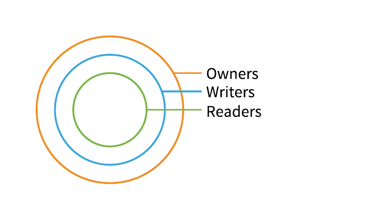

# Sharing Resources

The EarthOne Platform enables sharing of resources with access control
lists. There are lists for readers, writers, and owners of most
resources with specific prefixes for specifying others by group,
organization or email.

## Access Control Lists

Most resources have three primary access control lists; readers,
writers, and owners, each allowing a different set of actions. Each
level is a superset of the others.

Generally the rules are as follows:

- `readers` are able to list and access individual resources.
- `writers` are able to modify individual resources and child resources.
- `owners` are able to delete resources and modify access controls for
  individual resources.

You may notice the owners access control list has an organization
identifier by default. These organization identifiers have a different
meaning than they do in the readers and writers lists. This is for
future functionality to enable individuals with the organization admin
role to manage resources across the organization.

## Identifiers

Identifiers in the access control lists can have the following formats:

- `org:orgname` - Organization membership is manually managed. Contact
  [Support](https://earthone.earthdaily.com/support) for assistance.
- `group:groupname` - Groups only apply within an organization.
- `email:user@company.com`
- `user:guid`
- `public`
